<!--
If not stated otherwise in this file or this component's LICENSE
file the following copyright and licenses apply:

Copyright 2026 RDK Management

Licensed under the Apache License, Version 2.0 (the "License");
you may not use this file except in compliance with the License.
You may obtain a copy of the License at

http://www.apache.org/licenses/LICENSE-2.0

Unless required by applicable law or agreed to in writing, software
distributed under the License is distributed on an "AS IS" BASIS,
WITHOUT WARRANTIES OR CONDITIONS OF ANY KIND, either express or implied.
See the License for the specific language governing permissions and
limitations under the License.
-->

# Eyil Secure Gateway architecture and implementation guide

## 1. Introduction

This document defines the EyilClient and EyilGateway architecture: transport,
concurrent request coordination, connection contexts, request execution and
gateway-owned shared memory. It also records the integration boundaries and
unanswered questions that must not be replaced
by assumptions in code.

Eyil Secure Gateway is an open-source RDK component intended for the
`rdkcentral` ecosystem. The supported platform deployment uses the
**AppManager and RuntimeManager plugins**. Crypto is its first service; the
Gateway remains a general service router. The plugin is `EyilGateway`, its
callsign is `org.rdk.EyilGateway`, and its independent C client library is
`EyilClient`, installed as `libeyilclient.so`.

> **Integration scope:** ICrypto from entservices-apis branch `topic/crypto` is
> a required Gateway build/API dependency. The deployed Crypto plugin supplies
> the runtime implementation and is available before Gateway activation.
> Gateway queries its configurable callsign for
> each invocation and releases that interface reference immediately after use.
> AppManager/RuntimeManager API integration remains at the explicitly marked
> TODO boundaries.

The document specifies the design and its required behavior. Items marked
**Proposed** require review; **TODO** identifies an unresolved contract or
integration decision. Deployment diagrams distinguish platform components from
EyilGateway and EyilClient responsibilities. UML sequences define call flows,
ownership and failure handling. Unresolved policy, public API and format
choices are listed separately from agreed behavior.

Navigation: [ACs](#2-acceptance-criteria-and-scope),
[platform architecture](#3-high-level-architecture-and-platform-placement),
[protocol](#4-apis-protobuf-and-zeromq),
[client flows](#5-eyilclient-design-and-api-flows),
[Gateway flows](#6-eyilgateway-design-and-flows),
[gaps to answer](#7-gaps-to-answer).

## 2. Acceptance criteria and scope

The acceptance criteria define required behavior and map to the detailed flows.
AC1 covers EyilGateway, AC2 covers EyilClient and AC3 covers the Firebolt Crypto
Client Library.

### 2.1 AC1: EyilGateway plugin

| ID | Acceptance criterion |
| --- | --- |
| AC1.1 | Run as the Thunder plugin `EyilGateway`, callsign `org.rdk.EyilGateway`. Initially run the implementation in process. |
| AC1.2 | Bind a `ZMQ_ROUTER` to `ipc:///tmp/app-eyil-gateway.ipc` and accept multiple application connections. |
| AC1.3 | Enable `ZMQ_PLAIN_SERVER` on the ROUTER and run a `ZMQ_REP` ZAP handler at `inproc://zeromq.zap.01` in the same ZMQ context. |
| AC1.4 | Run a monitor worker receiving events on a `ZMQ_PAIR` at `inproc://app-eyil-gateway-monitor`. |
| AC1.5 | Extract kernel-derived peer UID from the ZAP address; retain GID and host PID. For this phase, accept valid direct UDS clients without AppManager authorization and allow all gateway APIs. |
| AC1.6 | Assign a unique ZAP `User-Id` per connection and bind it to the Gateway-side transport FD and connection lifetime. Notify Crypto with CONNECTED during authentication. Retrieve User-Id from every request and resolve its independent context. Multiple connections from one process remain independent. |
| AC1.7 | Dispatch requests as separate jobs on a Gateway-owned Thunder thread pool. Allow at most 1,024 waiting requests with 10 seconds to start Dispatch; reject saturation/expiry with RPC_STATUS_INTERNAL. Keep transport and unrelated requests progressing. |
| AC1.8 | Parse the Protobuf envelope and route `RPC_SERVICE_CRYPTO` to a service adapter. The adapter invokes the external Crypto plugin through ICrypto from topic/crypto, acquiring and releasing the interface per call. |
| AC1.9 | Gateway creates, owns and accounts for shared-memory allocations used by encrypt, decrypt, sign and verify. AllocateSharedBuffer and ReleaseSharedBuffer terminate in Gateway. Allocations belong to one connection; multiple allocations per connection are supported. |
| AC1.10 | On a correlated disconnect, close admission for that connection, finish accepted work, notify Crypto through a scoped NotifyAppState(DISCONNECTED) invocation, and release resources after backend access has ended. |

Each accepted request has an independent dispatch job on the fixed private
worker pool. Workers are reused across jobs; available workers, backend
capacity and resource dependencies determine execution concurrency.

Gateway activation/deactivation is required independently of future app
lifecycle integration. Deactivation blocks new admissions, settles already
accepted requests under their dispatch deadlines and drain rules, closes client
connections, stops ZeroMQ and joins owned threads before destruction.
Reactivation and startup after a crash create
fresh runtime state; old connections and requests are not restored. Section
6.16 defines the sequence.

### 2.2 AC2: EyilClient library

| ID | Acceptance criterion |
| --- | --- |
| AC2.1 | Expose the C API in `eyilclient/EyilClient.h` for consumers such as the Firebolt Crypto Client Library. The library itself does not depend on Thunder. |
| AC2.2 | Connect a `ZMQ_DEALER` to `ipc:///tmp/app-eyil-gateway.ipc`. Supply internal dummy PLAIN username/password strings to trigger server-side ZAP; they are not app credentials. |
| AC2.3 | Receive socket monitor events on a monitor thread through a `ZMQ_PAIR` at `inproc://app-eyil-client-monitor-<unique-client-id>`. Consolidating this work into the I/O owner requires the confirmation described in section 5.2. |
| AC2.4 | Implement all four binary/string request methods, including client_send_request_async and client_send_request_string_async. Support multiple outstanding requests on one connection and responses arriving out of order. Async calls return CLIENT_OK after the I/O owner successfully submits the message to libzmq, then deliver a validated response through the supplied response callback with no response timeout. Section 5.4 defines send failures and cleanup when no response can be delivered. |

Both string methods accept ordinary NUL-terminated text without a caller-supplied
length or encoding step. EyilClient owns input copying and wire serialization.
The byte methods retain explicit sizes for binary Protobuf. Section 5.8 defines
the string boundary and the remaining text/service interpretation contract.

Notification APIs are retained for future support. In this version,
client_register_notifications returns CLIENT_NOT_IMPLEMENTED and
client_unregister_notifications has no effect. No notification handler is stored
or invoked. Async responses and connection-state callbacks retain their separate
contracts.

EyilClient uses a **library-owned serving/I/O thread**, one per `Client`.
Applications do not supply an I/O handler or pump the library. AC2.3 specifies
a separate client monitor thread. Handling its PAIR socket on the serving loop
is a proposed consolidation;
confirmation is required before treating that as satisfying the literal
dedicated-thread wording. See TODO(CLIENT-MONITOR).

Initial client defaults are **15 seconds for connect**, **15 seconds per
synchronous request** and **15 seconds for async send submission**. Client
submission queues and pending-request maps grow dynamically with no fixed
request-count cap. Async responses have no deadline. These time limits do not
expire idle connections. An application may freeze
its process after finishing all operations and callbacks; it owns preparation
for that freeze. ZeroMQ heartbeats are disabled on both ends. See section 5.5
for socket settings and sections 5.14 and 6.14 for lifecycle assumptions.

The supplied ACs do not define automatic reconnect, retry or session-restoration
behavior. This is a **missing lifecycle requirement**, tracked as
TODO(RECONNECT-LIFECYCLE) in section 7.3. The current delivery follows the agreed
explicit-reconnect policy while the broader platform lifecycle requirements
remain to be specified.

The agreed design makes connection loss terminal for that Client
connection: disable automatic reconnect, retire pending client work and discard
undelivered messages. The app closes the old Client and explicitly connects again
with fresh client and Gateway session state. No queued request, response, buffer
ID or session key handle is transferred to the new connection. Section 5.14
defines cleanup and ownership.

Initial connection success or failure is reported only by the synchronous
client_connect return value. A later unexpected connection loss invokes
CLIENT_CONNECTION_LOST once through the registered handler, subject to the
explicit-close cutoff. Explicit disconnect emits no connection callback.
CLIENT_CONNECTION_RESTORED and CLIENT_CONNECTION_TERMINATED are not emitted by
this lifecycle. Section 5.5 defines the callback contract.

The ACs require socket monitoring and cleanup on disconnect. They do
not require application heartbeat RPCs, an inactivity watchdog or ZeroMQ
transport heartbeats. EyilClient and Gateway have transport heartbeats
disabled and contain no custom heartbeat or inactivity-watchdog logic.

### 2.3 AC3: Firebolt Crypto Client Library

| ID | Acceptance criterion |
| --- | --- |
| AC3.1 | Firebolt Crypto uses EyilClient to route app requests to Gateway and ultimately the external Crypto backend. |
| AC3.2 | Firebolt Crypto serializes CryptoRequest into RpcRequest.payload, selects RPC_SERVICE_CRYPTO and passes the serialized envelope to the byte API. EyilClient assigns request IDs and schema version 1, validates/correlates RpcResponse and returns its bytes; Firebolt Crypto inspects RpcStatus and deserializes CryptoResponse. |

Firebolt Crypto and the real Crypto plugin are separate deliverables. Their
presence in diagrams does not add their implementation to this repository.

### 2.4 Delivery boundary

| Part | Responsibility | Integration boundary |
| --- | --- | --- |
| Thunder wrapper | IPlugin, Root<IConfiguration>(), Configure(), private StopAndWait(), release and remote-connection notification | Await drain and teardown before releasing the implementation |
| Implementation library | IConfiguration and runtime ownership | Transport, authentication seam, registry, private pool, CryptoServiceAdapter using ICrypto, router and buffers |
| EyilClient | Nine C APIs, connection handles, coordinator, I/O thread, pending requests and response ownership | Independent of Thunder and ICrypto; async behavior uses the public callback signatures, as specified in section 5.4 |
| Protocol | Generated rpc.proto and crypto.proto, schema constant 1 | EyilClient handles the RPC envelope; service consumers handle service payloads |
| ZeroMQ | Runtime sockets, monitors and peer credentials | Target libzmq must provide the required credential and monitor behavior |
| AppManager / RuntimeManager | Future identity, entitlement and optional lifecycle integration | TODO(AUTH-APPMANAGER); no calls or authentication dependency in the initial scope |
| ICrypto API | Required Gateway build/API dependency | Use entservices-apis topic/crypto headers and compatible COM-RPC bindings where required; CryptoServiceAdapter implements the calls against this interface |
| Crypto plugin | Required deployed backend for Crypto operations | Callsign selected through PLUGIN_EYILGATEWAY_CRYPTO_CALLSIGN; query/invoke/release ICrypto per call with the connection's ApplicationContext |
| Tests and CI | Build/install validation, L1/L2 and coverage | Validate the API, concurrency, transport and ownership flows in this document |

Keep authentication and Crypto integration behind separate adapters. The interim
identity provider accepts connections until AppManager lookup is integrated.
CryptoServiceAdapter calls the deployed Crypto plugin using trusted connection
metadata and checks both invocation and service results. Gateway-local buffer
allocation/release needs no ICrypto call.

Short-lived interface ownership does not remove the ICrypto dependency.
Crypto is available before Gateway activation. Gateway sends CONNECTED during
authentication and DISCONNECTED after accepted work ends. Crypto owns its
internal session, key and recovery implementation.

## 3. High-level architecture and platform placement

### 3.1 RDK deployment

The deployment is an RDK platform with AppManager and RuntimeManager. The initial
Gateway implementation shares Thunder's process, while an application and its
EyilClient instance run inside an application container. The wrapper/implementation
split preserves a path to a separate implementation process later.

AppManager and RuntimeManager remain part of the intended deployment while
their Gateway authentication integration is pending. Crypto is called through
the configured Thunder interface. Local PC builds and isolated development
tests validate the component; production deployment uses the RDK platform
components shown below.

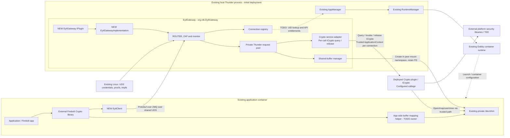
```mermaid
flowchart LR
    subgraph APP["Existing application container"]
        A["Application / Firebolt app"]
        F["External Firebolt Crypto library"]
        C["NEW EyilClient"]
        MAP["App-side buffer mapping helper - TODO owner"]
        SHM["Existing private /dev/shm"]
        A --> F
        F --> C
        F --> MAP
        MAP --> SHM
    end
    subgraph TH["Existing host Thunder process - initial deployment"]
        subgraph GW["EyilGateway - org.rdk.EyilGateway"]
            WR["NEW EyilGateway IPlugin"]
            IM["NEW EyilGatewayImplementation"]
            IO["ROUTER, ZAP and monitor"]
            REG["Connection registry"]
            POOL["Private Thunder request pool"]
            AD["Crypto service adapter<br/>Per-call ICrypto query / release"]
            BM["Shared-buffer manager"]
            WR --> IM
            IM --> IO
            IO --> REG
            IO --> POOL
            POOL --> AD
            POOL --> BM
        end
        AM["Existing AppManager"]
        RM["Existing RuntimeManager"]
        AM --> RM
    end
    CP["Deployed Crypto plugin / ICrypto<br/>Configured callsign"]
    SEC["External platform security libraries / TEE"]
    K["Existing Linux: UDS credentials, procfs, tmpfs"]
    D["Existing Dobby container runtime"]
    C -- "Protobuf over ZMQ over shared UDS" --> IO
    K --> IO
    RM --> D
    D -. "Launch / container configuration" .-> APP
    REG -. "TODO: UID lookup and API entitlements" .-> AM
    AD -- "Query / invoke / release ICrypto<br/>Trusted ApplicationContext per connection" --> CP
    CP --> SEC
    BM -- "Create in peer mount namespace, retain FD" --> SHM
    CP -- "Open/map/use/close via trusted path" --> SHM
```

The inner EyilGateway block groups components owned by the plugin. AppManager
and RuntimeManager remain separate plugins within the Thunder process. The
diagram distinguishes existing platform infrastructure from new Gateway
components and pending AppManager/RuntimeManager integration. Crypto may itself
be in process or remote;
Gateway must not depend on a raw pointer or FD being meaningful in Crypto's
process.

### 3.2 Components, ownership and trust boundaries

| Component | Owner / location | Responsibility |
| --- | --- | --- |
| Application / Firebolt Crypto | Application container; external consumer | Express operations, serialize Crypto payloads and consume results |
| EyilClient | New library in the application's process | Transport coordination, RPC correlation and C API buffer ownership |
| App-side mapping helper | Placement TODO; not part of the current EyilClient transport API | Open/map the name returned by allocation; manage app mappings |
| EyilGateway wrapper | New Thunder IPlugin | Framework lifecycle and implementation acquisition |
| EyilGatewayImplementation | New implementation library | Own Gateway transport, contexts, request pool, adapters and allocations |
| AppManager / RuntimeManager | Existing RDK platform plugins | Future authoritative identity/entitlements; lifecycle information if adopted |
| Dobby / DobbyTool | Existing container runtime / diagnostic tool | Launch, container namespace/mount setup and test execution; no request routing |
| Linux kernel / libzmq | Existing platform dependencies | UDS transport and peer credentials; monitor support depends on the target libzmq |
| Crypto plugin / ICrypto | Deployed external Thunder backend | Crypto execution, per-application-session state, keys and key authorization |
| Sec API / secure hardware / TEE | External platform-specific implementation | Backend-dependent cryptographic operations; no Gateway dependency |

There is **one listening UDS endpoint**, shared by all intended applications.
Each accepted connection gets its own identity, request accounting and buffer
ownership. Separate connections do not require separate socket paths.

The app cannot authoritatively provide its UID, appId, sessionId or a host
shared-memory path. The transport supplies peer credentials; the Gateway creates
the connection context and resolves opaque buffer IDs. Key policy remains in
Crypto, including locators, usages, import/export restrictions and sharing.

### 3.3 Container mounts and direct access

The AC endpoint is `ipc:///tmp/app-eyil-gateway.ipc`. Deployment must expose the
same socket object to intended containers, with deliberate directory/socket
permissions. Sharing all of host `/tmp` also exposes unrelated objects; a narrow
mount is preferred when supported. A directory mount avoids binding a container
to an obsolete socket inode after the server recreates it. Final Dobby mount
configuration and permissions remain TODO(DEPLOYMENT).

Monitor and ZAP `inproc://` endpoints are local to a ZMQ context; they need no
filesystem socket or container mount.

Ordinary application containers must not acquire the Crypto interface directly
through Thunder's communicator. `ApplicationContext` is identity metadata; it
does not authenticate the COM-RPC caller. The platform direction is to restrict
general app access to Thunder. Deployment validation must verify the actual
communicator mounts and access policy for the deployed Crypto integration.

Gateway's private pool isolates its request scheduling from Thunder's global
worker queue. It does not isolate process crashes, total CPU/memory pressure or
a blocked in-process backend. Those limits matter while Gateway is in process.

### 3.4 External integration seams

| TODO | Integration point | Selected behavior / remaining decision |
| --- | --- | --- |
| TODO(AUTH-APPMANAGER) | AuthenticationProvider called by ZAP; future Gateway → AppManager → RuntimeManager lookup using trusted UID | Accept valid direct UDS peers, record UID/GID/PID, create unique interim appId/sessionId per connection |
| TODO(API-AUTHORIZATION) | Admission check against entitlements cached in the connection context | Allow all structurally valid supported APIs; still enforce limits and buffer ownership |
| ICrypto lifecycle | Scoped NotifyAppState calls through CryptoServiceAdapter | CONNECTED during authentication; DISCONNECTED after accepted work ends; Crypto owns its internal session/key behavior |
| TODO(LIFECYCLE-EVENTS) | Lifecycle observer receiving platform events and submitting serialized context transitions | No AppManager/RuntimeManager subscriptions or inferred hibernate/idle policy |

The interface names in this table describe internal seams. They are not
additional app-facing Thunder interfaces and do not claim that a formal
AppManager authentication API is already available. Future API additions should
be confined to these seams, rather than spreading external plugin types through
the client, transport or buffer registry.

## 4. APIs: Protobuf and ZeroMQ

### 4.1 The two Protobuf files

| File | Purpose | Boundary |
| --- | --- | --- |
| [rpc.proto](../apis/proto/rpc.proto) | Service-neutral RpcRequest/RpcResponse, request_id, service, schema_version and RpcStatus | EyilClient ↔ Gateway routing |
| [crypto.proto](../apis/proto/crypto.proto) | CryptoRequest/CryptoResponse, operations, key metadata, buffer allocation/release and offset/length regions | Crypto consumer ↔ Gateway Crypto adapter |

`RpcRequest.payload` contains a serialized service request.
`RpcResponse.payload` contains the service response when available. Crypto
defines an operation enum and a `oneof`; they must agree. A valid Protobuf parse
alone does not validate the operation, enum values, required message presence
or allowed lengths.

The RPC envelope fields are:

| Message | Fields |
| --- | --- |
| RpcRequest | request_id: uint64; service: RpcService; schema_version: uint32; payload: bytes |
| RpcResponse | request_id: uint64; service: RpcService; schema_version: uint32; status: RpcStatus; payload: bytes |

[ProtocolVersion.h](../apis/proto/ProtocolVersion.h) fixes the current envelope
schema to **1**. EyilClient sets it for each RPC. There is no version negotiation
or fallback protocol in the current schema. Library/package ABI versions and
Thunder plugin metadata versions are separate concepts.

Client and Gateway must use matching generated rpc.proto and crypto.proto
definitions for the agreed schema.

**Agreed envelope handling:** EyilClient
serializes/deserializes the outer RPC envelope, owns request IDs, sets
schema_version to 1 and correlates responses.

For the byte API, the caller supplies a serialized RpcRequest carrying
service and payload. EyilClient parses the envelope, assigns request_id, sets
schema_version and serializes it for transmission. On receipt, it parses and
validates RpcResponse, matches request_id to the pending call and returns the
serialized response to that caller. The service is carried in the envelope;
no separate service argument is needed. Crypto payload bytes remain opaque to
EyilClient and are interpreted by the service-specific consumer.

Both string request APIs accept ordinary NUL-terminated request text and return
ordinary NUL-terminated response text. EyilClient measures and copies input up
to the first NUL; the caller supplies no size or text encoding. Wire envelope
construction and serialization belong inside the library. Protobuf bytes fields
and ZMQ can carry text bytes directly. The service route and interpretation of
that text are a separate contract, described in section 5.8.

### 4.2 Status and error layers

| Layer | Meaning and handling |
| --- | --- |
| ClientResult | Local C API validation, connection, allocation, timeout or communication result |
| RpcStatus | Gateway routing/execution result; explicitly inspect it even when a response was received |
| CryptoError | Crypto service result, carried inside CryptoResponse |
| Core::hresult | Whether the ICrypto invocation itself succeeded; check before reading output parameters |

`CLIENT_OK` on an asynchronous submission means zmq_send accepted the message
into libzmq's queue; it does not confirm physical UDS delivery or remote success.
`RPC_STATUS_OK` means the Gateway successfully produced the
service response; `CryptoResponse.error` can still report a failed crypto
operation. Protobuf's zero default `RPC_STATUS_UNSPECIFIED` is not success.

#### Agreed local error behavior

The following client behavior is agreed. It applies independently of AppManager authentication and the outcome of
a Crypto invocation.
Apply ClientResult through the connect, synchronous request or async submission
return value. Async response callbacks carry response data only; they do not
carry local ClientResult errors.

| Situation | ClientResult | Response handling |
| --- | --- | --- |
| Invalid arguments, oversized string input or invalid caller-supplied binary request envelope | CLIENT_INVALID_ARGUMENT | No response |
| client_register_notifications is called | CLIENT_NOT_IMPLEMENTED | Reserved for future support; no handler is stored or invoked |
| client_connect receives a valid, already allocated Client handle in the caller's slot | CLIENT_ALREADY_CONNECTED | Preserve the existing handle and connection state; create no new connection and invoke no callback |
| Submission without a usable connection | CLIENT_NOT_CONNECTED | No response |
| Explicit client_disconnect wins while a synchronous result or an unaccepted async send is pending | CLIENT_NOT_CONNECTED | Clear synchronous outputs, cancel unsent work and retire pending IDs; no async response callback |
| Authentication explicitly rejected | CLIENT_AUTH_FAILED | No response |
| Detected allocation failure during connect, sync processing or async submission before libzmq acceptance, including queue insertion | CLIENT_OUT_OF_MEMORY | Roll back local state; sync outputs remain NULL/0 and async submission invokes no response callback |
| Connect, synchronous request or async send-submission deadline expires | CLIENT_TIMEOUT | No handle on connect failure; no synchronous response on timeout; async send failure invokes no response callback. A synchronous timeout may leave remote execution in progress |
| Connection lost during a synchronous request or before async send acceptance, malformed synchronous response or terminal send failure | CLIENT_COMMUNICATION_ERROR | No response |
| Valid correlated synchronous RPC response delivered, or async message accepted by zmq_send | CLIENT_OK | Sync returns the response; async returns without waiting for one. The caller checks RpcStatus and service status when a response is delivered |

For synchronous byte responses, every local error produces `response_data == NULL` and
`response_size == 0`. For string responses, it produces `response_data == NULL`.
A valid Gateway error response, including RPC_STATUS_INTERNAL, is still a
received RPC response: byte APIs return CLIENT_OK with its bytes and preserve
RpcStatus.
Do not turn a local failure into a fabricated Gateway RpcResponse or CryptoError.

Byte APIs expose the complete RpcResponse for the caller to inspect. String
APIs expose text; TEXT-SERVICE-CONTRACT must define how Gateway and service
errors are represented in that text. A valid Gateway error response must remain
an error visible to the consumer, without being fabricated as successful text
or confused with a local allocation/transport failure.

Connect, synchronous request and async send-submission timeouts are **15,000 ms**
in the initial version, using one common internal duration constant. Async
responses have no timeout. No new public timeout-configuration
API is required for this version. An authentication error requires an explicit
rejection; an unavailable endpoint or lost connection is not evidence of denied
access.
Temporary socket backpressure is handled within the active send deadline and
is not automatically a terminal communication failure. The client has no fixed
queue/request-count limit and does not report a local queue-full error. If it
cannot allocate request state or grow the queue, return CLIENT_OUT_OF_MEMORY.
Gateway allows at most 1,024 requests waiting for a private-pool worker, with
a 10-second deadline to start dispatch. Queue saturation, expiry before dispatch
and detected Gateway allocation failure map to RPC_STATUS_INTERNAL when a
correlated reply can be constructed and sent. It does not become a local
CLIENT_OUT_OF_MEMORY result in EyilClient.

An async submission that returns an error must not invoke its response callback.
After CLIENT_OK, deliver a valid correlated response at most once. There is no
async response timeout and no synthetic error callback. A connection failure
retires outstanding async records through the connection-state path; a matched
response that fails local validation/allocation is retired with diagnostics and
no callback. Therefore a callback is not guaranteed after every successful send.
Section 5.4 defines this response-only contract.

A timeout or connection loss does not prove remote cancellation. Do not replay
the operation automatically or claim that its shared buffer is safe to reuse.

| RpcStatus | Intended use |
| --- | --- |
| UNSPECIFIED (0) | Missing/unset result; reject as an invalid response |
| OK (1) | Successfully routed and processed at the Gateway layer |
| INVALID_REQUEST (2) | Parsed outer RPC envelope violates the agreed structure; service-payload rejections use the generic error below |
| UNSUPPORTED_SCHEMA (3) | Unsupported envelope schema_version |
| UNSUPPORTED_SERVICE (4) | Unknown or unregistered RPC service |
| MALFORMED_REQUEST (5) | Cannot decode the outer RPC envelope or its framing; service-payload decoding failures use the generic error below |
| INVALID_CONNECTION (6) | Missing, stale or inadmissible authenticated connection context |
| INTERNAL (7) | Generic Gateway rejection or execution failure, including the cases below, full 1,024-entry waiting queue, 10-second dispatch-wait expiry, allocation failure, null ICrypto lookup or failed invocation when a correlated reply is possible |

#### Generic Gateway rejection and explicit error logging

Use the existing **RPC_STATUS_INTERNAL** for duplicate request IDs, invalid
service payloads, shared-buffer quota failures and rejected operations involving
a busy or release-pending buffer. No additional wire error codes are needed.
The Gateway must log the specific cause at **ERROR** severity where the
rejection is detected, independently of whether an error response can be sent.

| Rejection | RPC result when safely correlatable | Required log detail |
| --- | --- | --- |
| Duplicate request ID | RPC_STATUS_INTERNAL | Duplicate ID and the original request's state |
| Invalid service payload | RPC_STATUS_INTERNAL | Decode failure, operation/oneof mismatch, invalid field, enum, range or buffer reference, as applicable |
| Shared-buffer quota exceeded | RPC_STATUS_INTERNAL | Requested size/count, current usage, applicable limit and whether the quota is per connection or global |
| Operation rejected because a buffer is release-pending | RPC_STATUS_INTERNAL | Buffer ID and release state |
| Operation rejected because a buffer is busy | RPC_STATUS_INTERNAL | Buffer ID and reserved/active-use state |

Include the connection token/generation, request_id, service and operation when
known. Record a specific reason such as `duplicate_request_id`,
`invalid_service_payload`, `buffer_quota_exceeded`, `buffer_release_pending` or
`buffer_busy`; these are local diagnostics, not new protocol fields. Do not log
request payloads, key material or shared-memory contents. Rejected work must not
invoke Crypto, overwrite another request's state or invalidate active buffer
leases. Roll back partially reserved resources.

Use an empty service payload for a Gateway rejection; do not fabricate a
CryptoError. A successfully invoked Crypto method still preserves its actual
CryptoError in the service response. Existing outer-envelope, schema, service
and connection status mappings remain as listed above.

Only send an error when the request ID and original authenticated route permit
unambiguous correlation. A duplicate ID still owned by an accepted request must
not produce a second competing response under that ID: log and discard the
duplicate, leave the original job/completion intact and never dispatch a second
operation. Likewise, log and discard malformed input without a trustworthy ID
or route. The generic status does not justify inventing a request ID or replying
to a replacement connection.

Error replies follow the same single nonblocking send-attempt rule as successful
responses. Log any delivery failure separately and drop the reply without a
retry. A generic failure does not acknowledge buffer release or prove that an
earlier operation finished. Buffer admission, deferred release and completion
timing remain resource-lifecycle questions; their rejection status and logging
are settled here.

### 4.3 Protocol capabilities and limitations

| Capability | Implementation consequence |
| --- | --- |
| Independent request_id | Many requests may be outstanding; match responses by ID, not arrival order |
| Explicit service enum | A new service needs a schema/adapter addition; only CRYPTO is currently defined |
| Opaque service payload | Transport does not implement Crypto key policy |
| Buffer ID plus regions | Four bulk-data operations avoid embedding their input/output in the RPC message |
| uint32 buffer fields | Validate size/ranges with overflow-safe arithmetic and stricter configured quotas |
| No app identity fields | Derive context from trusted transport metadata |
| No deadline/cancel message | A local timeout cannot cancel backend work or prove buffer reuse is safe |
| No notification envelope | Notification support is reserved for the future; registration returns CLIENT_NOT_IMPLEMENTED and creates no subscription |
| No retry/deduplication contract | Do not replay key generation, import or other operations automatically |
| NUL-terminated string API boundary | Copy input up to the first NUL without caller encoding; service selection and text interpretation require TEXT-SERVICE-CONTRACT |
| No lifecycle/heartbeat messages | Do not invent idle expiry, hibernation commands or heartbeat services |

The protocol permits concurrent requests; it does not define ordering for
operations sharing a key, buffer or session. Request-ID correlation also does
not provide exactly-once execution or distinguish a lost reply from an operation
that never ran.

### 4.4 ZeroMQ endpoints and message framing

| Endpoint | Socket / owner | Purpose |
| --- | --- | --- |
| `ipc:///tmp/app-eyil-gateway.ipc` | Gateway ROUTER binds; each client DEALER connects | Application RPC over filesystem UDS |
| `inproc://zeromq.zap.01` | Gateway ZAP REP binds | Internal authentication exchange |
| `inproc://app-eyil-gateway-monitor` | ROUTER monitor publishes; Gateway PAIR receives | Gateway transport events |
| `inproc://app-eyil-client-monitor-<unique-client-id>` | DEALER monitor publishes; client PAIR receives | Client transport events |

DEALER sends one frame containing the serialized RpcRequest.
ROUTER receives `[routing_id][RpcRequest bytes]` and replies with
`[routing_id][RpcResponse bytes]`; DEALER receives the response body only.
There is no empty REQ delimiter.
Validate the frame count and consume/reject an entire malformed multipart
message before accepting another. Define size and frame limits explicitly.

String API input does not change this framing: EyilClient constructs the binary
RpcRequest internally and sends it with its serialized length. Gateway still
receives a binary envelope. The local C-string terminator is not a transport
frame delimiter and is not included in a directly carried text payload.

The ROUTER I/O owner copies `zmq_msg_gets(message, "User-Id")` before closing
the received message. The routing frame is a delivery address, not authenticated
identity. ZAP's User-Id is a different identifier.

Each DEALER and ROUTER has one socket-owning thread. API callers and request
workers communicate with it through queues; they never send or receive on its
socket. This follows the restrictions for these socket types in the
[ZeroMQ socket API](https://libzmq.readthedocs.io/en/latest/zmq_socket.html).
Socket options, connection, monitoring and closure follow the same ownership.

PLAIN server mode belongs on the ROUTER. The REP handler answers ZAP exchanges;
EyilClient supplies dummy PLAIN strings and never runs a ZAP server. The trusted
UID/GID/PID representation depends on the target libzmq implementation, rather
than the client password. See the
[ZAP specification](https://rfc.zeromq.org/spec/27/).

## 5. EyilClient design and API flows

### 5.1 Responsibilities and limits

EyilClient provides transport coordination, not Crypto semantics. A caller can
submit concurrent synchronous and asynchronous requests on the same `Client`.
A synchronous caller waits for its response; an async caller waits only for
libzmq send acceptance. Neither may hold a lock needed by the I/O owner or
another caller while waiting.

Each Client has one library-owned serving thread and one owned ZMQ context.
libzmq also creates its own internal I/O threads: those do not maintain the
library's pending map,
run its callbacks or replace its serving thread.

There is no application heartbeat producer, heartbeat worker, periodic liveness
RPC or inactivity watchdog in EyilClient. Connection-state handling uses
the monitor events and the request coordinator. Connect, sync requests and async
send submission retain 15-second deadlines; async response waiting has none.
Built-in libzmq transport heartbeats are also disabled, as specified in
section 5.5.

The library does not:

- Call AppManager, RuntimeManager, Thunder or ICrypto.
- Decide key authorization, generate trusted app identity or choose host paths.
- Allocate, map or release Gateway-owned buffers implicitly through the generic
  transport API. The app-side Crypto layer requests and maps them explicitly.
- Promise that reconnect preserves keys, buffers or a Gateway session.
- Treat a timeout, a successful send or a connection callback as proof that a
  remote Crypto operation finished.

### 5.2 Component organization and ownership

| Component | Responsibility | Owner / synchronization |
| --- | --- | --- |
| C API facade | Validate arguments, clear outputs, prepare owned input by parsing a binary envelope or copying a NUL-terminated string, and hold a live call reference | Calling application thread; never touches DEALER |
| Per-Client coordinator | State, generation, submission queue and shutdown coordination | Short protected state transitions; no fixed client request-count cap |
| Submission queue | Dynamically growing std::queue<Action> of owned request actions; shutdown uses a separate stop flag | Mutex protects push/front/pop; process work after releasing it |
| Request record | Copied request, assigned ID, waiter or response handler, generation and state; sync total deadline or async send deadline | Retained until response delivery or local retirement; accepted async response waiting has no deadline |
| Serving/I/O loop | Drain submissions, send/receive, correlate replies, monitor events | Library-owned thread; sole DEALER owner |
| Pending map | request_id → waiter/callback and expected response metadata | Serving thread; completion ownership transferred once |
| Completion target | Sync result waiter, async send-result waiter and per-request response callback | Each waiter resolves once; response callbacks run at most once on the I/O owner without internal locks held |
| Monitor collector | Read/decode PAIR events and hand them to connection-state handling | I/O owner performs these monitor-thread duties in the proposed design; a separate worker remains an AC wording decision |
| Response storage | Independently allocated byte/string result | Ownership passes to application, freed with client_free_response |

Each request entry point retains a scoped live-call reference before accessing
Client state or preparing input, and releases it on every return path. The guard
covers validation, copying/parsing, queue admission, waits and final response
preparation. Admission and callback claims are serialized against explicit
disconnect. Section 5.13 defines the caller's handle-lifetime obligations and
the cleanup barrier; a raw Client pointer alone is not a lifetime reference.

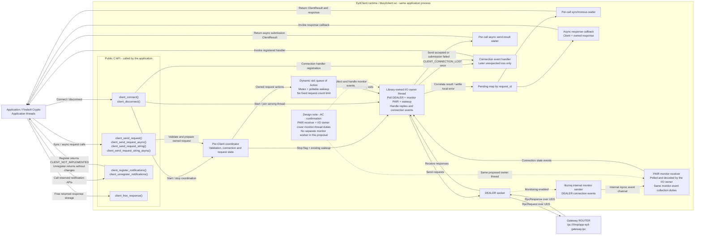
```mermaid
flowchart LR
    A["Application / Firebolt Crypto<br/>Application threads"]
    subgraph LIB["EyilClient runtime / libeyilclient.so - same application process"]
        subgraph API["Public C API - called by the application"]
            LIFE["client_connect()<br/>client_disconnect()"]
            REQ["client_send_request()<br/>client_send_request_async()<br/>client_send_request_string()<br/>client_send_request_string_async()"]
            NOTIFY["client_register_notifications()<br/>client_unregister_notifications()"]
            FREE["client_free_response()"]
        end
        CO["Per-Client coordinator<br/>Validation, connection and request state"]
        Q["Dynamic std::queue of Action<br/>Mutex + pollable wakeup<br/>No fixed request-count limit"]
        IO["Library-owned I/O owner thread<br/>Poll DEALER + monitor PAIR + wakeup<br/>Handle replies and connection events"]
        D["DEALER socket"]
        P["Pending map by request_id"]
        SYNC["Per-call synchronous waiter"]
        SEND_RESULT["Per-call async send-result waiter"]
        CB["Async response callback<br/>Client + owned response"]
        HANDLERS["Connection event handler<br/>Later unexpected loss only"]
        EVENTS["libzmq internal monitor sender<br/>DEALER connection events"]
        M["PAIR monitor receiver<br/>Polled and decoded by the I/O owner<br/>Same monitor-event collection duties"]
        MN["Design note - AC confirmation<br/>PAIR receiver + I/O owner cover monitor-thread duties<br/>No separate monitor worker in this proposal"]
        LIFE -- "Start / stop coordination" --> CO
        CO -- "Owned request actions" --> Q
        CO -- "Stop flag + existing wakeup" --> IO
        LIFE -- "Start / join serving thread" --> IO
        LIFE -- "Connection handler registration" --> HANDLERS
        REQ -- "Validate and prepare owned request" --> CO
        Q -- "Commands and requests" --> IO
        IO -- "Send requests" --> D
        D -- "Receive responses" --> IO
        IO -- "Correlate result / settle local error" --> P
        IO -- "Send accepted or submission failed" --> SEND_RESULT
        P --> SYNC
        P --> CB
        IO -- "CLIENT_CONNECTION_LOST once" --> HANDLERS
        D -. "Monitoring enabled" .-> EVENTS
        EVENTS -- "Internal inproc event channel" --> M
        M -- "Connection state events" --> IO
        MN -. "Same proposed owner thread" .-> M
        MN -. "Collect and handle monitor events" .-> IO
    end
    G["Gateway ROUTER<br/>ipc:///tmp/app-eyil-gateway.ipc"]
    A -- "Connect / disconnect" --> LIFE
    A -- "Sync / async request calls" --> REQ
    A -- "Call reserved notification APIs" --> NOTIFY
    NOTIFY -- "Register returns CLIENT_NOT_IMPLEMENTED<br/>Unregister returns without changes" --> A
    A -- "Free returned response storage" --> FREE
    SYNC -- "Return ClientResult and response" --> A
    SEND_RESULT -- "Return async submission ClientResult" --> A
    CB -- "Invoke response callback" --> A
    HANDLERS -- "Invoke registered handler" --> A
    D -- "RpcRequest over UDS" --> G
    G -- "RpcResponse over UDS" --> D
```

The application explicitly calls the public functions shown in the inner API
block. Those entry points run on the calling application thread; the submission
queue transfers owned requests to the library-owned I/O loop. Startup and
shutdown use retained runtime state and a separate stop flag. Synchronous results
return to the caller, while asynchronous results use the registered per-request
response handler. Section 5.4 defines send waiting and callback execution rules.
Response freeing is a local operation. The reserved notification APIs do not
create callback state, subscriptions or Gateway event producers.

The PAIR monitor receiver is an internal socket plus event-decoding code.
Enabling monitoring on DEALER makes libzmq create the other PAIR endpoint, which
emits connection, handshake and disconnect events. The receiver connects through
the client monitor's inproc endpoint. It carries transport events rather than
RPC responses. See the
[ZeroMQ monitor API](https://libzmq.readthedocs.io/en/latest/zmq_socket_monitor.html).
In the proposed arrangement, the same client I/O loop reads DEALER and the
PAIR receiver; the PAIR block does not itself imply a separate thread or service.
The dedicated-monitor-thread wording remains TODO(CLIENT-MONITOR).

> **Note for the PAIR and I/O-owner blocks:** together they perform the monitor
> thread's expected event-collection and connection-state duties. The PAIR block
> is a socket and decoder executed by the I/O owner, not another thread. A
> separate worker is technically optional; accepting this arrangement against
> the AC's explicit monitor-thread wording remains to be confirmed.

Monitoring is a responsibility, not necessarily a dedicated thread. The two
proposed arrangements consume the same PAIR events:

| Thread or component | Responsibility |
| --- | --- |
| libzmq's internal I/O threads | Transport/protocol work and production of socket-monitor events |
| EyilClient serving/I/O owner | Own DEALER, poll replies, submissions and deadlines; in the proposed consolidated model, also poll the monitor PAIR and update connection state |
| Optional dedicated monitor worker | Own only the monitor PAIR and post decoded events to the coordinator/I/O owner; needed only if the AC requires a distinct worker |

In the consolidated model, poll the DEALER, monitor PAIR and submission wakeup
together. Reading a monitor event must not wait for an RPC response. A dedicated
monitor worker would separate that event-reading work, but it would not replace
the I/O owner or its pending-request coordination. ZeroMQ's monitor API requires
a PAIR receiver, not a particular application-thread arrangement. The remaining
CLIENT-MONITOR question is acceptance of the AC's thread wording; both proposed
arrangements provide the required monitoring function.

Freezing the whole application stops both its serving thread and any dedicated
monitor thread, including libzmq's own threads. Adding a separate monitor thread
cannot make the frozen application process events. In either arrangement,
callbacks must remain short to avoid delaying the client's processing.

#### Monitor responsibilities for AC confirmation

Confirm the following monitoring contract independently of whether a dedicated
OS thread is required. The consolidated implementation assigns collection and
handling to the existing I/O owner. A dedicated collector would own only PAIR
and forward events to that owner; it must not also read or write DEALER or
independently mutate the pending-request map.

| Expected monitor responsibility | How PAIR plus the I/O owner cover it |
| --- | --- |
| Set up event collection before connecting | The DEALER owner enables monitoring at the unique client monitor endpoint; the collector creates/connects its PAIR receiver in the same ZMQ context |
| Receive and decode complete monitor messages | Poll PAIR alongside DEALER and the submission wakeup; validate the event frames, event value and endpoint for the configured monitor API version |
| Establish handshake readiness | On HANDSHAKE_SUCCEEDED, publish READY and wake client_connect without an application callback; CONNECTED alone does not establish readiness |
| Report initial connection/authentication failures | Wake the connect waiter with the exact ClientResult from section 5.5, without a callback; distinguish authentication denial from transport/protocol failure |
| Handle loss of an established connection | Mark the connection unusable, stop admission, fail unresolved sync/send-result waiters with CLIENT_COMMUNICATION_ERROR, retire accepted async response records and report CLIENT_CONNECTION_LOST once if callback admission remains open |
| Handle later state transitions without duplicates | Serialize the terminal loss transition, retire the old generation once and ignore later events; explicit reconnect creates a new Client and session as specified in section 5.14 |
| Keep application callbacks and request retirement coordinated | Invoke connection handlers without internal locks, resolve each active API waiter once and retire affected async response records once; no synthetic async error callback |
| Handle monitor failure and orderly stop | Treat unexpected collector failure as a runtime error; during requested shutdown, suppress intentional-close callbacks, wake the poller, stop monitoring and close PAIR on its owner without waiting indefinitely for another event |

The selected monitor events and their framing come from the
[ZeroMQ monitor API](https://libzmq.readthedocs.io/en/latest/zmq_socket_monitor.html).
The ClientResult mapping, pending-request completion and callback rules are
EyilClient responsibilities built on those events. The 15-second connect, sync
request and async send-submission timers are coordinator/I/O-loop work; monitor
events alone do not implement those deadlines. Async response waiting has no timer.

The loop must fairly service monitor events, replies and submissions in bounded
batches. Functional equivalence does not imply identical scheduling isolation:
a blocking callback on the shared owner delays monitor processing too. A
separate collector can keep reading events in that situation, but pending-map
updates and request completions still need the owner. The proposed design
therefore requires nonblocking I/O and short application callbacks.

**Confirmation to obtain:** does the PAIR receiver plus the I/O owner, with the
responsibilities above, satisfy AC2.3, or is an additional dedicated OS thread
itself mandatory? No heartbeat sender, idle-session watchdog or periodic PID
responsiveness probe is part of this monitor contract. The monitor also does
not perform Gateway-side ZAP authentication or decode service responses.

#### Request submission and completion

A wakeup FD or equivalent queue notification lets application threads wake the
serving loop without sharing a ZMQ socket. Use a dynamically growing
`std::queue<Action>` with a mutex around push/front/pop. The I/O owner moves an
action out under the lock, releases the lock, and then processes it. A pollable
wakeup lets it service submissions alongside DEALER replies and PAIR events;
a condition variable alone cannot wake its socket poll. Per-call waiters use
condition variables for their result. There is no fixed client queue length,
pending-request count or aggregate queue-byte admission limit.

Construct the owned request and retained waiter, initialize the mode, generation
and original 15-second deadline, then publish the action.
Use non-throwing ownership moves and release partially prepared storage if
allocation fails. Publish only a successfully inserted action, unlock, then
signal the existing wakeup. A failed queue insertion returns
CLIENT_OUT_OF_MEMORY without sending or invoking a response callback. Copy an
asynchronous request before returning to the caller, so the caller may reuse
its input memory. The pending map can also allocate; install its entry before
the first send and resolve the retained waiter with CLIENT_OUT_OF_MEMORY if
that insertion fails. Never send an untracked request.

Proposed request states are `QUEUED → ACCEPTED_BY_LIBZMQ → RETIRED`, with local
failure/cancellation/shutdown paths. Retirement may follow response delivery
or cleanup without a response. Remove a pending entry atomically before
invoking its response handler. Reserve IDs before sending; do not reuse an ID while
a late response from the same connection generation could still arrive.
Validate response ID, service, schema and status before completing the caller.

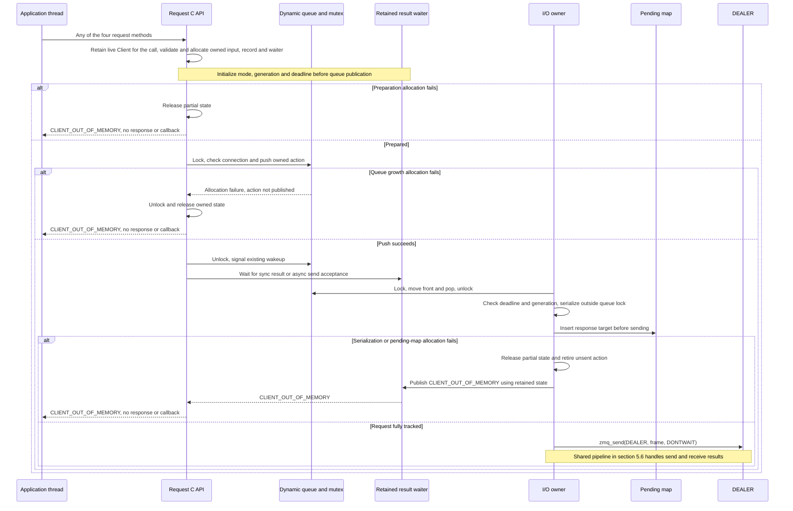
```mermaid
sequenceDiagram
    participant A as Application thread
    participant API as Request C API
    participant Q as Dynamic queue and mutex
    participant W as Retained result waiter
    participant IO as I/O owner
    participant P as Pending map
    participant Z as DEALER
    A->>API: Any of the four request methods
    API->>API: Retain live Client for the call, validate and allocate owned input, record and waiter
    Note over API,W: Initialize mode, generation and deadline before queue publication
    alt Preparation allocation fails
        API->>API: Release partial state
        API-->>A: CLIENT_OUT_OF_MEMORY, no response or callback
    else Prepared
        API->>Q: Lock, check connection and push owned action
        alt Queue growth allocation fails
            Q-->>API: Allocation failure, action not published
            API->>API: Unlock and release owned state
            API-->>A: CLIENT_OUT_OF_MEMORY, no response or callback
        else Push succeeds
            API->>Q: Unlock, signal existing wakeup
            API->>W: Wait for sync result or async send acceptance
            IO->>Q: Lock, move front and pop, unlock
            IO->>IO: Check deadline and generation, serialize outside queue lock
            IO->>P: Insert response target before sending
            alt Serialization or pending-map allocation fails
                IO->>IO: Release partial state and retire unsent action
                IO->>W: Publish CLIENT_OUT_OF_MEMORY using retained state
                W-->>API: CLIENT_OUT_OF_MEMORY
                API-->>A: CLIENT_OUT_OF_MEMORY, no response or callback
            else Request fully tracked
                IO->>Z: zmq_send(DEALER, frame, DONTWAIT)
                Note over IO,Z: Shared pipeline in section 5.6 handles send and receive results
            end
        end
    end
```

### 5.3 General routing: concurrent requests on one connection

Coverage: **AC2.1, AC2.2, AC2.4, AC1.6, AC1.7, AC3.1–AC3.2**.

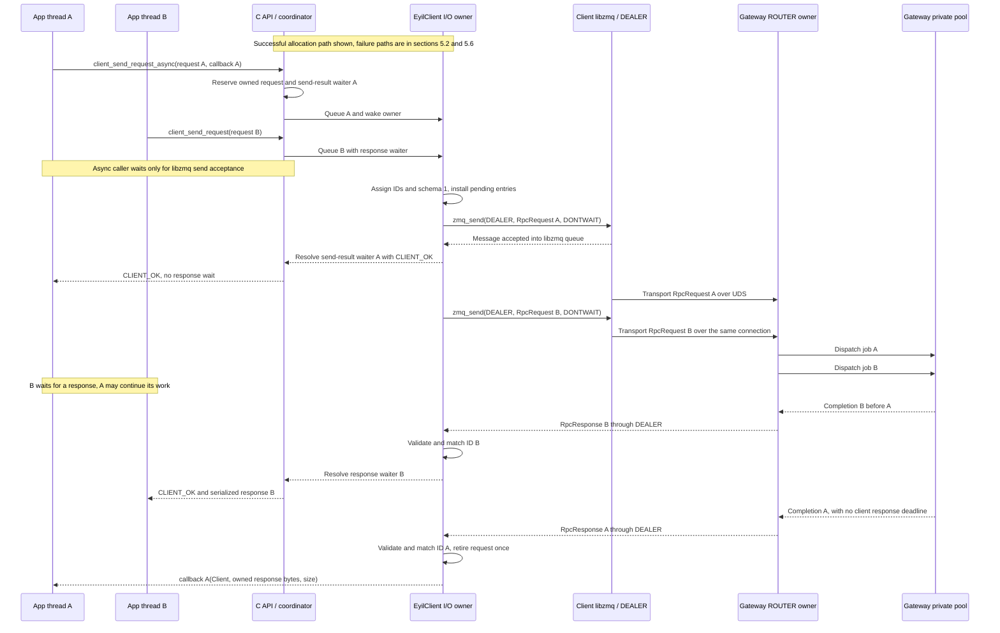
```mermaid
sequenceDiagram
    participant A as App thread A
    participant B as App thread B
    participant API as C API / coordinator
    participant IO as EyilClient I/O owner
    participant Z as Client libzmq / DEALER
    participant GW as Gateway ROUTER owner
    participant W as Gateway private pool
    Note over API,IO: Successful allocation path shown, failure paths are in sections 5.2 and 5.6
    A->>API: client_send_request_async(request A, callback A)
    API->>API: Reserve owned request and send-result waiter A
    API->>IO: Queue A and wake owner
    B->>API: client_send_request(request B)
    API->>IO: Queue B with response waiter
    Note over A,API: Async caller waits only for libzmq send acceptance
    IO->>IO: Assign IDs and schema 1, install pending entries
    IO->>Z: zmq_send(DEALER, RpcRequest A, DONTWAIT)
    Z-->>IO: Message accepted into libzmq queue
    IO-->>API: Resolve send-result waiter A with CLIENT_OK
    API-->>A: CLIENT_OK, no response wait
    Z->>GW: Transport RpcRequest A over UDS
    IO->>Z: zmq_send(DEALER, RpcRequest B, DONTWAIT)
    Z->>GW: Transport RpcRequest B over the same connection
    GW->>W: Dispatch job A
    GW->>W: Dispatch job B
    Note over A,B: B waits for a response, A may continue its work
    W-->>GW: Completion B before A
    GW-->>IO: RpcResponse B through DEALER
    IO->>IO: Validate and match ID B
    IO-->>API: Resolve response waiter B
    API-->>B: CLIENT_OK and serialized response B
    W-->>GW: Completion A, with no client response deadline
    GW-->>IO: RpcResponse A through DEALER
    IO->>IO: Validate and match ID A, retire request once
    IO-->>A: callback A(Client, owned response bytes, size)
```

This is not a strict send/receive alternation. Several callers can wait for
send acceptance while the same I/O owner continues receiving earlier replies.
A successful send does not confirm that the UDS write or Gateway receipt has
occurred. Request-ID correlation routes each response to its own waiter or
registered response handler. Slow callbacks must not monopolize the I/O loop.

### 5.4 Public API index

The public API is declared in
[EyilClient.h](../EyilClient/include/eyilclient/EyilClient.h). All nine methods
have individual sequences below. Both asynchronous request methods are required
public functionality under AC2.4, alongside their synchronous counterparts.

| Method | Behavior | AC coverage |
| --- | --- | --- |
| client_connect | Return a handle after successful handshake; reject an occupied handle slot with CLIENT_ALREADY_CONNECTED; report exact startup/authentication/timeout errors | AC2.1–AC2.3; AC1.3, AC1.5–AC1.6 |
| client_send_request | Binary request with a per-call synchronous waiter | AC2.1, AC2.2, AC2.4 |
| client_send_request_async | Wait for libzmq send acceptance; deliver a later binary response through the supplied callback with no response timeout | AC2.1, AC2.2, AC2.4 |
| client_send_request_string | Copy NUL-terminated request text, use shared RPC coordination and return owned NUL-terminated response text | AC2.1, AC2.4 |
| client_send_request_string_async | Same plain-text boundary with the send-acceptance contract and response-only callback | AC2.1, AC2.4 |
| client_free_response | Release a library-allocated result | AC2.1 |
| client_register_notifications | Return CLIENT_NOT_IMPLEMENTED; reserved for future support | AC2.1 and the public header |
| client_unregister_notifications | Return without changing state; reserved for future support | AC2.1 and the public header |
| client_disconnect | Stop admission/I/O, settle pending work and destroy the handle | AC2.1–AC2.3; AC1.10 on the Gateway side |

#### Allocation failures across the public API

Catch detectable allocation failures at the C API boundary and inside the
I/O owner, including `std::bad_alloc`, failed allocator returns and explicit
ENOMEM from local setup/transport. No C++ allocation exception may escape a
C entry point or terminate the serving loop. Use retained result state to
publish an error; failure reporting and cleanup must not require another heap
allocation. Diagnostics are best effort and must not prevent retirement.

| API | Allocation failure handling |
| --- | --- |
| client_connect | CLIENT_OUT_OF_MEMORY for handle/runtime/setup allocation failure; roll back only this attempt, join any started threads, leave the output NULL |
| client_send_request | CLIENT_OUT_OF_MEMORY for input/envelope/request/waiter/queue/pending-map/send storage or correlated response allocation failure; NULL output and size 0 |
| client_send_request_async | Before send acceptance, return CLIENT_OUT_OF_MEMORY with no response callback; after acceptance, retire a matched response that cannot be allocated with diagnostics and no callback |
| client_send_request_string | Same synchronous rules, including copying input text, constructing the wire request and allocating the response string; return CLIENT_OUT_OF_MEMORY and NULL, releasing temporary storage |
| client_send_request_string_async | Same async rules, including input copying and wire-request preparation before acceptance, and response-string allocation afterward |
| client_free_response | Void, releases storage without allocating; NULL is accepted; no ClientResult is returned |
| client_register_notifications | Always CLIENT_NOT_IMPLEMENTED in this version; no state is allocated or handler retained |
| client_unregister_notifications | Void, no effect or allocation in this version |
| client_disconnect | Void, uses an existing stop flag and wakeup to initiate cleanup without allocating a queue entry; frees retained state, no ClientResult is returned |

For all four request methods, pre-send failure cancels the unsent action and
releases partial state. Failed queue publication cannot leave a hidden request
to be sent later. A failure after sending does not undo remote execution or
make a shared buffer safe to reuse. Never replay the operation to recover a
local allocation failure.

The common receive pipeline in section 5.6 also defines failure before a
response can be correlated. An accepted async send retains CLIENT_OK even if
response processing fails before the submitting thread resumes; its send result
cannot be revised or turned into an error callback.

#### Required asynchronous request behavior

Implement client_send_request_async() and client_send_request_string_async()
using the same connection, request correlation and coordinator as the
synchronous methods. The submitting thread waits for its send result, **not for
the remote response**.

- Validate and copy the request, reserve its pending record and send-result
  waiter, then queue work for the I/O owner.
- Return CLIENT_OK only after that owner successfully calls zmq_send for the
  request. Enqueueing a command in the library's own submission queue is not
  sufficient. EAGAIN remains pending within the 15-second send-submission budget.
- Return validation, allocation, connection or send-submission timeout errors
  directly from the API. A failed submission invokes no response callback.
- After send acceptance, retain the request for a response with **no response
  timeout**. A valid response invokes its registered callback at most once.
- Connection loss or explicit shutdown retires outstanding async records without
  a response callback. Transport loss is reported by the connection-event handler.
  Local failure to validate or allocate a matched response also retires that
  record with diagnostics and no response callback.
- A successful send therefore does not guarantee a later callback. Never
  fabricate a Gateway response or deliver NULL as a synthetic error response.

**Selected send guarantee:** zmq_send success means acceptance into libzmq's
queue. It does not prove physical UDS transmission, Gateway receipt or backend
execution, even with a blocking send. No receipt ACK or Protobuf extension is
required by this contract. See the
[ZeroMQ send contract](https://libzmq.readthedocs.io/en/latest/zmq_send.html).

The string method accepts the same NUL-terminated text as its synchronous
counterpart, without caller encoding. Both asynchronous request methods are
required. Byte-method callers continue to supply and interpret serialized
Protobuf; the plain-text contract applies to the string methods.

#### Async signatures and response ownership

The asynchronous request API uses these signatures:

```c
typedef void (*ClientResponseHandler)(
    Client *client,
    uint8_t *response_data,
    size_t response_size);

typedef void (*ClientStringResponseHandler)(
    Client *client,
    char *response_data);

ClientResult client_send_request_async(
    Client *client,
    const uint8_t *request_data,
    size_t request_size,
    ClientResponseHandler handler);

ClientResult client_send_request_string_async(
    Client *client,
    const char *request_data,
    ClientStringResponseHandler handler);
```

The pending map associates the library-assigned request_id with the handler
supplied for that request. Callback arguments carry the actual response only.
For byte responses, the app inspects RpcStatus and service status. String
responses carry ordinary text, with Gateway/service error representation defined
under TEXT-SERVICE-CONTRACT. The caller releases either result through
client_free_response(). A valid Gateway error response follows the same response
delivery path. ClientNotificationHandler is reserved for future support and is
not used to deliver request results or local errors.

Copy input before returning so the caller may reuse its request storage.
Keep pending bookkeeping and callback code valid until response delivery or
connection teardown. Without a response deadline, a request that never receives
a reply can retain its pending-map entry and memory until teardown. Local
validation/allocation failure retires the affected entry but cannot report a
per-request error through these response-only signatures.

#### Send-result coordination and cancellation

Each async request has two distinct stages: a bounded submission wait and an
unbounded response wait. Use a retained send-result waiter separate from the
pending response record. The I/O owner publishes ACCEPTED or a terminal send
error once; the submitting thread returns that result.

Serialize the nonblocking send attempt and its acceptance publication against
send-deadline cancellation. Check the request's state and deadline before every
attempt. Once cancelled before acceptance, it must never be sent later. If a
nonblocking attempt is already in progress, resolve that attempt before returning
an error that claims the submission failed. A successful acceptance cannot
later be changed into a send timeout by a competing waiter or disconnect event.

After acceptance, disarm the async send deadline. Response arrival and
connection cleanup compete only for ownership of the pending record; retire it
once and discard late/duplicate replies. No async response-expiry task runs.
A local retirement or successful send does not prove backend completion or make
a shared buffer safe to reuse.

#### Request-callback execution model

- Invoke response callbacks on the owning Client's serving/I/O thread, without
  internal state/queue locks held. Callbacks are serialized within a Client;
  different Clients can invoke callbacks concurrently.
- Retire the pending record before calling application code, and keep the Client
  and response storage alive for the invocation.
- Never call the handler inline on the submission call stack. A fast response
  can invoke it on the I/O owner before the submitting thread resumes from its
  send-result wait; prepare application state before making the API call.
- A response callback may call client_free_response. Schedule new requests and
  other work on an application thread.
- All request APIs, including async submission, can wait for the I/O owner.
  Calling them from that owner's callback would deadlock. Detect this case and
  return CLIENT_INVALID_ARGUMENT before admission. Do not call client_connect
  or client_disconnect from the callback either.
- Callbacks must return promptly so other sends, replies, monitor events and
  active deadlines can progress.

These rules do not depend on AppManager or the Crypto backend. Explicit
disconnect closes callback admission, resolves unresolved sync/send-result
waiters with CLIENT_NOT_CONNECTED, retires async response records and waits for
already-claimed callbacks and live calls before destroying the handle. Section
5.13 defines the complete ordering. Section 5.5 defines the connection-handler
contract: startup uses the synchronous result, later unexpected loss emits
CLIENT_CONNECTION_LOST and explicit close emits no connection callback.

### 5.5 client_connect()

Coverage: **AC2.1–AC2.3; AC1.3, AC1.5–AC1.6**.

#### Handle ownership and CLIENT_ALREADY_CONNECTED

The API treats `Client **client` as an input/output handle slot.
Initialize it before the first call, for example `Client *client = NULL`.

- If `client == NULL`, return CLIENT_INVALID_ARGUMENT without dereferencing it.
- If `*client != NULL` and contains a valid Client handle that has not been
  destroyed, return CLIENT_ALREADY_CONNECTED immediately. Preserve that handle,
  its registered handler, pending requests and connection state. Do not allocate
  a runtime, start threads, connect another socket or invoke a callback for the
  rejected call.
- If `*client == NULL`, start a new connection attempt. Publish the handle only
  on CLIENT_OK; on startup failure the slot remains NULL after rollback.

CLIENT_ALREADY_CONNECTED is local handle-ownership validation, not a Gateway
rejection or a restriction to one connection per process, UID or app. A separate
NULL-initialized slot may create another independent Client. An existing handle
still occupies its slot after transport loss; calling client_connect with it is
not a reconnect API and returns CLIENT_ALREADY_CONNECTED. To reconnect, call
client_disconnect on the old handle from an application thread, reset the slot
to NULL and call client_connect again. The new call creates a fresh runtime and
authenticated session; the old handle never returns to READY after loss.

The caller must serialize access to the same handle slot, including concurrent
connect attempts. Uninitialized, fabricated or destroyed handles are invalid
API usage. After client_disconnect destroys a handle, the caller must reset its
own slot to NULL before reusing it: client_disconnect takes Client*, so it cannot
clear the caller's variable.

#### Readiness contract

**Agreed readiness contract:** return CLIENT_OK and publish a valid Client
handle only after local startup has succeeded and the client monitor receives
`ZMQ_EVENT_HANDSHAKE_SUCCEEDED` for the pending connection attempt. The
application can then immediately submit RPC requests. Gateway completes
NotifyAppState(CONNECTED) during authentication before returning ZAP success.
Crypto is available before Gateway activation; RPCs carry operation results.

The startup coordinator waits for handshake success or a terminal failure
within a **15-second connect deadline**. Deadline expiry returns CLIENT_TIMEOUT;
explicit authentication rejection returns CLIENT_AUTH_FAILED. Section 5.14
defines the common duration constant and its application to each timed wait.

#### Connection callback contract

client_connect is synchronous. Its return value reports the initial connection
outcome; the connection handler reports only a later unexpected loss.

| Situation | API result | Connection callback |
| --- | --- | --- |
| Initial setup and authentication succeed | CLIENT_OK with a valid Client handle | None |
| Initial connection attempt fails | Exact ClientResult, including CLIENT_AUTH_FAILED for an explicit authentication denial; output remains NULL | None |
| An established connection is lost unexpectedly | Retire pending work using section 5.14; later request submissions return CLIENT_NOT_CONNECTED | CLIENT_CONNECTION_LOST once, if the registered handler can be claimed before explicit close shuts callback admission |
| Application calls client_disconnect | Synchronous local cleanup, void return | None for the intentional close; an already-claimed loss callback may finish before disconnect returns |

CLIENT_CONNECTION_RESTORED and CLIENT_CONNECTION_TERMINATED are unused in this
design. A fresh explicit client_connect reports its own success or failure
through its return value. Authentication denial occurs during that call's
handshake and returns CLIENT_AUTH_FAILED; it does not generate TERMINATED.
An established socket closing does not by itself identify an authentication
failure. Automatic reconnect and in-place reauthentication are not part of
this lifecycle. Any future use of RESTORED or TERMINATED requires an explicit
lifecycle contract under TODO(RECONNECT-LIFECYCLE); the enum declarations alone
do not define that behavior.

Keep connection-callback delivery disabled while the handle is unpublished.
Serialize successful handle publication with enabling loss-callback delivery;
retain a loss detected after startup success until it can be delivered with the
published handle. Failed startup never exposes an incomplete Client through a
callback. A genuine loss immediately after readiness can race the calling
thread's resumption; it is a distinct loss event, not a startup-success callback.
Section 5.13 defines callback claims and quiescence during explicit close.

#### Socket settings for a fresh connection

Set these options on each new client DEALER before zmq_connect:

| Option | Required setting | Purpose |
| --- | --- | --- |
| ZMQ_RECONNECT_IVL | -1 | Disable libzmq automatic reconnection |
| ZMQ_IMMEDIATE | 1 | Queue sends only on completed connections |
| ZMQ_LINGER | 0 | Discard unsent transport messages when closing the socket |

Also set zero linger on the client monitor socket. Retain the library's
HANDSHAKE_SUCCEEDED admission barrier and nonblocking sends; IMMEDIATE does not
replace readiness validation. Closing the old socket is required to retire its
transport queues. These options do not cancel messages already received by
Gateway or prove remote completion. See the
[ZeroMQ socket options](https://libzmq.readthedocs.io/en/latest/zmq_setsockopt.html).

The 15-second connect deadline still bounds readiness waiting for a new attempt.
It does not create an automatic retry loop. If startup fails, roll back that
attempt; another attempt requires a new explicit client_connect call. A terminal
failure returns its mapped error promptly; an attempt still pending at the
deadline returns CLIENT_TIMEOUT.

#### Disabled ZeroMQ heartbeats

**Decision: ZeroMQ transport heartbeats are disabled on both the client's
DEALER and Gateway's ROUTER.** Apply these settings before connect/bind and
whenever either socket is recreated:

| Option | Required setting | Meaning |
| --- | --- | --- |
| ZMQ_HEARTBEAT_IVL | 0 | Do not send periodic ZMTP PING commands |
| ZMQ_HEARTBEAT_TIMEOUT | 0 | No active heartbeat timeout while the heartbeat interval is disabled |
| ZMQ_HEARTBEAT_TTL | 0 | Do not request heartbeat-based expiry at the peer |

Configure the disabled values before zmq_connect()/zmq_bind() and after socket
recreation. These settings apply when establishing the connection. See the
[ZeroMQ socket-option contract](https://libzmq.readthedocs.io/en/latest/zmq_setsockopt.html).

Freezing an application also stops its libzmq threads. Disabling transport
heartbeats avoids disconnecting that preserved idle connection merely because
the frozen client cannot exchange heartbeat traffic. This does not guarantee
survival across Gateway failure, actual socket closure or checkpoint/restore
that replaces descriptors.

Keep the PAIR monitors and the 15-second connect, synchronous-request and
async-send deadlines. Async responses have no timeout. There is no application
heartbeat RPC, heartbeat worker, idle-expiry timer or inactivity watchdog.

Gateway serves requests and owns connection resources; it does not supervise
application health. An idle, completely hung process may retain its socket and
bounded connection state until actual disconnection or an explicitly agreed
platform lifecycle action. Protect other clients through quotas, fair scheduling
and nonblocking sends; do not add responsiveness probes or heartbeat expiry.

#### Connection sequence

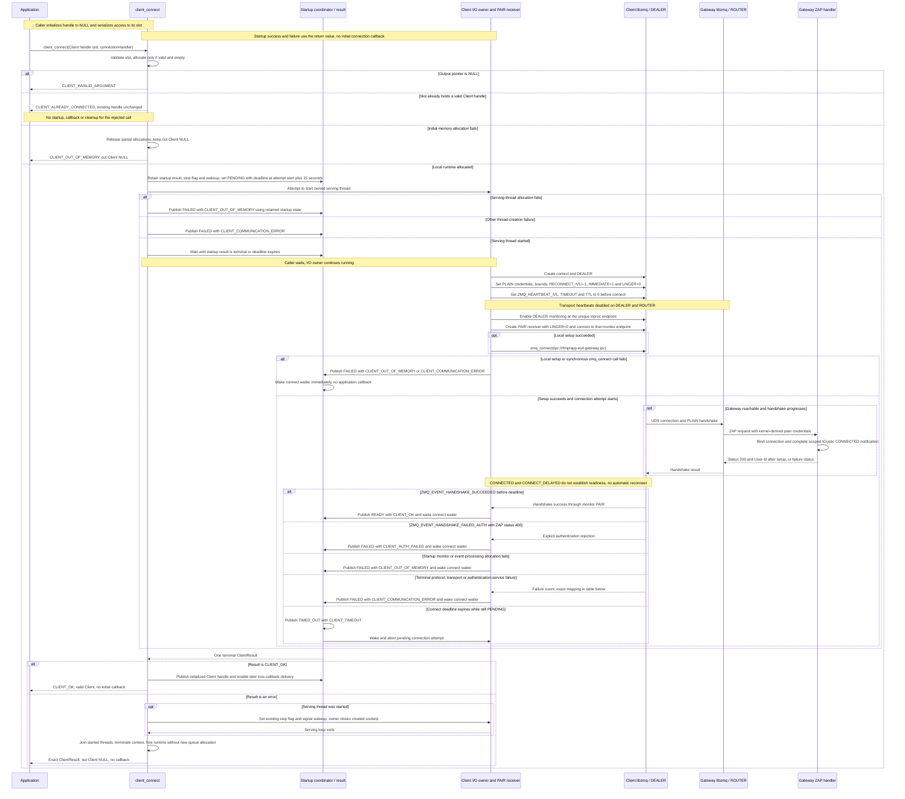
```mermaid
sequenceDiagram
    participant A as Application
    participant API as client_connect
    participant C as Startup coordinator / result
    participant IO as Client I/O owner and PAIR receiver
    participant Z as Client libzmq / DEALER
    participant GW as Gateway libzmq / ROUTER
    participant G as Gateway ZAP handler
    Note over A,API: Caller initializes handle to NULL and serializes access to its slot
    Note over API,IO: Startup success and failure use the return value, no initial connection callback
    A->>API: client_connect(Client handle slot, connectionHandler)
    API->>API: Validate slot, allocate only if valid and empty
    alt Output pointer is NULL
        API-->>A: CLIENT_INVALID_ARGUMENT
    else Slot already holds a valid Client handle
        API-->>A: CLIENT_ALREADY_CONNECTED, existing handle unchanged
        Note over A,API: No startup, callback or cleanup for the rejected call
    else Initial memory allocation fails
        API->>API: Release partial allocations, keep out Client NULL
        API-->>A: CLIENT_OUT_OF_MEMORY, out Client NULL
    else Local runtime allocated
        API->>C: Retain startup result, stop flag and wakeup, set PENDING with deadline at attempt start plus 15 seconds
        API->>IO: Attempt to start owned serving thread
        alt Serving-thread allocation fails
            API->>C: Publish FAILED with CLIENT_OUT_OF_MEMORY using retained startup state
        else Other thread-creation failure
            API->>C: Publish FAILED with CLIENT_COMMUNICATION_ERROR
        else Serving thread started
            API->>C: Wait until startup result is terminal or deadline expires
            Note over API,IO: Caller waits, I/O owner continues running
            IO->>Z: Create context and DEALER
            IO->>Z: Set PLAIN credentials, bounds, RECONNECT_IVL=-1, IMMEDIATE=1 and LINGER=0
            IO->>Z: Set ZMQ_HEARTBEAT_IVL, TIMEOUT and TTL to 0 before connect
            Note over IO,GW: Transport heartbeats disabled on DEALER and ROUTER
            IO->>Z: Enable DEALER monitoring at the unique inproc endpoint
            IO->>Z: Create PAIR receiver with LINGER=0 and connect to that monitor endpoint
            opt Local setup succeeded
                IO->>Z: zmq_connect(ipc:///tmp/app-eyil-gateway.ipc)
            end
            alt Local setup or synchronous zmq_connect call fails
                IO->>C: Publish FAILED with CLIENT_OUT_OF_MEMORY or CLIENT_COMMUNICATION_ERROR
                C->>C: Wake connect waiter immediately, no application callback
            else Setup succeeds and connection attempt starts
                opt Gateway reachable and handshake progresses
                    Z->>GW: UDS connection and PLAIN handshake
                    GW->>G: ZAP request with kernel-derived peer credentials
                    G->>G: Bind connection and complete scoped ICrypto CONNECTED notification
                    G-->>GW: Status 200 and User-Id after setup, or failure status
                    GW-->>Z: Handshake result
                end
                Note over IO,Z: CONNECTED and CONNECT_DELAYED do not establish readiness, no automatic reconnect
                alt ZMQ_EVENT_HANDSHAKE_SUCCEEDED before deadline
                    Z-->>IO: Handshake success through monitor PAIR
                    IO->>C: Publish READY with CLIENT_OK and wake connect waiter
                else ZMQ_EVENT_HANDSHAKE_FAILED_AUTH with ZAP status 400
                    Z-->>IO: Explicit authentication rejection
                    IO->>C: Publish FAILED with CLIENT_AUTH_FAILED and wake connect waiter
                else Startup monitor or event-processing allocation fails
                    IO->>C: Publish FAILED with CLIENT_OUT_OF_MEMORY and wake connect waiter
                else Terminal protocol, transport or authentication-service failure
                    Z-->>IO: Failure event, exact mapping in table below
                    IO->>C: Publish FAILED with CLIENT_COMMUNICATION_ERROR and wake connect waiter
                else Connect deadline expires while still PENDING
                    C->>C: Publish TIMED_OUT with CLIENT_TIMEOUT
                    C->>IO: Wake and abort pending connection attempt
                end
            end
        end
        C-->>API: One terminal ClientResult
        alt Result is CLIENT_OK
            API->>C: Publish initialized Client handle and enable later loss-callback delivery
            API-->>A: CLIENT_OK, valid Client, no initial callback
        else Result is an error
            opt Serving thread was started
                API->>IO: Set existing stop flag and signal wakeup, owner closes created sockets
                IO-->>API: Serving loop exits
            end
            API->>API: Join started threads, terminate context, free runtime without new queue allocation
            API-->>A: Exact ClientResult, out Client NULL, no callback
        end
    end
```

Startup state includes the stop flag and wakeup needed for rollback. A detected
allocation failure during serving-thread creation or owner-side setup publishes
CLIENT_OUT_OF_MEMORY through that retained state. Other startup failures use
CLIENT_COMMUNICATION_ERROR. Cleanup only stops or joins threads that actually
started and does not allocate a shutdown action.

#### Exact initial-connect outcomes

| Condition / monitor event | Startup action | client_connect result |
| --- | --- | --- |
| Output argument `Client **client` is NULL | Reject before creating runtime state | CLIENT_INVALID_ARGUMENT |
| `*client` already holds a valid, not-yet-destroyed Client handle, including after transport loss | Reject before allocating or starting another connection; preserve the existing handle, handler and state | CLIENT_ALREADY_CONNECTED, original handle unchanged |
| Client/runtime/serving-thread allocation fails, including an explicit ENOMEM from local setup or startup event processing | Stop/roll back any initialized resources | CLIENT_OUT_OF_MEMORY, output NULL |
| Non-memory context/socket/monitor/thread setup failure, or synchronous zmq_connect error | Publish FAILED and stop the attempt | CLIENT_COMMUNICATION_ERROR, output NULL |
| ZMQ_EVENT_CONNECTED | Keep PENDING; transport connection alone is insufficient | No return yet |
| ZMQ_EVENT_CONNECT_DELAYED | Keep PENDING within the original deadline; do not create another connection attempt | No return yet |
| ZMQ_EVENT_HANDSHAKE_SUCCEEDED while PENDING and before the deadline | Publish READY and wake caller | CLIENT_OK, valid output handle |
| ZMQ_EVENT_HANDSHAKE_FAILED_AUTH with ZAP status 400 | Publish FAILED and wake caller immediately | CLIENT_AUTH_FAILED, output NULL |
| ZMQ_EVENT_HANDSHAKE_FAILED_AUTH with ZAP status 300 or 500 | End this connect attempt as an authentication-service failure | CLIENT_COMMUNICATION_ERROR, output NULL |
| ZMQ_EVENT_HANDSHAKE_FAILED_PROTOCOL | Publish FAILED and wake caller immediately | CLIENT_COMMUNICATION_ERROR, output NULL |
| ZMQ_EVENT_HANDSHAKE_FAILED_NO_DETAIL | Publish FAILED and wake caller immediately | CLIENT_COMMUNICATION_ERROR, output NULL |
| ZMQ_EVENT_DISCONNECTED before initial readiness | End this connect attempt and wake caller | CLIENT_COMMUNICATION_ERROR, output NULL |
| Monitor/receive processing terminates unexpectedly for a non-memory reason while startup is PENDING | Publish FAILED and wake caller | CLIENT_COMMUNICATION_ERROR, output NULL |
| Absolute connection deadline expires while startup is PENDING, including an unavailable endpoint without a terminal failure event | Publish TIMED_OUT; stop and clean up the attempt | CLIENT_TIMEOUT, output NULL |

The monitor's HANDSHAKE_FAILED_AUTH event carries the ZAP status: 400 is an
authentication denial, 300 a temporary authentication-service error and 500 an
internal authentication-service error. This client contract ends the current
connect call on those explicit failures, preserving CLIENT_AUTH_FAILED for a
denial. Event and status definitions:
[ZeroMQ monitor API](https://libzmq.readthedocs.io/en/latest/zmq_socket_monitor.html),
[ZAP specification](https://rfc.zeromq.org/spec/27/).

`zmq_connect()` returning zero and receiving ZMQ_EVENT_CONNECTED are both
insufficient for CLIENT_OK. Successful handshake detection is the agreed
readiness barrier. The client sends no extra Crypto request or AppManager
probe; Gateway performs CONNECTED during authentication as in section 6.5.

The startup coordinator stores a terminal result, rather than only a
`connected` boolean. The wait predicate is `startupState != PENDING` with an
absolute monotonic deadline. Success and explicit failures publish the result
and notify the waiter; the timeout path publishes CLIENT_TIMEOUT. Synchronize
these transitions so one attempt has one final outcome. A late handshake event
cannot revive a timed-out or failed attempt or restart its deadline. After a
previously successful client_connect, connection loss is terminal and recovery
uses a new explicit connection as defined in section 5.14.

On failure of a new connection attempt from an empty slot, keep the output
handle NULL, close created sockets on their owner, stop/join started threads,
terminate the owned context and free the incomplete handle before returning.
CLIENT_ALREADY_CONNECTED is an earlier rejection: preserve the existing handle
and do not run startup rollback against it. The deadline bounds the readiness
wait; safe rollback still has to finish. Return every startup outcome through
client_connect alone, without a connection callback. Handshake success does
not emit RESTORED, and authentication denial does not emit TERMINATED. Only a
separate unexpected loss after startup success can enter the loss-callback path
defined above.

### 5.6 client_send_request()

Coverage: **AC2.1, AC2.2, AC2.4**; Crypto use also supports **AC3.1–AC3.2**.

The caller supplies one serialized RpcRequest containing the service and its
opaque payload. The library parses that envelope, replaces request_id and
schema_version, and serializes the outgoing request. It validates the returning
RpcResponse and gives the caller its complete serialized bytes. It does not
parse CryptoRequest or CryptoResponse. No additional service argument or byte
API signature change is needed for this agreed envelope handling.

#### Submission and synchronous wait

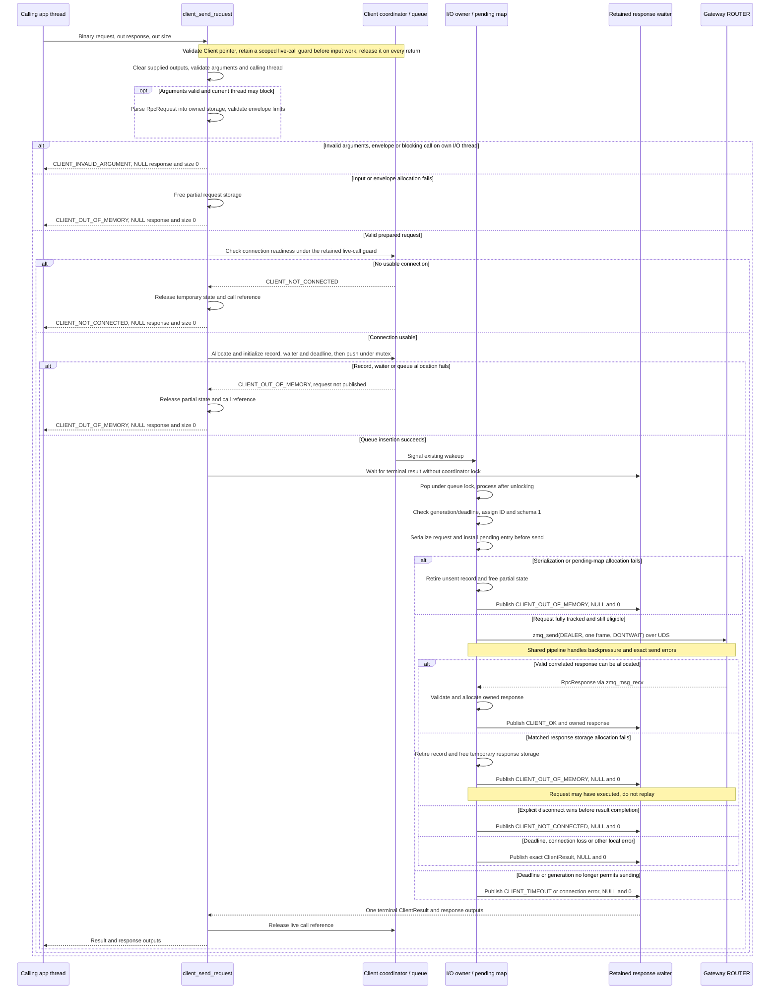
```mermaid
sequenceDiagram
    participant A as Calling app thread
    participant API as client_send_request
    participant C as Client coordinator / queue
    participant IO as I/O owner / pending map
    participant W as Retained response waiter
    participant G as Gateway ROUTER
    A->>API: Binary request, out response, out size
    Note over API,C: Validate Client pointer, retain a scoped live-call guard before input work, release it on every return
    API->>API: Clear supplied outputs, validate arguments and calling thread
    opt Arguments valid and current thread may block
        API->>API: Parse RpcRequest into owned storage, validate envelope limits
    end
    alt Invalid arguments, envelope or blocking call on own I/O thread
        API-->>A: CLIENT_INVALID_ARGUMENT, NULL response and size 0
    else Input or envelope allocation fails
        API->>API: Free partial request storage
        API-->>A: CLIENT_OUT_OF_MEMORY, NULL response and size 0
    else Valid prepared request
        API->>C: Check connection readiness under the retained live-call guard
        alt No usable connection
            C-->>API: CLIENT_NOT_CONNECTED
            API->>API: Release temporary state and call reference
            API-->>A: CLIENT_NOT_CONNECTED, NULL response and size 0
        else Connection usable
            API->>C: Allocate and initialize record, waiter and deadline, then push under mutex
            alt Record, waiter or queue allocation fails
                C-->>API: CLIENT_OUT_OF_MEMORY, request not published
                API->>API: Release partial state and call reference
                API-->>A: CLIENT_OUT_OF_MEMORY, NULL response and size 0
            else Queue insertion succeeds
                C->>IO: Signal existing wakeup
                API->>W: Wait for terminal result without coordinator lock
                IO->>IO: Pop under queue lock, process after unlocking
                IO->>IO: Check generation/deadline, assign ID and schema 1
                IO->>IO: Serialize request and install pending entry before send
                alt Serialization or pending-map allocation fails
                    IO->>IO: Retire unsent record and free partial state
                    IO->>W: Publish CLIENT_OUT_OF_MEMORY, NULL and 0
                else Request fully tracked and still eligible
                    IO->>G: zmq_send(DEALER, one frame, DONTWAIT) over UDS
                    Note over IO,G: Shared pipeline handles backpressure and exact send errors
                    alt Valid correlated response can be allocated
                        G-->>IO: RpcResponse via zmq_msg_recv
                        IO->>IO: Validate and allocate owned response
                        IO->>W: Publish CLIENT_OK and owned response
                    else Matched response storage allocation fails
                        IO->>IO: Retire record and free temporary response storage
                        IO->>W: Publish CLIENT_OUT_OF_MEMORY, NULL and 0
                        Note over IO,G: Request may have executed, do not replay
                    else Explicit disconnect wins before result completion
                        IO->>W: Publish CLIENT_NOT_CONNECTED, NULL and 0
                    else Deadline, connection loss or other local error
                        IO->>W: Publish exact ClientResult, NULL and 0
                    end
                else Deadline or generation no longer permits sending
                    IO->>W: Publish CLIENT_TIMEOUT or connection error, NULL and 0
                end
                W-->>API: One terminal ClientResult and response outputs
                API->>C: Release live call reference
                API-->>A: Result and response outputs
            end
        end
    end
```

Before dereferencing outputs, validate their addresses; clear every supplied
output even if another required argument is missing. Require a non-NULL live
Client, non-NULL input with nonzero bounded length, and both output pointers.
An empty/default envelope or RPC_SERVICE_UNSPECIFIED is invalid. Other numeric
service values can reach Gateway, which determines support. Validate Protobuf
parsing and common message limits without interpreting the service payload.
Caller-supplied request_id and schema_version are ignored and overwritten.

The request record owns its parsed data, completion state and connection
generation. Application input need remain valid only for the API call. Allocate
the owned request and completion bookkeeping before acceptance. For async
calls the same preparation completes before returning CLIENT_OK. Neither API
may leave a queued pointer into temporary caller storage.

#### Shared nonblocking send and receive pipeline

This pipeline serves all four request APIs. Socket operations, pending-map
mutation and monitor processing belong to the I/O owner. A record identifies
whether its caller waits for a synchronous result or only for async send
acceptance. Sync requests retain their total deadline after send; async requests
disarm their submission deadline once libzmq accepts the message.

Explicit local close uses CLIENT_NOT_CONNECTED for still-pending API results;
unexpected transport loss uses CLIENT_COMMUNICATION_ERROR. Preserve any result
that already won completion. No callback or send attempt can be newly admitted
after the local-close cutoff; section 5.13 covers an attempt already in progress.

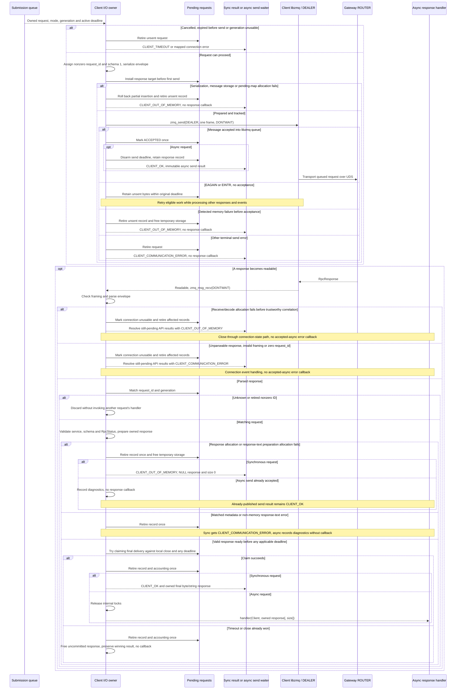
```mermaid
sequenceDiagram
    participant Q as Submission queue
    participant IO as Client I/O owner
    participant P as Pending requests
    participant W as Sync result or async send waiter
    participant Z as Client libzmq / DEALER
    participant G as Gateway ROUTER
    participant H as Async response handler
    Q-->>IO: Owned request, mode, generation and active deadline
    alt Cancelled, expired before send or generation unusable
        IO->>P: Retire unsent request
        IO-->>W: CLIENT_TIMEOUT or mapped connection error
    else Request can proceed
        IO->>IO: Assign nonzero request_id and schema 1, serialize envelope
        IO->>P: Install response target before first send
        alt Serialization, message storage or pending-map allocation fails
            IO->>P: Roll back partial insertion and retire unsent record
            IO-->>W: CLIENT_OUT_OF_MEMORY, no response callback
        else Prepared and tracked
            IO->>Z: zmq_send(DEALER, one frame, DONTWAIT)
            alt Message accepted into libzmq queue
                IO->>P: Mark ACCEPTED once
                opt Async request
                    IO->>P: Disarm send deadline, retain response record
                    IO-->>W: CLIENT_OK, immutable async send result
                end
                Z->>G: Transport queued request over UDS
            else EAGAIN or EINTR, no acceptance
                IO->>P: Retain unsent bytes within original deadline
                Note over IO,Z: Retry eligible work while processing other responses and events
            else Detected memory failure before acceptance
                IO->>P: Retire unsent record and free temporary storage
                IO-->>W: CLIENT_OUT_OF_MEMORY, no response callback
            else Other terminal send error
                IO->>P: Retire request
                IO-->>W: CLIENT_COMMUNICATION_ERROR, no response callback
            end
        end
    end
    opt A response becomes readable
        G-->>Z: RpcResponse
        Z-->>IO: Readable, zmq_msg_recv(DONTWAIT)
        IO->>IO: Check framing and parse envelope
        alt Receive/decode allocation fails before trustworthy correlation
            IO->>P: Mark connection unusable and retire affected records
            IO-->>W: Resolve still-pending API results with CLIENT_OUT_OF_MEMORY
            Note over IO,H: Close through connection-state path, no accepted-async error callback
        else Unparseable response, invalid framing or zero request_id
            IO->>P: Mark connection unusable and retire affected records
            IO-->>W: Resolve still-pending API results with CLIENT_COMMUNICATION_ERROR
            Note over IO,H: Connection event handling, no accepted-async error callback
        else Parsed response
            IO->>P: Match request_id and generation
            alt Unknown or retired nonzero ID
                IO->>IO: Discard without invoking another request's handler
            else Matching request
                IO->>IO: Validate service, schema and RpcStatus, prepare owned response
                alt Response allocation or response-text preparation allocation fails
                    IO->>P: Retire record once and free temporary storage
                    alt Synchronous request
                        IO-->>W: CLIENT_OUT_OF_MEMORY, NULL response and size 0
                    else Async send already accepted
                        IO->>IO: Record diagnostics, no response callback
                        Note over IO,H: Already-published send result remains CLIENT_OK
                    end
                else Matched metadata or non-memory response-text error
                    IO->>P: Retire record once
                    Note over IO,H: Sync gets CLIENT_COMMUNICATION_ERROR, async records diagnostics without callback
                else Valid response ready before any applicable deadline
                    IO->>P: Try claiming final delivery against local close and any deadline
                    alt Claim succeeds
                        IO->>P: Retire record and accounting once
                        alt Synchronous request
                            IO-->>W: CLIENT_OK and owned final byte/string response
                        else Async request
                            IO->>IO: Release internal locks
                            IO-->>H: handler(Client, owned response[, size])
                        end
                    else Timeout or close already won
                        IO->>P: Retire record and accounting once
                        IO->>IO: Free uncommitted response, preserve winning result, no callback
                    end
                end
            end
        end
    end
```

Implementation rules:

- Install the response target before sending, so even an immediate reply can
  be correlated. Serialization, message-storage and pending-map allocation
  failures retire only the affected unsent request, publish
  CLIENT_OUT_OF_MEMORY through its retained waiter and leave other requests
  progressing. Use one DEALER body frame without a REQ-style delimiter.
- A successful zmq_send is the async return boundary: libzmq queued the message.
  Do not claim physical delivery or submit it again. EAGAIN permits retry only
  for work that has not been accepted, within its original active deadline.
  EINTR permits retry while the request remains eligible. Other terminal send
  failures return CLIENT_COMMUNICATION_ERROR; explicit memory failures return
  CLIENT_OUT_OF_MEMORY. See
  [zmq_send](https://libzmq.readthedocs.io/en/latest/zmq_send.html).
- Receive with zmq_msg_recv and check ZMQ_RCVMORE. EAGAIN means nothing to read;
  EINTR permits retry. Drain malformed multipart input without treating its
  remaining frames as separate responses. See
  [zmq_msg_recv](https://libzmq.readthedocs.io/en/latest/zmq_msg_recv.html).
- A detected receive/decode allocation failure before trustworthy request-ID
  correlation cannot safely be attributed to one request. Mark the connection
  unusable and close it on its owner. Resolve still-pending synchronous results
  and unaccepted async send waiters with CLIENT_OUT_OF_MEMORY; retire accepted
  async records and report CLIENT_CONNECTION_LOST through the connection-state
  path. Do not use a partly parsed ID to fail an unrelated request. Complete
  cleanup with retained state, without allocating another control action.
- Uncorrelatable malformed input makes the connection unusable under the
  terminal-loss policy. Resolve pending synchronous and not-yet-accepted send
  waiters with CLIENT_COMMUNICATION_ERROR. Retire accepted async response
  records and report connection loss through the connection-state path.
- A parsed nonzero ID absent from the pending map is discarded. It may be a
  late synchronous reply or a duplicate; it is not a notification.
- A matched response must have the expected service, schema version 1 and a
  known nonzero RpcStatus. A valid Gateway error response is still delivered
  normally: sync returns CLIENT_OK with bytes, async invokes its response
  handler. The service consumer interprets CryptoResponse.
- Matched metadata failure returns CLIENT_COMMUNICATION_ERROR to a synchronous
  waiter; matched response allocation failure returns CLIENT_OUT_OF_MEMORY.
  For an async record whose send succeeded, retire it with diagnostics and no
  response callback. Its send result remains CLIENT_OK, even if its submitting
  thread has not resumed yet. These signatures have no post-send error channel.
- Returned response storage must be compatible with client_free_response.
  String methods prepare NUL-terminated response text according to the service
  contract; they do not return the serialized binary envelope as a C string.
  If response-text preparation fails, apply the same sync-error/async-retirement
  distinction. Never truncate binary data at an embedded NUL to report success.
- Prepare the final byte or string result before claiming synchronous success
  or an async callback. Serialize that claim with explicit close and any active
  synchronous deadline. If another terminal path wins during preparation, free
  the uncommitted result; a received envelope alone does not commit public success.
- Retire request accounting once and free temporary Protobuf/ZMQ storage on
  every terminal path. Late replies cannot revive a retired request.

The connection-wide handling of an uncorrelatable malformed response or decode
allocation failure follows the terminal cleanup path in section 5.14, preserving
the error mappings above. Recovery requires explicit close and a fresh connect.
An allocation failure after trustworthy correlation affects only that request.
No async response deadline or synthetic local-error RpcResponse is introduced.

#### Synchronous timeout, disconnect and response races

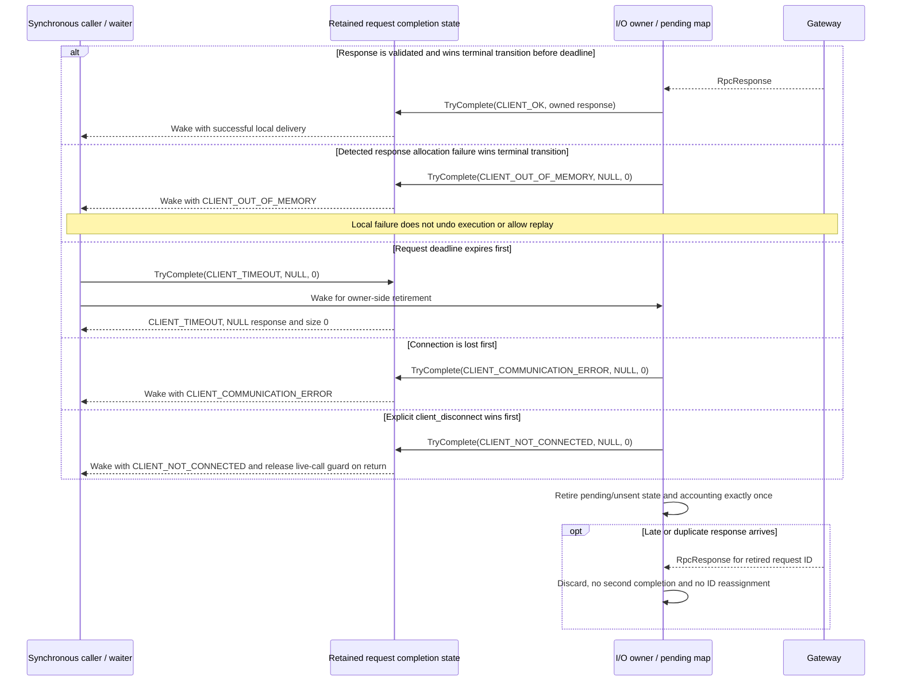
```mermaid
sequenceDiagram
    participant A as Synchronous caller / waiter
    participant R as Retained request completion state
    participant IO as I/O owner / pending map
    participant G as Gateway
    alt Response is validated and wins terminal transition before deadline
        G-->>IO: RpcResponse
        IO->>R: TryComplete(CLIENT_OK, owned response)
        R-->>A: Wake with successful local delivery
    else Detected response allocation failure wins terminal transition
        IO->>R: TryComplete(CLIENT_OUT_OF_MEMORY, NULL, 0)
        R-->>A: Wake with CLIENT_OUT_OF_MEMORY
        Note over A,G: Local failure does not undo execution or allow replay
    else Request deadline expires first
        A->>R: TryComplete(CLIENT_TIMEOUT, NULL, 0)
        A->>IO: Wake for owner-side retirement
        R-->>A: CLIENT_TIMEOUT, NULL response and size 0
    else Connection is lost first
        IO->>R: TryComplete(CLIENT_COMMUNICATION_ERROR, NULL, 0)
        R-->>A: Wake with CLIENT_COMMUNICATION_ERROR
    else Explicit client_disconnect wins first
        IO->>R: TryComplete(CLIENT_NOT_CONNECTED, NULL, 0)
        R-->>A: Wake with CLIENT_NOT_CONNECTED and release live-call guard on return
    end
    IO->>IO: Retire pending/unsent state and accounting exactly once
    opt Late or duplicate response arrives
        G-->>IO: RpcResponse for retired request ID
        IO->>IO: Discard, no second completion and no ID reassignment
    end
```

The waiter and I/O owner share a retained completion object, not a pointer to
the caller's stack. TryComplete publishes the result and its response ownership
atomically with respect to other terminal paths. If a prepared response loses
that race, its storage is freed internally. The I/O owner alone removes pending
entries; a caller-side timeout marks completion and wakes that owner. The queued
record stays alive until owner-side retirement, even if the caller has returned.
This response-deadline race applies to synchronous requests only. For async
submission, section 5.4 defines the separate send-result race; after acceptance,
an async request has no response deadline. A cancelled unsent record must never
be sent later. Check a synchronous request's absolute deadline when claiming its
response as well as when processing timers.

On every local failure, return NULL response and size zero. A timeout ends the
local wait; it does not cancel remote work, release remote buffers or authorize
replay. A valid response containing a non-OK RpcStatus still returns CLIENT_OK;
the caller inspects that status and eventually calls client_free_response.

The 15-second synchronous deadline is selected. The queue and pending map grow
dynamically; detected allocation failures use CLIENT_OUT_OF_MEMORY, with no
local queue-full result. Section 5.14 defines terminal loss and explicit reconnect.
Section 5.13 defines explicit-close results and callback quiescence. Per-message
size bounds remain under RESOURCE-LIMITS in section 7.3.

### 5.7 client_send_request_async()

Coverage: **AC2.1, AC2.2, AC2.4**.

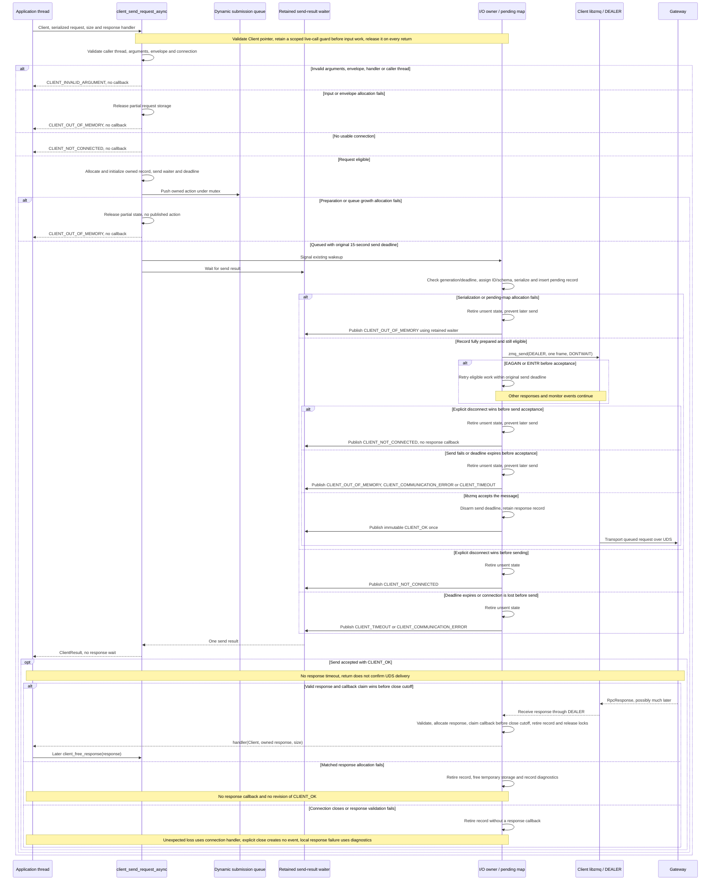
```mermaid
sequenceDiagram
    participant A as Application thread
    participant API as client_send_request_async
    participant Q as Dynamic submission queue
    participant W as Retained send-result waiter
    participant IO as I/O owner / pending map
    participant Z as Client libzmq / DEALER
    participant G as Gateway
    A->>API: Client, serialized request, size and response handler
    Note over API,IO: Validate Client pointer, retain a scoped live-call guard before input work, release it on every return
    API->>API: Validate caller thread, arguments, envelope and connection
    alt Invalid arguments, envelope, handler or caller thread
        API-->>A: CLIENT_INVALID_ARGUMENT, no callback
    else Input or envelope allocation fails
        API->>API: Release partial request storage
        API-->>A: CLIENT_OUT_OF_MEMORY, no callback
    else No usable connection
        API-->>A: CLIENT_NOT_CONNECTED, no callback
    else Request eligible
        API->>API: Allocate and initialize owned record, send waiter and deadline
        API->>Q: Push owned action under mutex
        alt Preparation or queue growth allocation fails
            API->>API: Release partial state, no published action
            API-->>A: CLIENT_OUT_OF_MEMORY, no callback
        else Queued with original 15-second send deadline
            API->>IO: Signal existing wakeup
            API->>W: Wait for send result
            IO->>IO: Check generation/deadline, assign ID/schema, serialize and insert pending record
            alt Serialization or pending-map allocation fails
                IO->>IO: Retire unsent state, prevent later send
                IO->>W: Publish CLIENT_OUT_OF_MEMORY using retained waiter
            else Record fully prepared and still eligible
                IO->>Z: zmq_send(DEALER, one frame, DONTWAIT)
                alt EAGAIN or EINTR before acceptance
                    IO->>IO: Retry eligible work within original send deadline
                    Note over IO,Z: Other responses and monitor events continue
                end
                alt Explicit disconnect wins before send acceptance
                    IO->>IO: Retire unsent state, prevent later send
                    IO->>W: Publish CLIENT_NOT_CONNECTED, no response callback
                else Send fails or deadline expires before acceptance
                    IO->>IO: Retire unsent state, prevent later send
                    IO->>W: Publish CLIENT_OUT_OF_MEMORY, CLIENT_COMMUNICATION_ERROR or CLIENT_TIMEOUT
                else libzmq accepts the message
                    IO->>IO: Disarm send deadline, retain response record
                    IO->>W: Publish immutable CLIENT_OK once
                    Z->>G: Transport queued request over UDS
                end
            else Explicit disconnect wins before sending
                IO->>IO: Retire unsent state
                IO->>W: Publish CLIENT_NOT_CONNECTED
            else Deadline expires or connection is lost before send
                IO->>IO: Retire unsent state
                IO->>W: Publish CLIENT_TIMEOUT or CLIENT_COMMUNICATION_ERROR
            end
            W-->>API: One send result
            API-->>A: ClientResult, no response wait
            opt Send accepted with CLIENT_OK
                Note over A,G: No response timeout, return does not confirm UDS delivery
                alt Valid response and callback claim wins before close cutoff
                    G-->>Z: RpcResponse, possibly much later
                    Z-->>IO: Receive response through DEALER
                    IO->>IO: Validate, allocate response, claim callback before close cutoff, retire record and release locks
                    IO-->>A: handler(Client, owned response, size)
                    A->>API: Later client_free_response(response)
                else Matched response allocation fails
                    IO->>IO: Retire record, free temporary storage and record diagnostics
                    Note over A,IO: No response callback and no revision of CLIENT_OK
                else Connection closes or response validation fails
                    IO->>IO: Retire record without a response callback
                    Note over A,IO: Unexpected loss uses connection handler, explicit close creates no event, local response failure uses diagnostics
                end
            end
        end
    end
```

CLIENT_OK is returned after libzmq send acceptance, not after insertion into
the library's command queue. The API may wait up to the 15-second send budget
for the owner to submit the message; it never waits for the operation's response.

Invalid arguments/envelope/handler or invocation on the I/O-owner callback thread
returns CLIENT_INVALID_ARGUMENT. No usable connection returns
CLIENT_NOT_CONNECTED; allocation failure returns CLIENT_OUT_OF_MEMORY; terminal
send failure or connection loss before acceptance returns CLIENT_COMMUNICATION_ERROR.
Send-deadline expiry returns CLIENT_TIMEOUT. Queue insertion or pending-map
allocation failure returns CLIENT_OUT_OF_MEMORY. Every failed submission returns
without a response callback.

An explicit disconnect that wins before send acceptance returns
CLIENT_NOT_CONNECTED through the retained send waiter. If the in-progress send
was accepted, preserve CLIENT_OK and retire the response record without a
synthetic callback. Section 5.13 defines the close/acceptance race.

After acceptance, invoke the supplied ClientResponseHandler only for a validated,
deliverable response, including a Gateway error response. No local response
timeout or error callback runs. Connection teardown or a local response-processing
failure can retire the request without invoking the handler. A server that stays
connected but never replies leaves the record pending until local retirement
or teardown; the client imposes no fixed pending-request count limit.

Callbacks run on the I/O owner with no internal locks. They may free their
response, but must schedule subsequent request calls on an application thread:
even an async API waits for this same I/O owner to submit its send.

### 5.8 client_send_request_string()

Coverage: **AC2.1, AC2.4**.

The string API accepts an ordinary NUL-terminated request string and returns an
owned NUL-terminated response string. EyilClient determines the input length,
copies the text and handles wire serialization internally. It shares request
coordination, IDs, schema version 1, deadlines and socket ownership with the
byte APIs. It does not parse the caller's raw string as a serialized Protobuf
envelope.

The sequence includes a text/service mapping boundary. Its service route,
request interpretation and response/error representation remain
TODO(TEXT-SERVICE-CONTRACT); copying a C string does not resolve those choices.
The input/ownership behavior below is agreed independently of that mapping.

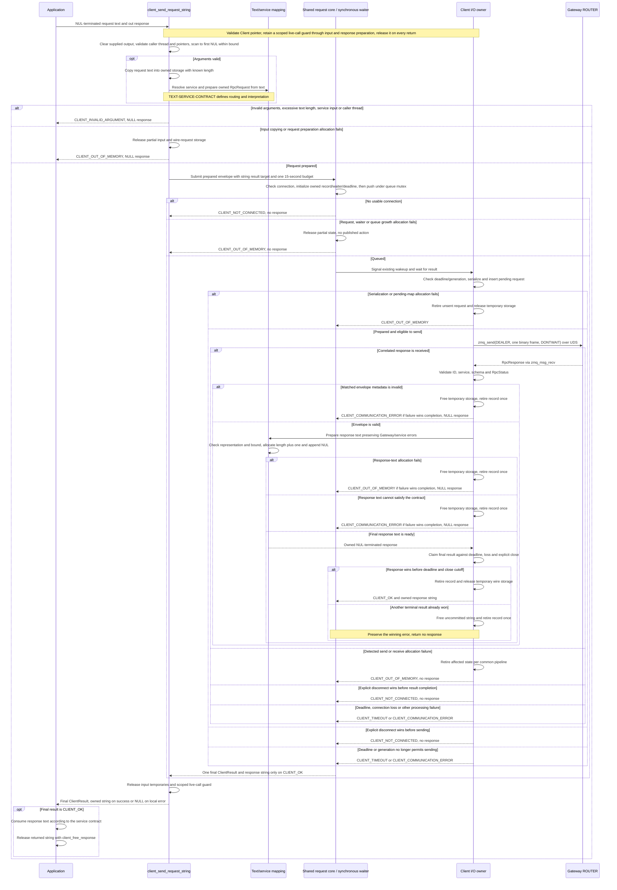
```mermaid
sequenceDiagram
    participant A as Application
    participant API as client_send_request_string
    participant TEXT as Text/service mapping
    participant B as Shared request core / synchronous waiter
    participant IO as Client I/O owner
    participant G as Gateway ROUTER
    A->>API: NUL-terminated request text and out response
    Note over API,IO: Validate Client pointer, retain a scoped live-call guard through input and response preparation, release it on every return
    API->>API: Clear supplied output, validate caller thread and pointers, scan to first NUL within bound
    opt Arguments valid
        API->>API: Copy request text into owned storage with known length
        API->>TEXT: Resolve service and prepare owned RpcRequest from text
        Note over API,TEXT: TEXT-SERVICE-CONTRACT defines routing and interpretation
    end
    alt Invalid arguments, excessive text length, service input or caller thread
        API-->>A: CLIENT_INVALID_ARGUMENT, NULL response
    else Input copying or request preparation allocation fails
        API->>API: Release partial input and wire-request storage
        API-->>A: CLIENT_OUT_OF_MEMORY, NULL response
    else Request prepared
        API->>B: Submit prepared envelope with string result target and one 15-second budget
        B->>B: Check connection, initialize owned record/waiter/deadline, then push under queue mutex
        alt No usable connection
            B-->>API: CLIENT_NOT_CONNECTED, no response
        else Request, waiter or queue growth allocation fails
            B->>B: Release partial state, no published action
            B-->>API: CLIENT_OUT_OF_MEMORY, no response
        else Queued
            B->>IO: Signal existing wakeup and wait for result
            IO->>IO: Check deadline/generation, serialize and insert pending request
            alt Serialization or pending-map allocation fails
                IO->>IO: Retire unsent request and release temporary storage
                IO-->>B: CLIENT_OUT_OF_MEMORY
            else Prepared and eligible to send
                IO->>G: zmq_send(DEALER, one binary frame, DONTWAIT) over UDS
                alt Correlated response is received
                    G-->>IO: RpcResponse via zmq_msg_recv
                    IO->>IO: Validate ID, service, schema and RpcStatus
                    alt Matched envelope metadata is invalid
                        IO->>IO: Free temporary storage, retire record once
                        IO-->>B: CLIENT_COMMUNICATION_ERROR if failure wins completion, NULL response
                    else Envelope is valid
                        IO->>TEXT: Prepare response text preserving Gateway/service errors
                        TEXT->>TEXT: Check representation and bound, allocate length plus one and append NUL
                        alt Response-text allocation fails
                            IO->>IO: Free temporary storage, retire record once
                            IO-->>B: CLIENT_OUT_OF_MEMORY if failure wins completion, NULL response
                        else Response text cannot satisfy the contract
                            IO->>IO: Free temporary storage, retire record once
                            IO-->>B: CLIENT_COMMUNICATION_ERROR if failure wins completion, NULL response
                        else Final response text is ready
                            TEXT-->>IO: Owned NUL-terminated response
                            IO->>IO: Claim final result against deadline, loss and explicit close
                            alt Response wins before deadline and close cutoff
                                IO->>IO: Retire record and release temporary wire storage
                                IO-->>B: CLIENT_OK and owned response string
                            else Another terminal result already won
                                IO->>IO: Free uncommitted string and retire record once
                                Note over B,IO: Preserve the winning error, return no response
                            end
                        end
                    end
                else Detected send or receive allocation failure
                    IO->>IO: Retire affected state per common pipeline
                    IO-->>B: CLIENT_OUT_OF_MEMORY, no response
                else Explicit disconnect wins before result completion
                    IO-->>B: CLIENT_NOT_CONNECTED, no response
                else Deadline, connection loss or other processing failure
                    IO-->>B: CLIENT_TIMEOUT or CLIENT_COMMUNICATION_ERROR
                end
            else Explicit disconnect wins before sending
                IO-->>B: CLIENT_NOT_CONNECTED, no response
            else Deadline or generation no longer permits sending
                IO-->>B: CLIENT_TIMEOUT or CLIENT_COMMUNICATION_ERROR
            end
            B-->>API: One final ClientResult and response string only on CLIENT_OK
        end
        API->>API: Release input temporaries and scoped live-call guard
        API-->>A: Final ClientResult, owned string on success or NULL on local error
        opt Final result is CLIENT_OK
            A->>A: Consume response text according to the service contract
            A->>A: Release returned string with client_free_response
        end
    end
```

Final text preparation belongs to the shared I/O receive/completion path, just
as it does for the asynchronous string method. Complete the synchronous waiter
only after the returned string is ready. The same 15-second deadline and
explicit-close cutoff cover that preparation; they are not restarted after
receiving the binary envelope. If timeout or close wins while text is being
prepared, free the uncommitted string and preserve the winning result. A text
allocation failure may occur after remote execution and does not permit replay.

#### Plain-string input, length and ownership

Both string methods take a valid NUL-terminated C string. There is no request
size argument because the first `\0` determines its length. The library scans
within the configured text bound and copies the bytes before that terminator
into owned storage. It records the length internally for serialization and
transport. The caller must keep the source valid and unchanged until the API
returns; subsequent I/O must not reference the caller's storage.

No Base64 encoding or decoding is needed, either by the caller or inside the
transport. Protobuf's bytes field and ZMQ already carry the text bytes. The
caller does not supply a serialized RPC envelope through this API. EyilClient
constructs and serializes that envelope internally once the service mapping is
defined. Serialized wire messages always retain their explicit binary length;
never measure them with strlen(). See the
[Protobuf wire format](https://protobuf.dev/programming-guides/encoding/).

The first NUL ends the request. A pointer to `"abc\0def"` supplies only `"abc"`;
the library cannot infer that the caller intended additional bytes. Use the
byte API with its explicit size for arbitrary binary Protobuf. An empty string
is valid at the C-string boundary; whether it is a meaningful service request
is determined by the service contract. A NULL input pointer is invalid.

On response delivery, the library uses the known response-text length,
allocates length plus one bytes, copies the text and appends `\0`. The caller
receives ordinary text and frees it with client_free_response. An empty text
response is an allocated string containing only the terminator, not a NULL
success result. Do not truncate an unrepresentable binary response at its first
NUL or automatically expose it in a different encoding.

#### Text interpretation and service routing

Transporting text and interpreting it as an operation are separate contracts.
RpcRequest.payload can hold text bytes directly when the selected service
accepts text. The current CRYPTO adapter expects a serialized CryptoRequest,
so arbitrary text is not automatically a valid Crypto operation.

**TODO(TEXT-SERVICE-CONTRACT):** define the service route for string calls, how
Gateway distinguishes/interprets their payload, and the response text contract,
including representation of RpcStatus and service errors. The public string
method has no service argument and the current schema defines only CRYPTO.
Do not silently infer a service, add an implicit text operation to Crypto or
change the binary Crypto payload contract. Any service-specific translation
belongs at the service integration boundary; EyilClient transport remains
independent of Crypto policy.

This question concerns service semantics, not input length or caller encoding.
The UML mapping participant marks that integration boundary; it does not select
a new text format or claim that arbitrary text is already a Crypto request.

#### Application impact and tradeoffs

The effect on callers depends on which API they use:

| Consumer | Effect of the plain-string contract |
| --- | --- |
| Application using a high-level Firebolt Crypto API | The Crypto library continues to own service request construction; choosing the string transport does not change the app's high-level function signatures |
| Application or binding calling the string APIs directly | Pass NUL-terminated text and consume returned text; no caller-side wire serialization or encoding, but the service must understand the request |
| Consumer calling the byte APIs | Continue passing serialized Protobuf with explicit request/response lengths |

| Advantage | Cost or limitation |
| --- | --- |
| No size argument or caller encoding is required | Input must be valid NUL-terminated storage; embedded NUL ends the string |
| No text-encoding expansion or extra encoding pass | The library still scans/copies text and serializes the binary wire envelope |
| Existing C signatures and callbacks remain usable | Service routing and request/response meaning still need a defined contract |
| Uses the same request coordinator, IDs and transport | The string API cannot expose arbitrary binary response data as ordinary text |

Check length-plus-one arithmetic for overflow and enforce configured text and
wire-message bounds before allocation. Product-specific values remain under
RESOURCE-LIMITS. No new public size parameter is required. The string API hides
wire representation from its caller; it cannot hide the service's required
operation arguments or make an undefined command meaningful.

Ownership and failures are defined: validate and copy input before submission,
own all intermediate wire storage, and return a separately owned NUL-terminated
response for client_free_response. Check size arithmetic and configured text
and wire-message limits before allocation. Invalid arguments or oversized input
return CLIENT_INVALID_ARGUMENT; allocation failure returns CLIENT_OUT_OF_MEMORY.
All temporary storage is released on every success/rejection/error path. A valid
received response must satisfy the response-text contract and its size bound;
an unrepresentable response, including unexpected embedded NUL in response text,
is a local CLIENT_COMMUNICATION_ERROR rather than a silently truncated success.

CLIENT_TIMEOUT and transport errors propagate unchanged from the shared binary
core. Failure to allocate the final text can occur after remote execution and
successful receipt of its response: return CLIENT_OUT_OF_MEMORY and NULL, and
do not replay the operation. Before send acceptance, local failures return
through the API with no async response callback. NUL-terminated string handling
does not change the agreed timeout or ownership behavior.

### 5.9 client_send_request_string_async()

Coverage: **AC2.1, AC2.4**.

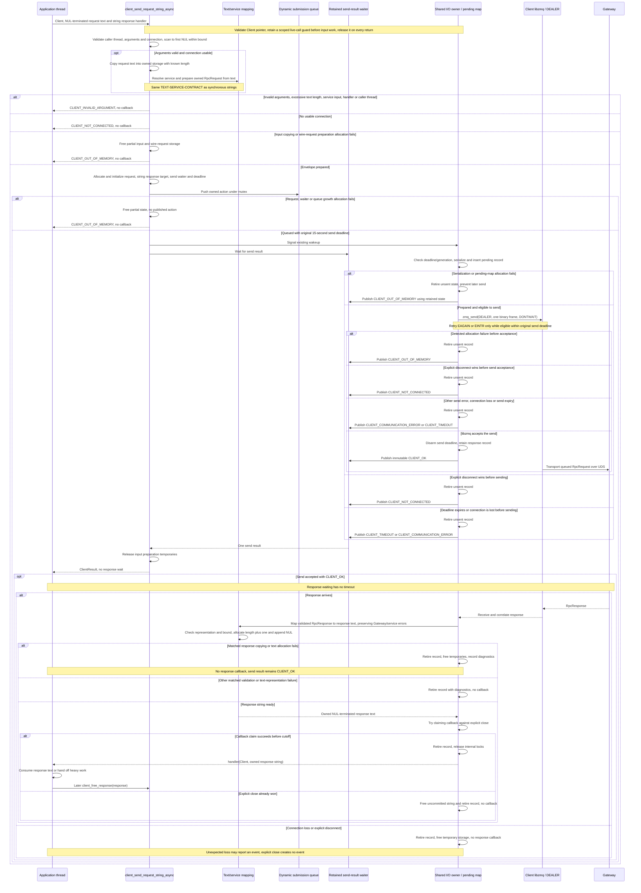
```mermaid
sequenceDiagram
    participant A as Application thread
    participant API as client_send_request_string_async
    participant TEXT as Text/service mapping
    participant Q as Dynamic submission queue
    participant W as Retained send-result waiter
    participant IO as Shared I/O owner / pending map
    participant Z as Client libzmq / DEALER
    participant G as Gateway
    A->>API: Client, NUL-terminated request text and string response handler
    Note over API,IO: Validate Client pointer, retain a scoped live-call guard before input work, release it on every return
    API->>API: Validate caller thread, arguments and connection, scan to first NUL within bound
    opt Arguments valid and connection usable
        API->>API: Copy request text into owned storage with known length
        API->>TEXT: Resolve service and prepare owned RpcRequest from text
        Note over API,TEXT: Same TEXT-SERVICE-CONTRACT as synchronous strings
    end
    alt Invalid arguments, excessive text length, service input, handler or caller thread
        API-->>A: CLIENT_INVALID_ARGUMENT, no callback
    else No usable connection
        API-->>A: CLIENT_NOT_CONNECTED, no callback
    else Input copying or wire-request preparation allocation fails
        API->>API: Free partial input and wire-request storage
        API-->>A: CLIENT_OUT_OF_MEMORY, no callback
    else Envelope prepared
        API->>API: Allocate and initialize request, string response target, send waiter and deadline
        API->>Q: Push owned action under mutex
        alt Request, waiter or queue growth allocation fails
            API->>API: Free partial state, no published action
            API-->>A: CLIENT_OUT_OF_MEMORY, no callback
        else Queued with original 15-second send deadline
            API->>IO: Signal existing wakeup
            API->>W: Wait for send result
            IO->>IO: Check deadline/generation, serialize and insert pending record
            alt Serialization or pending-map allocation fails
                IO->>IO: Retire unsent state, prevent later send
                IO->>W: Publish CLIENT_OUT_OF_MEMORY using retained state
            else Prepared and eligible to send
                IO->>Z: zmq_send(DEALER, one binary frame, DONTWAIT)
                Note over IO,Z: Retry EAGAIN or EINTR only while eligible within original send deadline
                alt Detected allocation failure before acceptance
                    IO->>IO: Retire unsent record
                    IO->>W: Publish CLIENT_OUT_OF_MEMORY
                else Explicit disconnect wins before send acceptance
                    IO->>IO: Retire unsent record
                    IO->>W: Publish CLIENT_NOT_CONNECTED
                else Other send error, connection loss or send expiry
                    IO->>IO: Retire unsent record
                    IO->>W: Publish CLIENT_COMMUNICATION_ERROR or CLIENT_TIMEOUT
                else libzmq accepts the send
                    IO->>IO: Disarm send deadline, retain response record
                    IO->>W: Publish immutable CLIENT_OK
                    Z->>G: Transport queued RpcRequest over UDS
                end
            else Explicit disconnect wins before sending
                IO->>IO: Retire unsent record
                IO->>W: Publish CLIENT_NOT_CONNECTED
            else Deadline expires or connection is lost before sending
                IO->>IO: Retire unsent record
                IO->>W: Publish CLIENT_TIMEOUT or CLIENT_COMMUNICATION_ERROR
            end
            W-->>API: One send result
            API->>API: Release input preparation temporaries
            API-->>A: ClientResult, no response wait
            opt Send accepted with CLIENT_OK
                Note over A,G: Response waiting has no timeout
                alt Response arrives
                    G-->>Z: RpcResponse
                    Z-->>IO: Receive and correlate response
                    IO->>TEXT: Map validated RpcResponse to response text, preserving Gateway/service errors
                    TEXT->>TEXT: Check representation and bound, allocate length plus one and append NUL
                    alt Matched response copying or text allocation fails
                        IO->>IO: Retire record, free temporaries, record diagnostics
                        Note over A,IO: No response callback, send result remains CLIENT_OK
                    else Other matched validation or text-representation failure
                        IO->>IO: Retire record with diagnostics, no callback
                    else Response string ready
                        TEXT-->>IO: Owned NUL-terminated response text
                        IO->>IO: Try claiming callback against explicit close
                        alt Callback claim succeeds before cutoff
                            IO->>IO: Retire record, release internal locks
                            IO-->>A: handler(Client, owned response string)
                            A->>A: Consume response text or hand off heavy work
                            A->>API: Later client_free_response(response)
                        else Explicit close already won
                            IO->>IO: Free uncommitted string and retire record, no callback
                        end
                    end
                else Connection loss or explicit disconnect
                    IO->>IO: Retire record, free temporary storage, no response callback
                    Note over A,IO: Unexpected loss may report an event, explicit close creates no event
                end
            end
        end
    end
```

Both string APIs share the byte APIs' coordinator, pending map and DEALER.
The async string method uses the public ClientStringResponseHandler signature,
with no size argument. Local input copying, wire preparation and send errors
return from the API using the same ClientResult mappings as section 5.7.

After successful send acceptance there is no response timeout. Preparing or
allocating the returned string may fail after remote execution; in that case,
retire the record with diagnostics and do not invoke a synthetic error callback.
Connection failures use the connection-event path. Input and callback output
use the same NUL-terminated text contract as synchronous strings in section 5.8.

### 5.10 client_free_response()

Coverage: **AC2.1**.

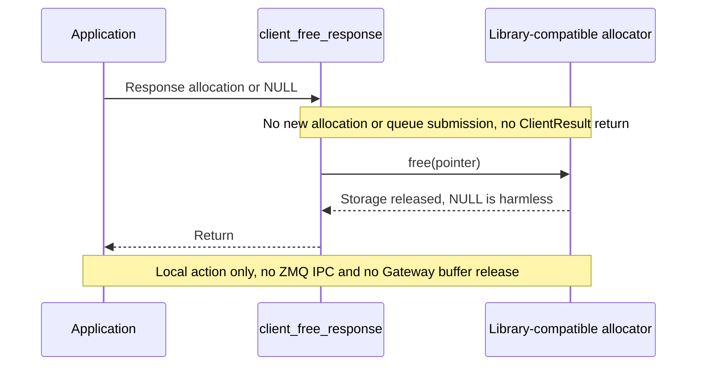
```mermaid
sequenceDiagram
    participant A as Application
    participant API as client_free_response
    participant M as Library-compatible allocator
    A->>API: Response allocation or NULL
    Note over API,M: No new allocation or queue submission, no ClientResult return
    API->>M: free(pointer)
    M-->>API: Storage released, NULL is harmless
    API-->>A: Return
    Note over A,M: Local action only, no ZMQ IPC and no Gateway buffer release
```

This releases a message-result allocation, not a shared-memory object.
Do not pass a mapped buffer, stack memory or a Gateway buffer ID. Freeing a
response requires no request record or new allocation and remains available
after another API reports CLIENT_OUT_OF_MEMORY.

### 5.11 client_register_notifications()

Coverage: **AC2.1**. This API is reserved for future notification support.

**Return CLIENT_NOT_IMPLEMENTED.** The function ignores its arguments and does
not store or invoke the handler, allocate notification state, subscribe to events
or send a message to Gateway.

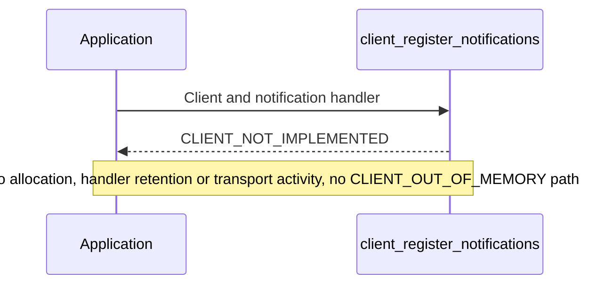
```mermaid
sequenceDiagram
    participant A as Application
    participant API as client_register_notifications
    A->>API: Client and notification handler
    API-->>A: CLIENT_NOT_IMPLEMENTED
    Note over A,API: No allocation, handler retention or transport activity, no CLIENT_OUT_OF_MEMORY path
```

Notification delivery is outside this version's scope. A future feature must
define the events, Protobuf payloads, wire identification and callback lifecycle
before enabling this API. It is not a pending decision for the current delivery.

Connection-state events go to ClientConnectionEventHandler registered through
client_connect(). Async responses go to the response handler supplied with each
request. A late or unmatched RPC response follows the validation rules in
section 5.6 and must not be reclassified as a notification.

### 5.12 client_unregister_notifications()

Coverage: **AC2.1**. This API is reserved for future notification support.

This void function returns without changing state. Notification registration
is unsupported, so there is no handler to remove or notification delivery to drain.

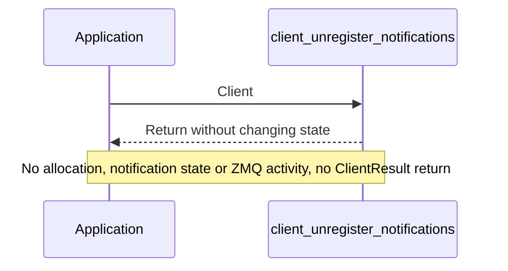
```mermaid
sequenceDiagram
    participant A as Application
    participant API as client_unregister_notifications
    A->>API: Client
    API-->>A: Return without changing state
    Note over A,API: No allocation, notification state or ZMQ activity, no ClientResult return
```

Calling this function is not required before client_disconnect in this version.
It does not affect the connection-event handler or pending request responses.
Neither notification function allocates, so neither has an out-of-memory path.

### 5.13 client_disconnect()

Coverage: **AC2.1–AC2.3**, leading to **AC1.10** when the Gateway detects closure.

client_disconnect is a synchronous local cleanup barrier. The app may call it
while requests are queued or awaiting responses; it need not wait for those
responses first. The function closes new admission, cancels unsent actions,
retires pending response IDs and closes the connection. It returns only after
the old runtime is quiescent and the handle is destroyed. It does not wait for
a Gateway acknowledgement or certify that remote operations have finished.

#### Results and callback behavior during explicit close

| State when local close wins | Outcome |
| --- | --- |
| Synchronous request still waiting | Return CLIENT_NOT_CONNECTED with NULL response and size 0 for bytes, or NULL for strings |
| Async submission not yet accepted by libzmq | Return CLIENT_NOT_CONNECTED through its send waiter; cancel the unsent action and invoke no response callback |
| Async send already accepted | Preserve CLIENT_OK, remove its pending response ID and release library-owned storage without a response callback |
| Uncommitted response or unclaimed callback | Discard its storage and pending record; do not start delivery after the close cutoff |
| Result or callback already claimed | Preserve the winning result/ownership, let the call or callback finish and wait for its live reference to be released |
| Already LOST handle | Finish teardown without changing the loss result or closing an already closed socket again |

Serialize local-close admission with request publication and callback claims.
Use the same retained completion state for close, response, timeout and transport
failure: only one terminal result wins. If a nonblocking send is already in
progress, let the owner resolve it before completing its send waiter. Successful
libzmq acceptance remains CLIENT_OK even if local close was requested while
that attempt ran; it must not become a reported failure for a message that was
accepted. Unsent actions cancelled by close can never execute later.

An intentional close generates no connection callback. Suppress monitor events
caused by shutting down the socket. A connection callback already claimed for an
earlier unexpected loss may finish; no new callback is claimed after callback
admission closes.
Response and connection callbacks run without internal locks, and no callback
can execute for that Client after client_disconnect returns.

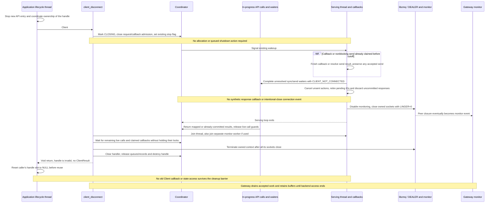
```mermaid
sequenceDiagram
    participant A as Application lifecycle thread
    participant API as client_disconnect
    participant C as Coordinator
    participant W as In-progress API calls and waiters
    participant IO as Serving thread and callbacks
    participant Z as libzmq / DEALER and monitor
    participant G as Gateway monitor
    A->>A: Stop new API entry and coordinate ownership of the handle
    A->>API: Client
    API->>C: Mark CLOSING, close request/callback admission, set existing stop flag
    Note over API,IO: No allocation or queued shutdown action required
    C->>IO: Signal existing wakeup
    opt Callback or nonblocking send already claimed before cutoff
        IO->>IO: Finish callback or resolve send result, preserve any accepted send
    end
    IO->>W: Complete unresolved sync/send waiters with CLIENT_NOT_CONNECTED
    IO->>IO: Cancel unsent actions, retire pending IDs and discard uncommitted responses
    Note over C,IO: No synthetic response callback or intentional-close connection event
    IO->>Z: Disable monitoring, close owned sockets with LINGER=0
    Z-->>G: Peer closure eventually becomes monitor event
    IO-->>C: Serving loop exits
    W->>C: Return mapped or already-committed results, release live-call guards
    API->>IO: Join thread, also join separate monitor worker if used
    API->>C: Wait for remaining live calls and claimed callbacks without holding their locks
    API->>Z: Terminate owned context after all its sockets close
    API->>C: Clear handler, release queues/records and destroy handle
    API-->>A: Void return, handle is invalid, no ClientResult
    A->>A: Reset caller's handle slot to NULL before reuse
    Note over A,IO: No old Client callback or state access survives the cleanup barrier
    Note over API,G: Gateway drains accepted work and retains buffers until backend access ends
```

Disconnect must remain possible after allocation failure. Set a stop flag
created during connect and signal the existing wakeup instead of pushing a
new shutdown action onto the dynamic queue. Resolve waiters using retained
completion objects and erase/free records without constructing a temporary
container. The function is void; it cannot report CLIENT_OUT_OF_MEMORY and
must not depend on allocating an error object to clean up.

Wake and resolve pending callers before waiting for their live-call references
to drain. Never wait while holding the queue, state or callback locks they need
to return. Joining the I/O owner also waits for its active callback. Callbacks
must return promptly; safe cleanup cannot forcefully terminate application code
running on that thread. Preserve results already committed to a caller,
including a fully prepared string owned by a completed waiter. Response-text
preparation precedes the final completion claim, as specified in section 5.8.
Free only uncommitted library-owned response storage.

The same function destroys a handle whose connection already reached LOST.
Reuse completed cleanup safely: close each socket once, join started threads
and terminate the old owned ZMQ context before releasing the handle. Free only
library-owned undelivered response storage; results already transferred to the
caller remain available for client_free_response. Explicit reconnect starts
from a NULL handle slot with no old runtime state, as specified in section 5.14.

#### Concurrent callers and handle lifetime

- Call disconnect from an application lifecycle thread, never from a Client
  response/connection callback or the I/O thread it must join. A callback can
  schedule cleanup on an application thread and return.
- The application serializes connect/disconnect and destruction of the same
  handle. Stop new call entry and coordinate threads that could still enter
  using a copied raw pointer. A call not yet holding an internal live reference
  must not race handle destruction; neither the internal queue lock nor a raw
  Client pointer makes that race safe.
- Calls already holding live references may remain blocked in the library while
  disconnect runs. Close wakes their waiters. An entered call that has not yet
  submitted work checks CLOSING before publication and returns
  CLIENT_NOT_CONNECTED instead of publishing a new action. Every return path
  releases its guard, including validation and allocation failures.
- Serialize callback admission with CLOSING. Claims made before the cutoff
  retain the Client until return; later responses/events are discarded. Keep
  the registered handler and its application dependencies valid until the
  disconnect barrier completes, then clear the registration.
- Once disconnect returns, do not use the old handle again, including a second
  disconnect. Clear the application's slot and use a new Client for reconnect.
  Already-transferred response allocations remain app-owned and may still be
  released through client_free_response.

The library never detaches a live thread and destroys its state. Explicit local
close cleans transport and request bookkeeping; Gateway's accepted jobs and
shared-buffer leases follow their existing drain and completion rules.

### 5.14 Deadlines, callbacks, reconnect and library unloading

#### Initial timeout and queue defaults

| Setting | Initial value | Meaning |
| --- | --- | --- |
| Common timed-wait duration | 15,000 ms | Shared by connect, synchronous requests and async send submission; no public timeout setter is required initially |
| Connect deadline | Connect-attempt start plus 15 seconds | Covers setup/handshake waiting for one explicit attempt; events cannot restart it and safe rollback must finish before return |
| Synchronous request deadline | Admission time plus 15 seconds | One budget across queueing, serialization, send attempts, response validation and preparation of the final byte/string result |
| Async send-submission deadline | Admission time plus 15 seconds | Covers queueing, serialization and send attempts until libzmq accepts the request; return its result through the API |
| Async response deadline | None | Disarm the send deadline after acceptance and retain the response record until delivery or local retirement/teardown |
| Submission queue and pending map | Dynamic, no fixed request-count cap | std::queue<Action> grows under a mutex; detected allocation failure returns CLIENT_OUT_OF_MEMORY while an API result is still pending |

The synchronous deadline is one total budget, not a new 15 seconds per phase.
An async request has a 15-second send budget only: time waiting for libzmq
acceptance does not start a response timer afterward. Connect and each request
use independent deadlines. None of these timers expires an idle connection.

A send-submission timeout must cancel unsent work and resolve any racing send
attempt before returning; it must not leave an abandoned queue entry that can
later be sent. If libzmq already accepted the request, preserve CLIENT_OK as
that submission's result. This does not prove that Gateway received or executed
the operation.

Allocate request state and grow the submission queue/pending map as needed.
There is no local queue-full result or aggregate queue-byte admission limit.
Catch allocation failure, release partial state and return CLIENT_OUT_OF_MEMORY
through the pending API result as described in sections 5.2 and 5.4. Free each
record once on response delivery, terminal local failure or teardown.
Outstanding async requests that receive no response can retain their memory
indefinitely; there is no hidden response or idle timeout.

A response callback may free its storage but must schedule new requests on an
application thread, because even async submission waits for the I/O owner.

Per-message validation/encoding bounds and libzmq socket high-water marks are
separate from the dynamic C++ submission queue. Select those transport settings
under RESOURCE-LIMITS. EAGAIN is temporary transport backpressure handled within
the active send deadline, not a local queue-full error. Gateway separately caps
waiting requests at 1,024 and expires a request that cannot start dispatch within
10 seconds. Its shared-buffer quotas and response-backpressure policy are
separate. The client queue remains dynamic without a fixed request-count cap.
Already-delivered response allocations belong to the application until freed.

#### Terminal connection loss and explicit reconnect

**Decision:** loss of an established connection ends that connection generation.
The I/O owner closes admission and transitions READY to LOST once. It stops
submissions, retires pending work and closes the old transport; it does not
reconnect the socket, restore the handle to READY or replay an operation. A new
request on the still-allocated lost handle returns CLIENT_NOT_CONNECTED.

| State at detected transport loss | Required cleanup/result |
| --- | --- |
| Unsent client submission actions | Cancel and erase them; they must never be sent later |
| Synchronous result or async send-result waiter still pending | Complete once with CLIENT_COMMUNICATION_ERROR; clear response outputs and invoke no async response callback |
| Async send already accepted by libzmq | Preserve its CLIENT_OK submission result, retire its response record without a callback and release library-owned request state |
| Queued, received or prepared response not committed to a caller | Discard it and release its library-owned storage and accounting |
| Result already committed to a waiter or callback | Preserve the winning completion and ownership transfer; do not overwrite it or free the caller's response |
| Old libzmq queues | Disable monitoring and close owner-held sockets with LINGER=0; discard unread input, release received message objects and do not reuse the sockets |

Use the retained completion objects, stop flags and wakeups so cleanup remains
possible after allocation failure. A response, timeout or send acceptance that
already won its terminal transition keeps its result. For connection-wide
local allocation/validation failures, use the existing error mappings from
section 5.6 with the same teardown discipline. No synthetic async error response
is introduced.

Report CLIENT_CONNECTION_LOST once for the established connection, without held
internal locks, if its callback is claimed before explicit close shuts callback
admission. Local close does not create a new loss event. Stop or wake any separate
monitor collector so all sockets close
on their owners. The old serving loop exits and the lost handle remains valid
only for rejected requests and orderly destruction. client_disconnect joins the
started threads and terminates the old owned ZMQ context; none of that runtime
is reused. A callback already executing must return before destruction completes.
The application schedules disconnect/reconnect from an application thread, not
from the connection callback.

Neither CLIENT_CONNECTION_RESTORED nor CLIENT_CONNECTION_TERMINATED is emitted.
The new explicit connection reports its startup outcome only through the
client_connect return value, just like the first connection. It cannot restore
the old handle or session.

The explicit API sequence is:

```c
client_disconnect(client);
client = NULL;
ClientResult result = client_connect(&client, connection_handler);
```

The application first coordinates its callers and the old handle's lifetime.
A successful new connect has a new Client runtime, owned ZMQ context, DEALER,
monitor endpoint and connection generation. Gateway authenticates a new
User-Id/session and performs CONNECTED again. Matching UID/PID or future
authoritative app identity does not restore an old connection. Pending maps,
queues and response records start empty; old buffer IDs and session key handles
cannot be used in the new session.

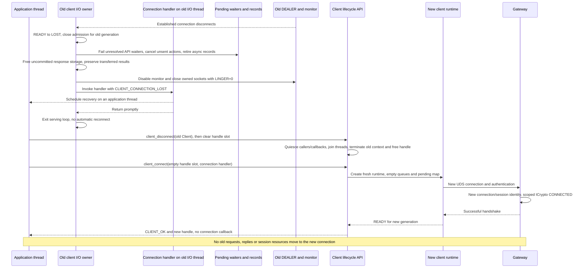
```mermaid
sequenceDiagram
    participant A as Application thread
    participant IO as Old client I/O owner
    participant H as Connection handler on old I/O thread
    participant W as Pending waiters and records
    participant Z as Old DEALER and monitor
    participant API as Client lifecycle API
    participant N as New client runtime
    participant G as Gateway
    Z-->>IO: Established connection disconnects
    IO->>IO: READY to LOST, close admission for old generation
    IO->>W: Fail unresolved API waiters, cancel unsent actions, retire async records
    IO->>IO: Free uncommitted response storage, preserve transferred results
    IO->>Z: Disable monitor and close owned sockets with LINGER=0
    IO->>H: Invoke handler with CLIENT_CONNECTION_LOST
    H-->>A: Schedule recovery on an application thread
    H-->>IO: Return promptly
    IO->>IO: Exit serving loop, no automatic reconnect
    A->>API: client_disconnect(old Client), then clear handle slot
    API->>API: Quiesce callers/callbacks, join threads, terminate old context and free handle
    A->>API: client_connect(empty handle slot, connection handler)
    API->>N: Create fresh runtime, empty queues and pending map
    N->>G: New UDS connection and authentication
    G->>G: New connection/session identity, scoped ICrypto CONNECTED
    G-->>N: Successful handshake
    N-->>API: READY for new generation
    API-->>A: CLIENT_OK and new handle, no connection callback
    Note over A,G: No old requests, replies or session resources move to the new connection
```

Client cleanup is not a remote cancellation acknowledgement. Gateway separately
closes the old context's admission and drops its undeliverable responses. Accepted
Gateway jobs follow the existing drain/deadline contract; active backend access
must finish before DISCONNECTED and buffer destruction. A new session can be
admitted while the old one retains private cleanup references, without sharing
its resources or accepting its late completions. A missing response does not
make automatic operation replay safe.

#### Freeze and runtime behavior

The application owns preparation for freezing its process: stop new submissions,
finish accepted operations and callbacks, and leave no uncertain remote work.
Async CLIENT_OK confirms only send acceptance, so it does not satisfy this
preparation requirement; the operation may still be executing remotely.
With no pending operation, no request timer is active and the 15-second duration
does not expire the idle connection. No custom heartbeat or inactivity watchdog
is part of that flow.

The intended freeze preserves the process and its descriptors. Transport
heartbeats are disabled on both ends, so a lack of heartbeat traffic during the
pause does not expire that connection. Actual socket closure or Gateway failure
still uses normal disconnect handling. Section 6.14 describes the Gateway side
and the distinction from process destruction.

#### Concurrency, callbacks and reconnect

The following constraints apply to all request APIs:

- Protect the dynamic submission queue with a mutex and process actions outside
  that lock. Nonblocking socket operations and fair processing of submissions,
  responses and monitor events keep other work progressing. There is no fixed
  client request-count cap.
- Use a monotonic clock for the agreed 15-second local deadlines. The current
  API has no timeout argument; future configurability is optional and does not
  block the initial fixed defaults. There is no idle-connection expiry.
- Resolve each synchronous result and async send-result waiter once. Async
  callbacks deliver responses at most once and are not guaranteed after send
  success. Retire async records without a callback on connection loss or local
  response-processing failure. Late replies cannot trigger a duplicate callback
  or satisfy another request; this does not guarantee exactly-once execution.
- Explicit local close resolves still-pending sync/send results with
  CLIENT_NOT_CONNECTED, retires pending IDs without synthetic callbacks and
  waits for live calls/claimed callbacks before destroying the handle. Preserve
  an earlier response, send acceptance, timeout or unexpected-loss result.
- Do not retry automatically after a timeout or reconnect. A crypto operation
  may already have changed backend state.
- Disable automatic transport reconnect and discard old pending requests and
  undelivered responses on connection loss. Explicit reconnect creates a fresh
  context with no reused buffer IDs, session key handles or queued work.
- Apply RECONNECT_IVL=-1, IMMEDIATE=1 and LINGER=0 to each new DEALER. Close the
  old socket rather than reconnecting it or carrying its libzmq queues forward.
- Keep transport heartbeats disabled on DEALER and ROUTER, including after
  socket recreation. Actual connection loss still invalidates assumptions about
  the old Gateway context, buffers and key handles. The explicit new-connection
  flow above applies after any actual loss, including one observed after thaw.
- Connection callbacks are specified by the header to run on
  an internal thread without calling other client APIs. Request callbacks use
  the execution rules in section 5.4: run on the I/O owner without held
  internal locks, permit response freeing, and prohibit all request calls
  because they wait for that same owner. Schedule new requests, disconnect and
  heavy work on an application thread.
- If arbitrary blocking callbacks must be supported, add a separate bounded
  completion executor with its own shutdown contract. Do not silently create
  an unbounded thread per callback.
- An application-owned event-loop mode would need additional public integration
  APIs. It is an optional future extension, not a requirement for this version.

#### Library unloading

A shared library can create threads. Runtime unloading is safe only after the
application disconnects every Client, all library-owned threads are joined,
all calls/callbacks have returned, owned ZMQ contexts are terminated and all
buffers requiring `client_free_response()` have been freed. No thread may still
execute library code after `dlclose()`. libzmq's internal threads do not remove
this obligation. See the
[dynamic loader API](https://man7.org/linux/man-pages/man3/dlopen.3.html).

### 5.15 Call hierarchy

```text
Application / Firebolt Crypto
  client_connect
    ClientCoordinator::Start
      Allocate runtime, startup result, stop flag and wakeup
        Allocation fails -> CLIENT_OUT_OF_MEMORY, roll back, output NULL
      IoLoop::Run
        Configure DEALER options with heartbeat IVL/TIMEOUT/TTL set to 0
        Set RECONNECT_IVL=-1, IMMEDIATE=1 and LINGER=0 before connect
        Enable monitor and connect PAIR receiver -> zmq_connect
        Poll PAIR -> handshake result -> complete startup waiter, no callback
      On startup success, publish handle and enable loss-callback delivery
      Return CLIENT_OK with published handle or exact error with NULL

  client_send_request[_async]
  client_send_request_string[_async]
    Validate Client pointer and retain a scoped live-call guard
      Release guard on every return, including errors
    Validate caller thread and arguments
      Byte API: parse the supplied binary RpcRequest using its explicit length
      String API: scan to first NUL within bound, copy text, prepare wire request
        TEXT-SERVICE-CONTRACT defines service routing and text interpretation
      Retain owned RpcRequest and payload
      Allocate owned request and sync result / async send-result waiter
      Initialize mode, generation and original deadline before publication
      ClientCoordinator::Submit -> mutex-protected dynamic queue -> wakeup
        Allocation or queue insertion fails -> CLIENT_OUT_OF_MEMORY, no send
        IoLoop::DrainSubmissions
          CheckGenerationAndActiveDeadline
          EnvelopeCodec::SerializeRequest(schema=1, unique request_id)
          PendingRequests::Insert(handler or synchronous waiter)
            Serialization/insertion allocation fails -> CLIENT_OUT_OF_MEMORY, no send
          zmq_send(DEALER, DONTWAIT)
            EAGAIN -> retain unsent work within original deadline
            Error -> retire request, resolve API waiter, no async callback
            Accepted -> resolve async send waiter with CLIENT_OK
                        disarm async send deadline, retain response record
        IoLoop::Receive
          zmq_msg_recv -> framing/size check -> parse RpcResponse
            Allocation fails before correlation -> close through connection-state path
              still-pending API results get CLIENT_OUT_OF_MEMORY
              accepted async records retire without response callbacks
            match ID/generation -> validate service/schema/status
              Byte API: owned serialized RpcResponse and explicit length
              String API: prepare response text, allocate length plus one, append NUL
                TEXT-SERVICE-CONTRACT preserves Gateway/service error meaning
                Allocation fails -> sync CLIENT_OUT_OF_MEMORY and NULL/0
                                    async diagnostics and retirement, no callback
                claim final result/callback against close and any sync deadline
                losing preparation frees its uncommitted result
                retire pending record once
                  sync: return ClientResult and response to waiter
                  async: handler(Client, response[, size]), no held locks
        Sync deadline -> CLIENT_TIMEOUT through response waiter
        Async send deadline -> cancel unsent work, return CLIENT_TIMEOUT
        Async response waiting -> no deadline
        Post-send async local response failure -> diagnostics, retire, no callback

  Monitor processing on the same I/O owner
    Poll PAIR -> decode transport event -> connection-state transition
      established loss -> close admission, mark old generation LOST
      resolve unresolved API waiters, cancel unsent actions
      retire accepted async records and discard uncommitted responses
      close sockets with LINGER=0, no automatic reconnect
      CLIENT_CONNECTION_LOST once if callback admission remains open
      exit serving loop, no RESTORED or TERMINATED callback
      app thread: disconnect old handle -> connect fresh runtime/session

  client_register_notifications -> CLIENT_NOT_IMPLEMENTED, future support
  client_unregister_notifications -> return without changing state

  client_free_response -> free
  client_disconnect
    App coordinates handle lifetime and stops new call entry
    CloseRequestAndCallbackAdmission -> existing stop flag and wakeup, no queue allocation
      resolve in-progress send, preserve accepted CLIENT_OK
      unresolved sync/send waiters -> CLIENT_NOT_CONNECTED
      cancel unsent work, retire pending IDs and discard uncommitted responses
      owner closes sockets -> join threads -> wait for live calls/claimed callbacks
      clear handler -> terminate context -> release handle
      no intentional-close connection callback and no callback after return
```

The call hierarchy contains no application heartbeat producer, heartbeat
service dispatch or inactivity-watchdog task. Pending lifecycle/API choices are
kept in sections 5.5 and 7.3.

## 6. EyilGateway design and flows

### 6.1 Plugin and implementation organization

EyilGateway runs **in process** with Thunder. The thin
`EyilGateway` wrapper implements IPlugin and acquires
`EyilGatewayImplementation` using
`Root<Exchange::IConfiguration>()`, then calls `Configure(IShell*)`.
The default `configuration.root.mode` is `Off`. A future `Local` mode can use
the same split with matching framework proxy/stubs.

**There is no app-facing Gateway COM-RPC or JSON-RPC API.** IConfiguration is
the internal Thunder bootstrap contract. The wrapper also acquires a private
lifecycle-control interface with StopAndWait(), which is not a method on
IConfiguration and is not exposed to apps. A future remote implementation needs
matching proxy/stubs for that interface. ICrypto calls form a separate
trusted backend boundary. "No public Gateway COM-RPC API" does not mean there
are no framework/backend interfaces internally.

| Component | Responsibility | Separation rule |
| --- | --- | --- |
| EyilGateway wrapper | Register notifications, acquire/configure implementation, await StopAndWait before release | Keep transport and service logic out of IPlugin |
| EyilGatewayImplementation | Own configuration/runtime and idempotent StopAndWait | IConfiguration starts the runtime; private lifecycle control drains and stops it |
| GatewayServer / IoLoop | Own ROUTER, receive messages, route completions | No blocking backend work; no worker uses ROUTER |
| ZapAuthenticator | Own REP, parse credentials, answer ZAP | No application-supplied identity is trusted |
| AuthenticationProvider | Interim acceptance; future authoritative lookup | TODO(AUTH-APPMANAGER), separate from transport |
| ConnectionRegistry | Map User-Id to retained context; serialize admission/closing | Never key ownership solely by UID/PID/routing ID |
| RequestDispatcher | Envelope/service validation, routing and nonblocking handoff to the private pool | Service-neutral at outer boundary |
| PendingRequestQueue | std::queue<Action> with a global 1,024-request waiting limit and 10-second dispatch deadline | Mutex-protected admission/counting; includes jobs submitted to the pool but not started |
| RequestJob | One retained dispatch object per accepted request | Immutable input plus explicit context/resource references |
| PrivateRequestPool | Own a Core::ThreadPool with a configured worker count | No replacement of Thunder's global worker singleton; internal capacity must not block ROUTER |
| CryptoServiceAdapter | Decode Crypto operations and query/invoke/release ICrypto per call | No cached ICrypto pointer, global Crypto session, health observer or duplicated key policy |
| SharedBufferManager | Create/track allocations, quotas, leases and release | Gateway-local; no dependency on ICrypto types |
| CompletionQueue | Bounded worker-to-ROUTER handoff for newly completed responses | At most one send attempt; release on success/failure, no per-connection retry queue and no delivery to a replacement route |
| MonitorCollector | Own PAIR and post normalized transport events | Correlation is a prerequisite for targeted cleanup |
| Optional lifecycle observer | Future app lifecycle events | TODO(LIFECYCLE-EVENTS), no current platform subscription |

There is no application heartbeat service, heartbeat worker or inactivity
watchdog in the Gateway runtime. The registry has no last-request-age expiry
rule. Connection cleanup is driven by correlated disconnect events and the
normal explicit shutdown path. ROUTER's built-in ZeroMQ heartbeats are disabled
at startup and on socket recreation, matching the client settings.
Gateway owns request isolation and resource accounting; application-health
supervision and app restart decisions remain outside its responsibilities.

These are recommended responsibilities, not a requirement for one source file
per row. Keep explicit module/config/version files, a thin wrapper and separate
implementation sources. Use internal interfaces at unfinished integration points
to isolate AppManager integration. Use topic/crypto ICrypto types only within the
Crypto adapter; keep them out of EyilClient, transport and buffer ownership.
Gateway does not poll Crypto health or subscribe to Crypto availability events.
The wrapper notifications for Gateway's own implementation lifetime remain
separate from Crypto and are still required.

### 6.2 Thread model and private Thunder pool

Coverage: **AC1.2–AC1.4, AC1.7**.

| Execution context | Owns / performs | Must not do |
| --- | --- | --- |
| Thunder framework thread | Initialize/Deinitialize and framework notifications | Run application requests synchronously |
| Gateway I/O owner | ROUTER, request validation/enqueueing, event/completion draining | Wait for Crypto, worker-pool capacity or a slow client |
| ZAP worker | REP and authentication exchange | Use ROUTER or modify another thread's socket |
| Monitor worker | PAIR events, normalized disconnect records | Guess a session from a non-unique PID |
| Private Thunder workers | RequestJob::Dispatch, buffer operations and scoped ICrypto calls | Send a ROUTER reply or own transport state |
| libzmq internal threads | Transport machinery | Replace Gateway request/session coordination |

Create a Gateway-owned `Core::ThreadPool` instance with an explicit worker
count and stack budget. Keep waiting request jobs in std::queue<Action> under
a mutex, with a global limit of **1,024 waiting requests** across connections.
The accounting includes both Gateway-staged jobs and jobs submitted to the
private pool that have not begun Dispatch. Running jobs are bounded separately
by the worker count; moving a job into Thunder's queue does not release a waiting
slot. Each action retains its context, generation, original dispatch deadline
and completion state before publication. Roll back partial allocations on
failure; pop under the mutex and process after unlocking.

A new request at the limit is rejected with RPC_STATUS_INTERNAL. A queued request
has **10,000 ms from Gateway admission to the start of Dispatch**, measured with
a monotonic clock. This is neither a backend execution timeout nor the client's
15-second deadline. The client submission queue remains unlimited by count.

Atomically arbitrate WAITING -> RUNNING against WAITING -> EXPIRED. The worker
checks the original deadline before executing any service logic; expiry wins
at/after the deadline, produces one correlated RPC_STATUS_INTERNAL response and
prevents later execution. Include time spent in Thunder's internal queue. The
ROUTER owner processes deadlines without blocking while other requests proceed.

Remove expired staged work and release its resources. If an already submitted
wrapper cannot be removed immediately, it retains an expired/cancelled marker
and becomes a no-op when dispatched. Return its capacity credit only when the
queued record is reclaimed; do not accumulate uncounted cancelled wrappers.
Errors and response delivery use the normal I/O completion path. No new
Protobuf status or client error code is introduced.

Shutdown, disconnect and authentication lifecycle control use a separate retained
control path, so the full request queue cannot prevent cleanup. A private worker
never waits for a reply to reach the client before releasing its execution slot.

Submit a distinct `Core::IDispatch` object for each queued request when the
private pool can accept it. A busy pool leaves admitted work pending only
within its original deadline; queue saturation rejects new work immediately.
Do not call `Core::IWorkerPool::Assign()`
or use `Core::IWorkerPool::Instance().Submit()` for application request work.
Some Thunder helper job classes submit implicitly to that global instance;
select the explicit private-pool path. Never implement the 10-second wait as a
blocking pool submission from the ROUTER thread.

The local Thunder R4.4 implementation supports independently owned thread pools.
Its submission APIs must be wrapped carefully: not every version returns an
enqueue-success result, and infinite submission waits would block the ROUTER.
The dynamic staging queue does not change Thunder's internal queue behavior.
Use a version-appropriate nonblocking handoff with tracked submission ownership;
if the pool cannot accept work yet, retain it and resume on capacity becoming
available. Never spin on a busy pool, drop an unconfirmed submission or block
the ROUTER. The exact handoff and worker-completion wakeup must be validated
against the target Thunder release. Reference:
[Thunder pool implementation](https://github.com/rdkcentral/Thunder/blob/2c0fcc5529e7da734be558ca6efa05d934dcce31/Source/core/ThreadPool.h).

The wrapper submits its framework deactivation job to Thunder's global pool.
Application request jobs use the Gateway's private pool.

Catch detectable request/job/queue allocation failures and release partial
state without publishing a job that could later execute. For a trustworthy
request ID and route, report RPC_STATUS_INTERNAL if the error reply can be
constructed and sent. If memory or transport failure prevents that reply, do
not claim it was delivered, fabricate success or retry the service operation.
After execution starts, an error response does not undo backend effects or
authorize early release of leased buffers. Client-local allocation failures
continue to use CLIENT_OUT_OF_MEMORY; these are separate error layers.

#### Proposed initial resource sizing

The following values are **proposals for target-device validation**, not adopted
production defaults or changes to runtime configuration. Rows marked **Agreed**
record the existing limits; the additional byte budgets and transport/worker
settings remain subject to product sizing under TODO(RESOURCE-LIMITS).

| Resource | Initial value / policy | Status |
| --- | --- | --- |
| Maximum complete request / response | 1 MiB each, including the outer RPC envelope; bulk Crypto data uses shared memory | Proposed |
| Gateway waiting requests | 1,024 globally, with at most 10 seconds from admission to the start of Dispatch | Agreed |
| Queued request data | 16 MiB globally, alongside the waiting-entry limit | Proposed |
| Reserved/completed response slots | 128 per connection / 1,024 globally, including reservations for running jobs | Agreed |
| Reserved/completed response data | 4 MiB per connection / 16 MiB globally, alongside the response-slot limits | Proposed |
| ZeroMQ send/receive high-water marks | ZMQ_SNDHWM = 32 and ZMQ_RCVHWM = 32 messages per peer on ROUTER and DEALER; tune through burst/load tests | Proposed |
| Private request workers | 4, configured independently of Thunder's global pool | Proposed |
| Worker stack size | Keep the Thunder/platform default initially; measure before reducing it, including when Crypto executes in process | Proposed |
| Shared memory | 16 MiB per buffer, up to 4 buffers / 64 MiB per connection, and 128 MiB globally | Proposed |
| Kernel socket buffers | Keep OS defaults with ZMQ_SNDBUF = -1 and ZMQ_RCVBUF = -1 | Proposed |

All applicable count and byte limits apply together. A 1,024-entry queue holding
1 MiB requests would otherwise consume 1 GiB for payloads alone. Fast dequeueing
does not prevent accumulation while backend workers are occupied. Inline
results, including GenerateRandom and ExportKey, must fit the complete response
limit with Protobuf overhead; the maximum payload is therefore smaller than
the maximum envelope.

System limits are a final boundary, not a per-plugin or per-connection budget.
Gateway initially shares Thunder's process, so exhausting memory can affect
other plugins. Keep OS socket-buffer and platform stack defaults where suitable,
but explicitly account for Gateway-owned queues, responses and shared memory.
libzmq 4.3.4 defaults to high-water marks of 1,000 messages per peer and an
unlimited maximum inbound message size. These settings alone do not define a
predictable Gateway memory budget.
[ZeroMQ 4.3.4 socket options](https://github.com/zeromq/libzmq/blob/v4.3.4/doc/zmq_setsockopt.txt)

The proposed budgets are not a total-process RAM limit. Protobuf copies,
bookkeeping, stacks, kernel buffers and libzmq queues add storage. In particular,
libzmq's queues are per peer and separate from Gateway's completion handoff;
validate sizing against simultaneous connections, peak message sizes and
backend latency. Apply the shared-memory global quota across all connections.

Expose adopted values through product configuration supplied by CMake/BitBake;
no public client API change is needed. Keep the existing error and delivery
contracts: Gateway resource rejection emits an explicit ERROR log and returns
RPC_STATUS_INTERNAL when a correlated reply is possible. Each response has one
send attempt. The client's C++ submission queue remains dynamic with no fixed
count cap; local allocation failures use CLIENT_OUT_OF_MEMORY. Finite transport
high-water marks do not introduce a new client submission-queue limit.

Apply message bounds at the client API and Gateway validation boundaries as
well as in transport configuration. A libzmq ZMQ_MAXMSGSIZE rejection disconnects
the oversized sender before an RPC error can be constructed; it follows normal
connection-loss handling. It must not be described as a guaranteed
RPC_STATUS_INTERNAL reply. The configured complete-message and text bounds must
also allow for envelope overhead and the local string terminator.
[ZeroMQ maximum message size](https://github.com/zeromq/libzmq/blob/v4.3.4/doc/zmq_setsockopt.txt)

### 6.3 Runtime records and synchronization

Each connection context contains:

| Field group | Required information |
| --- | --- |
| Identity | Unique User-Id, activation and connection generations, interim appId and sessionId |
| Transport binding | Gateway-side accepted FD plus immutable transport lifetime, bound to User-Id before ZAP success; FD is metadata owned by libzmq |
| Peer | Trusted host UID/GID/PID; process-instance evidence if available |
| Routing | Binary ROUTER routing ID plus a proven binding to this connection generation |
| Admission | AUTHENTICATING, ACTIVE, DRAINING, CLOSING or RETIRED; admission policy and accepted/queued/in-flight bookkeeping |
| Crypto context | Per-connection initialization/drain state and last observed call outcome; no ICrypto pointer or background plugin-health state |
| Resources | Owned buffer IDs, queued/active leases, completion accounting |
| Lifecycle | Correlated closing reason and exactly-once cleanup/notification state |

Preserve runtime app-instance identity separately when a future platform API
supplies it. The interim per-connection sessionId is not evidence of a real
launcher-provided app instance. Never derive uniqueness from UID, PID or a
reusable numeric FD alone.

Each RequestJob retains an immutable request plus `User-Id`, connection
generation, request_id, expected service and the required resource references.
A completion carries the same identity tuple and activation generation; workers
do not look up "whatever connection now has this routing ID."

Required synchronization rules:

- The I/O owner serializes admission, route publication and terminal connection
  transitions. ZAP/monitor workers submit bounded control events.
- ZAP must publish its context before returning acceptance; an acknowledgement
  or a protected registry insertion is needed so the first request cannot race
  ahead of its record. No backend call runs under the registry lock.
- Buffer records use retained leases and synchronized ownership/quota accounting.
  A release removes admission to that allocation before physical destruction.
- CONNECTED runs once during authentication before a context becomes ACTIVE
  and ZAP returns success. RPC workers never perform lazy session creation.
  Keep notification bookkeeping, not internal Crypto key state or health data.
- Closing new admission does not cancel accepted jobs. During deactivation or
  a correlated peer disconnect, queued jobs either start within their original
  10-second worker-wait deadline
  or expire with an error; started jobs complete before resources are released.
- Accepted jobs use their retained context and original generation during drain;
  removal from new-request lookup must not make them resolve a replacement
  context or fail solely because admission is now closed. Buffer dependencies
  and validation still apply. A disconnected route cannot receive a completion.
- A session removed from public lookup may remain privately retained by accepted
  jobs and lifecycle tasks. Purge entitlement/admission visibility immediately;
  retain only what those jobs and cleanup need.

These rules define invariants. The exact locking/owner-thread implementation
and dependency ordering remain **Gap 2**, not an assertion that arbitrary
concurrent access to these records is safe.

### 6.4 Startup and partial-start failure

Coverage: **AC1.1–AC1.4, AC1.7**.

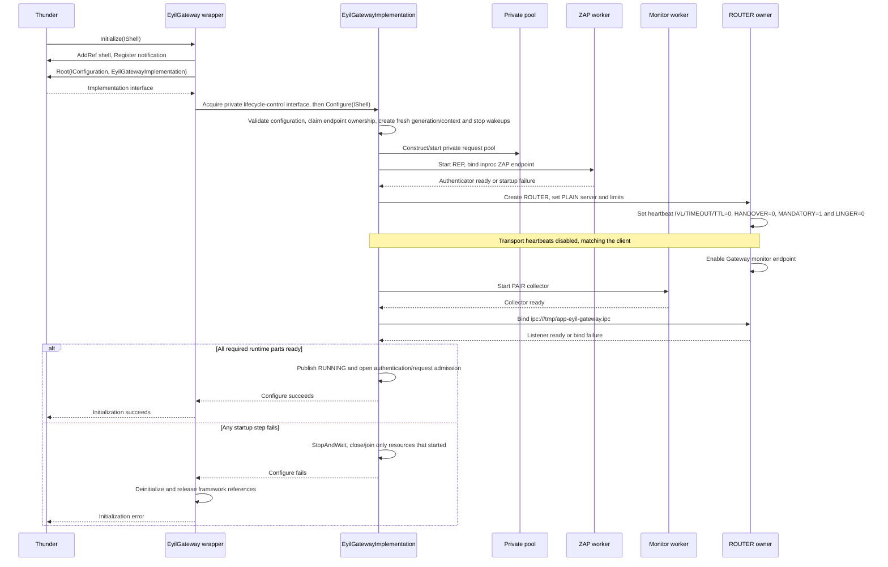
```mermaid
sequenceDiagram
    participant T as Thunder
    participant P as EyilGateway wrapper
    participant I as EyilGatewayImplementation
    participant W as Private pool
    participant Z as ZAP worker
    participant M as Monitor worker
    participant R as ROUTER owner
    T->>P: Initialize(IShell)
    P->>T: AddRef shell, Register notification
    P->>T: Root(IConfiguration, EyilGatewayImplementation)
    T-->>P: Implementation interface
    P->>I: Acquire private lifecycle-control interface, then Configure(IShell)
    I->>I: Validate configuration, claim endpoint ownership, create fresh generation/context and stop wakeups
    I->>W: Construct/start private request pool
    I->>Z: Start REP, bind inproc ZAP endpoint
    Z-->>I: Authenticator ready or startup failure
    I->>R: Create ROUTER, set PLAIN server and limits
    R->>R: Set heartbeat IVL/TIMEOUT/TTL=0, HANDOVER=0, MANDATORY=1 and LINGER=0
    Note over I,R: Transport heartbeats disabled, matching the client
    R->>R: Enable Gateway monitor endpoint
    I->>M: Start PAIR collector
    M-->>I: Collector ready
    I->>R: Bind ipc:///tmp/app-eyil-gateway.ipc
    R-->>I: Listener ready or bind failure
    alt All required runtime parts ready
        I->>I: Publish RUNNING and open authentication/request admission
        I-->>P: Configure succeeds
        P-->>T: Initialization succeeds
    else Any startup step fails
        I->>I: StopAndWait, close/join only resources that started
        I-->>P: Configure fails
        P->>P: Deinitialize and release framework references
        P-->>T: Initialization error
    end
```

Crypto is available before Gateway activation and remains available during
orderly Gateway teardown. Configure validates/stores its callsign; each
notification and operation acquires its interface on demand. There is no cached
ICrypto pointer, availability observer or startup polling. AppManager/RuntimeManager
lookup is not called in this phase.

Start the private pool, ZAP and monitor collector before binding ROUTER. Publish
RUNNING only once all owners are ready; a racing handshake cannot create an
ACTIVE context while startup admission is closed. Each activation gets fresh
registries, counters, generation, wakeups, sockets and its own ZMQ context.

Before binding ROUTER, explicitly set ZMQ_HEARTBEAT_IVL, ZMQ_HEARTBEAT_TIMEOUT
and ZMQ_HEARTBEAT_TTL to 0, matching client setup in section 5.5. Use the PAIR
monitor for transport events and event-driven cleanup. There is no application
heartbeat worker or inactivity watchdog.

Partial rollback uses the same StopAndWait discipline as section 6.16. Create
stop state and wakeups before starting threads; close/join only resources
actually created/started. Failed Configure returns only after rollback completes.

Require exclusive ownership of the configured UDS endpoint. Never replace a
live listener or unlink another runtime's socket. Release endpoint ownership
after socket owners exit and context termination completes. Rebinding creates
a new socket inode; container mounts must expose it as specified in section 3.3.

### 6.5 ZAP, interim identity and future AppManager lookup

Coverage: **AC1.3, AC1.5–AC1.6; AC2.2**.

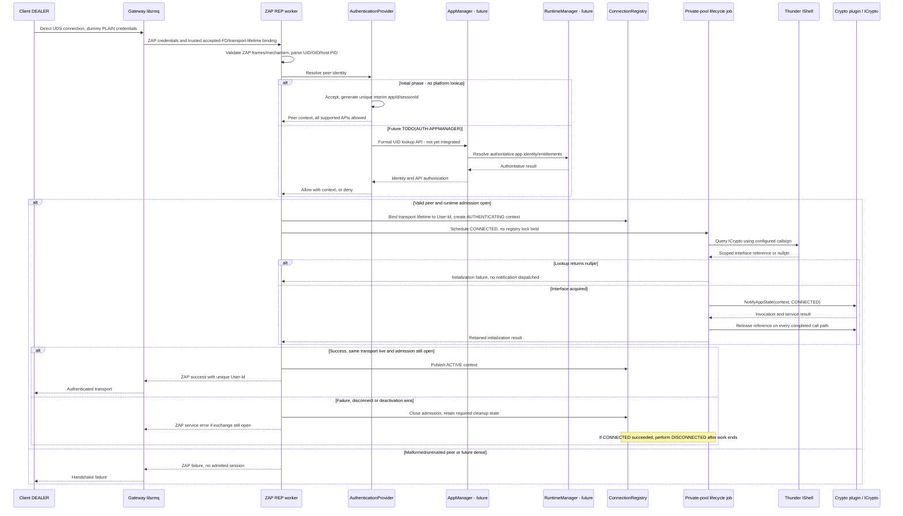
```mermaid
sequenceDiagram
    participant C as Client DEALER
    participant L as Gateway libzmq
    participant Z as ZAP REP worker
    participant A as AuthenticationProvider
    participant AM as AppManager - future
    participant RM as RuntimeManager - future
    participant REG as ConnectionRegistry
    participant W as Private-pool lifecycle job
    participant T as Thunder IShell
    participant CP as Crypto plugin / ICrypto
    C->>L: Direct UDS connection, dummy PLAIN credentials
    L->>Z: ZAP credentials and trusted accepted-FD/transport-lifetime binding
    Z->>Z: Validate ZAP frames/mechanism, parse UID/GID/host PID
    Z->>A: Resolve peer identity
    alt Initial phase - no platform lookup
        A->>A: Accept, generate unique interim appId/sessionId
        A-->>Z: Peer context, all supported APIs allowed
    else Future TODO(AUTH-APPMANAGER)
        A->>AM: Formal UID lookup API - not yet integrated
        AM->>RM: Resolve authoritative app identity/entitlements
        RM-->>AM: Authoritative result
        AM-->>A: Identity and API authorization
        A-->>Z: Allow with context, or deny
    end
    alt Valid peer and runtime admission open
        Z->>REG: Bind transport lifetime to User-Id, create AUTHENTICATING context
        Z->>W: Schedule CONNECTED, no registry lock held
        W->>T: Query ICrypto using configured callsign
        T-->>W: Scoped interface reference or nullptr
        alt Lookup returns nullptr
            W-->>Z: Initialization failure, no notification dispatched
        else Interface acquired
            W->>CP: NotifyAppState(context, CONNECTED)
            CP-->>W: Invocation and service result
            W->>CP: Release reference on every completed call path
            W-->>Z: Retained initialization result
        end
        alt Success, same transport live and admission still open
            Z->>REG: Publish ACTIVE context
            Z-->>L: ZAP success with unique User-Id
            L-->>C: Authenticated transport
        else Failure, disconnect or deactivation wins
            Z->>REG: Close admission, retain required cleanup state
            Z-->>L: ZAP service error if exchange still open
            Note over REG,W: If CONNECTED succeeded, perform DISCONNECTED after work ends
        end
    else Malformed/untrusted peer or future denial
        Z-->>L: ZAP failure, no admitted session
        L-->>C: Handshake failure
    end
```

A User-Id can encode `appId#sessionId#connectionToken`, or be an opaque random
token resolved through the registry. The important property is uniqueness per
accepted connection and an unambiguous lookup; any delimiter-based encoding
needs escaping/validation. Reconnection creates a new generation. Two sockets
from the same UID/GID/PID do not share a context.

CONNECTED is sent during authentication for every accepted connection,
including one that never sends an RPC. Crypto is already available. The private
lifecycle job completes before ZAP success; no first-request initialization is
needed. ZAP waits without registry locks and must wake on stop/transport closure.
A late CONNECTED result cannot revive a closed context.

A null ICrypto lookup or failed CONNECTED invocation fails setup. Return ZAP
300/500 when possible, mapped to CLIENT_COMMUNICATION_ERROR by the client, and
retain any uncertain cleanup obligation. Do not poll/retry Crypto or admit RPCs
against a context whose initialization failed. An in-progress CONNECTED job is
included in plugin shutdown accounting.

The interim "accept all" decision removes policy checks, not frame validation,
credential provenance checks, quotas or buffer isolation. Production API
entitlements are cached per connection and purged from admission on disconnect.
No app-supplied username, password, route or payload field replaces the kernel
identity or the future platform lookup.

### 6.6 Request ingress, dispatch and response delivery

Coverage: **AC1.2, AC1.6–AC1.9; AC2.4**.

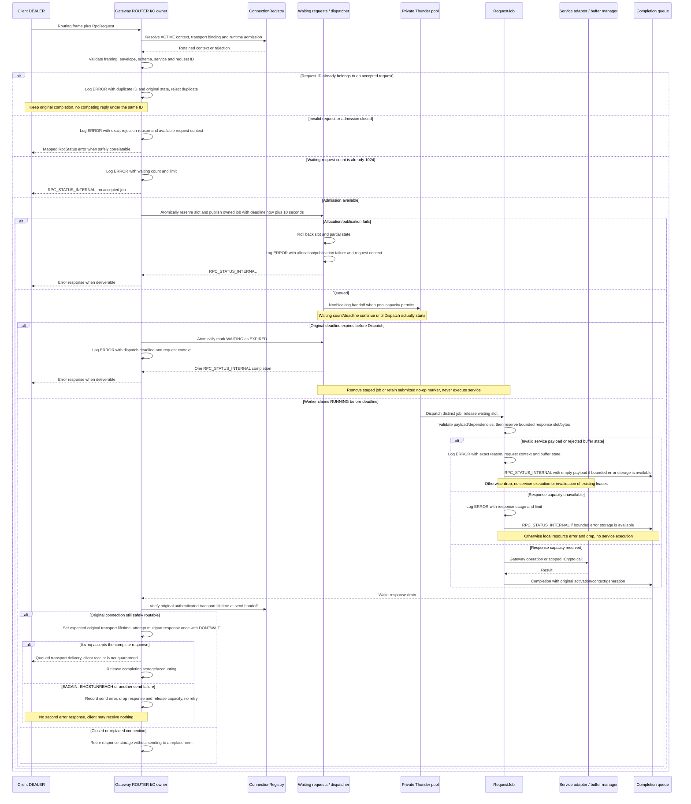
```mermaid
sequenceDiagram
    participant C as Client DEALER
    participant R as Gateway ROUTER I/O owner
    participant REG as ConnectionRegistry
    participant Q as Waiting requests / dispatcher
    participant P as Private Thunder pool
    participant J as RequestJob
    participant S as Service adapter / buffer manager
    participant OUT as Completion queue
    C->>R: Routing frame plus RpcRequest
    R->>REG: Resolve ACTIVE context, transport binding and runtime admission
    REG-->>R: Retained context or rejection
    R->>R: Validate framing, envelope, schema, service and request ID
    alt Request ID already belongs to an accepted request
        R->>R: Log ERROR with duplicate ID and original state, reject duplicate
        Note over R,C: Keep original completion, no competing reply under the same ID
    else Invalid request or admission closed
        R->>R: Log ERROR with exact rejection reason and available request context
        R-->>C: Mapped RpcStatus error when safely correlatable
    else Waiting-request count is already 1024
        R->>R: Log ERROR with waiting count and limit
        R-->>C: RPC_STATUS_INTERNAL, no accepted job
    else Admission available
        R->>Q: Atomically reserve slot and publish owned job with deadline now plus 10 seconds
        alt Allocation/publication fails
            Q->>Q: Roll back slot and partial state
            Q->>Q: Log ERROR with allocation/publication failure and request context
            Q-->>R: RPC_STATUS_INTERNAL
            R-->>C: Error response when deliverable
        else Queued
            Q->>P: Nonblocking handoff when pool capacity permits
            Note over Q,P: Waiting count/deadline continue until Dispatch actually starts
            alt Original deadline expires before Dispatch
                R->>Q: Atomically mark WAITING as EXPIRED
                R->>R: Log ERROR with dispatch deadline and request context
                Q-->>R: One RPC_STATUS_INTERNAL completion
                R-->>C: Error response when deliverable
                Note over Q,J: Remove staged job or retain submitted no-op marker, never execute service
            else Worker claims RUNNING before deadline
                P->>J: Dispatch distinct job, release waiting slot
                J->>J: Validate payload/dependencies, then reserve bounded response slot/bytes
                alt Invalid service payload or rejected buffer state
                    J->>J: Log ERROR with exact reason, request context and buffer state
                    J->>OUT: RPC_STATUS_INTERNAL with empty payload if bounded error storage is available
                    Note over J,S: Otherwise drop, no service execution or invalidation of existing leases
                else Response capacity unavailable
                    J->>J: Log ERROR with response usage and limit
                    J->>OUT: RPC_STATUS_INTERNAL if bounded error storage is available
                    Note over J,OUT: Otherwise local resource error and drop, no service execution
                else Response capacity reserved
                    J->>S: Gateway operation or scoped ICrypto call
                    S-->>J: Result
                    J->>OUT: Completion with original activation/context/generation
                end
                OUT-->>R: Wake response drain
                R->>REG: Verify original authenticated transport lifetime at send handoff
                alt Original connection still safely routable
                    R->>R: Set expected original transport lifetime, attempt multipart response once with DONTWAIT
                    alt libzmq accepts the complete response
                        R-->>C: Queued transport delivery, client receipt is not guaranteed
                        R->>R: Release completion storage/accounting
                    else EAGAIN, EHOSTUNREACH or another send failure
                        R->>R: Record send error, drop response and release capacity, no retry
                        Note over R,C: No second error response, client may receive nothing
                    end
                else Closed or replaced connection
                    R->>R: Retire response storage without sending to a replacement
                end
            end
        end
    end
```

Stage accepted work while private workers are occupied, within the global
1,024 waiting-request limit and original 10-second dispatch deadline. Saturation,
expiry and allocation failure produce RPC_STATUS_INTERNAL when deliverable.
Expired/rejected work never invokes Crypto or performs a buffer operation.
Requests that started Dispatch complete normally; this timer cannot cancel them.

The Gateway ROUTER owner serializes new admission with deactivation. Already
accepted work settles during drain while replies and control events continue.
Per-message bounds, shared-buffer quotas and completion-storage policy remain
separate. Process ingress, completions and deadlines fairly in bounded batches.

Validate at least: frame count, message size, trusted metadata, live context,
schema 1, supported service, request-ID rules, service parse, operation/oneof
agreement, enum/range validity and allocation ownership. Apply the generic
rejection and ERROR-log contract in section 4.2, including preservation of an
original request when its ID is duplicated. Independent requests can finish in
any order; dependent operations must follow the resource-ordering contract.

The same binary-envelope validation applies when a caller used a string API.
For CRYPTO, the payload must still satisfy CryptoRequest. Plain text support
needs the explicit routing and payload interpretation in TEXT-SERVICE-CONTRACT;
do not bypass service validation or parse arbitrary text as a Crypto message.

A job publishes completion rather than touching ROUTER. The handoff queue exists
to transfer the result to its socket owner; it is not a retry queue. Process
new completions promptly in bounded batches so replies, ingress, monitor events
and deadlines all progress. The storage and send rules below are selected
behavior, not an outstanding architecture gap.

#### Bounded response handoff

Use a bounded completion handoff from private workers to the ROUTER owner.
Initial response-slot defaults are **128 per connection and 1,024 globally**,
separate from the 1,024 requests waiting for workers. Count reserved slots for
running jobs as well as completed records. These limits do not introduce a
per-connection response-retry queue.

Before executing a service operation, reserve its completion slot and response
byte allowance atomically against the connection/global budgets. Use a finite
configured maximum serialized response size and finite per-connection/global
byte budgets; counts alone do not bound variable-size output. Validate the
configuration and size arithmetic before opening admission. Product sizing is
a resource configuration task, not a choice of delivery policy. Section 6.2
lists [proposed initial byte budgets](#proposed-initial-resource-sizing) for
target-device validation.

If reservation is unavailable, do not execute the operation or block a worker.
Publish RPC_STATUS_INTERNAL through the owner if bounded error storage is
available; otherwise record the local resource error and drop. Likewise,
allocation/publication failure cannot create unbounded overflow storage or
trigger another backend execution. Validate requested output lengths before
calling the backend where possible, and enforce the serialized-response limit
before publishing a completion.

Release the reservation exactly once when the single send attempt succeeds,
fails, or the response is discarded as stale. Configure a finite ROUTER
ZMQ_SNDHWM as well: libzmq's accepted output is separate from Gateway handoff
storage. Apply platform connection/message limits when sizing that storage.
Process a bounded batch of new completions per I/O-loop iteration, then return
to ingress, monitor events and deadlines.

#### One response send attempt

**Gateway attempts each response once, nonblocking. On failure it records a
local delivery error and drops the response.** There are no retained failed
replies, per-connection retry queues, send-retry timers or second attempts.

Configure ROUTER_MANDATORY=1 and use ZMQ_DONTWAIT for the multipart response.
A full route reports EAGAIN and an unreachable route reports EHOSTUNREACH;
neither is permission to replay the operation.
[ROUTER send behavior](https://libzmq.readthedocs.io/en/latest/zmq_setsockopt.html#zmq-router-mandatory-accept-only-routable-messages)

| Outcome | Gateway action |
| --- | --- |
| Original context/route is already retired or replaced | Discard the stale completion without sending it to another connection |
| Complete response accepted by libzmq | Release Gateway completion storage/accounting; do not wait for client receipt |
| EAGAIN | Record output-backpressure failure, drop this response and continue other work; do not infer process death or disconnect solely for this result |
| EHOSTUNREACH | Record unreachable-route failure and drop; connection cleanup uses the authenticated lifecycle path |
| EINTR or another send error | Record the failed attempt, drop without a retry and apply any required socket/runtime error handling |
| Completion preparation/publication fails | Record local failure and release owned state without blocking a worker or starting another backend operation |

"One attempt" applies to the complete response message, whose ROUTER framing is
[routing_id][RpcResponse bytes], not to a single frame. Prepare both frames
before starting, use SNDMORE on the route frame, and never interleave another
response. If routing-frame submission fails, do not submit its payload. If a
later frame fails, preserve or terminate the socket's multipart state safely
under the verified libzmq contract before sending unrelated traffic; never
restart that response. The target transport tests must cover these frame-level
failure paths. Success confirms local libzmq acceptance, not peer receipt.
[Send and multipart contract](https://libzmq.readthedocs.io/en/latest/zmq_send.html)

Apply this policy to successful results and all Gateway error replies, including
queue-saturation and 10-second dispatch-expiry errors. Do not attempt to send a
second RPC_STATUS_INTERNAL to report the failure of the first response.
Record the request ID, connection generation and local send error in bounded
diagnostics/counters, without logging Crypto payloads. Drop releases response
storage, not an allocation still leased to an active backend operation.

The client cannot observe this local send failure through a response that was
not delivered. If the transport stays open, a synchronous call reaches its
15-second CLIENT_TIMEOUT; an accepted async request has no response timeout and
may retain its pending record until local teardown or connection loss, without
a response callback. A monitor reports connection events, not individual
dropped replies. This policy does not introduce an async error callback or
unsolicited notification.

Finite libzmq output high-water marks and response byte limits are still
required: accepted messages can remain queued inside libzmq, and concurrent
workers can produce handoff records before the I/O owner consumes them.
The client request-submission retry behavior within its existing deadline is
separate from this Gateway response policy.

### 6.7 Crypto adapter: per-call ICrypto references and per-connection sessions

Coverage: **AC1.8, AC1.10**.

Use the ICrypto API from
[entservices-apis branch topic/crypto](https://github.com/rdkcentral/entservices-apis/tree/topic/crypto),
specifically [apis/Crypto/ICrypto.h](https://github.com/rdkcentral/entservices-apis/blob/topic/crypto/apis/Crypto/ICrypto.h).
The reviewed branch revision is 6926f6a72fbfff18b691d09b3b7376fbd541b9d3.
The platform build supplies compatible headers and any required COM-RPC
proxy/stubs from that branch; pin a compatible revision in the dependency
recipe for reproducible builds. The architecture assumes Crypto is deployed
and queries it through Thunder using the configured callsign.

The interface supplies ApplicationContext { appId, sessionId } and
SharedBuffer { name }. Construct these from trusted internal records. A raw
FD integer is not an interprocess shared-memory identity.

#### Callsign configuration: BitBake to CMake to runtime

Define a CMake cache string, using org.rdk.Crypto as the default configuration
value. Products override it to match their installed Crypto plugin:

```cmake
set(PLUGIN_EYILGATEWAY_CRYPTO_CALLSIGN "org.rdk.Crypto"
    CACHE STRING "Crypto plugin callsign queried by EyilGateway"
)
```

The BitBake recipe forwards its product-selected value through EXTRA_OECMAKE:

```bitbake
EYILGATEWAY_CRYPTO_CALLSIGN ?= "org.rdk.Crypto"
EXTRA_OECMAKE += "-DPLUGIN_EYILGATEWAY_CRYPTO_CALLSIGN=${EYILGATEWAY_CRYPTO_CALLSIGN}"
```

EyilGateway.config must carry that value into configuration.cryptocallsign in
the generated Thunder configuration. The following fragment shows the setting:

```json
{
    "callsign": "org.rdk.EyilGateway",
    "configuration": {
        "cryptocallsign": "org.rdk.Crypto"
    }
}
```

Configure(IShell*) reads ConfigLine(), validates the callsign is nonempty and
retains the string for the runtime lifetime. Empty/invalid configuration fails
Configure; do not substitute another plugin silently. No ICrypto lookup is
needed during Gateway startup. Every invocation passes the stored value to
QueryInterfaceByCallsign<Exchange::ICrypto>(). The name is not accepted from
an application request, and changing it requires Gateway reconfiguration/restart.
The Gateway's own callsign remains org.rdk.EyilGateway.

#### Interface ownership

Acquire ICrypto on the private worker immediately before the method invocation.
Hold the returned reference in a scoped Release guard around that invocation
and release it as soon as the call returns. The API returns value outputs into
caller-owned storage; check Core::hresult before consuming them, then map and
serialize them after releasing the interface. Release exactly once on every
path, including errors and unwinding; later response-allocation failure must
not leave an interface retained. Do not hold ICrypto while waiting in the
request queue, waiting for a session-initialization barrier or delivering a response.

No ICrypto pointer is cached in GatewayRuntime, CryptoServiceAdapter, a
connection context or a queued job. Concurrent invocations own independent
references, even if Thunder returns the same underlying object. Crypto owns
its internal synchronization under the ICrypto contract; reference counting
does not serialize calls. Use the same query/invoke/release scope for
NotifyAppState as for all operation methods.

This is a short-lived interface reference. Thunder owns the plugin and its
COM-RPC transport; Release is not an instruction to destroy Crypto, close a
physical transport connection or end the application's Crypto session. The
Gateway retains its IShell reference until workers and lifecycle jobs finish,
so they can safely perform their own lookups.

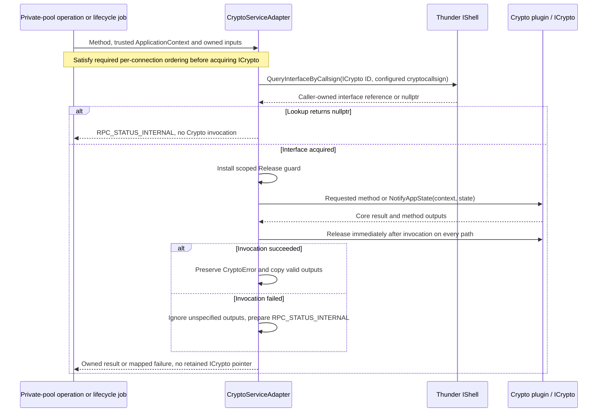
```mermaid
sequenceDiagram
    participant J as Private-pool operation or lifecycle job
    participant A as CryptoServiceAdapter
    participant T as Thunder IShell
    participant C as Crypto plugin / ICrypto
    J->>A: Method, trusted ApplicationContext and owned inputs
    Note over J,A: Satisfy required per-connection ordering before acquiring ICrypto
    A->>T: QueryInterfaceByCallsign(ICrypto ID, configured cryptocallsign)
    T-->>A: Caller-owned interface reference or nullptr
    alt Lookup returns nullptr
        A-->>J: RPC_STATUS_INTERNAL, no Crypto invocation
    else Interface acquired
        A->>A: Install scoped Release guard
        A->>C: Requested method or NotifyAppState(context, state)
        C-->>A: Core result and method outputs
        A->>C: Release immediately after invocation on every path
        alt Invocation succeeded
            A->>A: Preserve CryptoError and copy valid outputs
        else Invocation failed
            A->>A: Ignore unspecified outputs, prepare RPC_STATUS_INTERNAL
        end
        A-->>J: Owned result or mapped failure, no retained ICrypto pointer
    end
```

#### Application context is separate from the interface reference

Keep appId and sessionId stable for the client connection. The Crypto plugin
owns the corresponding session and transient keys; Gateway keeps only trusted
identity and lifecycle bookkeeping. There is no global Crypto session shared
by all apps and no new app session for each interface lookup.

For example, GenerateKey returns a key ID, Gateway releases its ICrypto
reference, and a later Sign obtains another reference and passes the same
ApplicationContext and key ID. Crypto must preserve that session's state across
these independent interface references. Releasing an interface must not invoke
NotifyAppState(DISCONNECTED) or discard the app's keys.

NotifyAppState(CONNECTED) completes during authentication before ZAP success
and RPC admission. After accepted work finishes, send DISCONNECTED once before
final connection-resource release. This also covers authenticated connections
that never send a request.

Crypto owns session creation, key lifetime, authorization, internal concurrency
and backend recovery. Gateway forwards ApplicationContext and arguments, checks
results and releases each interface reference. It does not implement those
Crypto policies. Every notification uses the same per-call ownership as an
operation.

Gateway does not poll Crypto, subscribe to its plugin-state changes, cache a
backend-health flag or automatically reactivate/restart it. Lookup and call
results are the observations available to Gateway. A new lookup does not prove
that earlier keys or sessions survived a backend restart. Section 6.15 defines
the Gateway error boundary; Crypto owns its internal recovery. Framework
notifications for the Gateway implementation are unrelated and remain valid.

Crypto owns key authorization. Gateway checks API entitlements when that
platform integration is enabled, without duplicating Crypto's key-usage,
export-protection or cross-app-sharing decisions.

### 6.8 Crypto operation routing map

All 17 Protobuf operations have an explicit destination. Only the two buffer
management operations terminate locally; the remaining 15 invoke the Crypto
backend. Structure/limit checks apply even in the interim accept-all phase.

| CryptoRequest operation | Destination / method | Main inputs → successful outputs |
| --- | --- | --- |
| LOAD_KEY | ICrypto::LoadKey | locator, provision_type → key_id |
| KEY_EXISTS | ICrypto::KeyExists | locator → exists, key_id when present |
| FLUSH_KEYS | ICrypto::FlushKeys | trusted context → empty response |
| GENERATE_KEY_PAIR | ICrypto::GenerateKeyPair | algorithm, matching parameters → private_key_id, public_key_id |
| DERIVE_SESSION_KEYS | ICrypto::DeriveSessionKeys | algorithm and source key IDs → encryption/hmac/wrapping key IDs |
| GET_KEY_INFO | ICrypto::GetKeyInfo | key_id → type, usages, algorithm |
| GENERATE_KEY | ICrypto::GenerateKey | algorithm, usages → key_id |
| UNLOAD_KEY | ICrypto::UnloadKey | key_id → empty response |
| IMPORT_KEY | ICrypto::ImportKey | type, optional protection format, blob → key_id |
| EXPORT_KEY | ICrypto::ExportKey | key_id, optional protection format → blob |
| GENERATE_RANDOM | ICrypto::GenerateRandom | bounded byte count → random bytes |
| ENCRYPT | ICrypto::Encrypt | buffer_id, algorithm, key_id, init/input regions → encrypted region |
| DECRYPT | ICrypto::Decrypt | buffer_id, algorithm, key_id, init/encrypted regions → plaintext region |
| SIGN | ICrypto::Sign | buffer_id, algorithms, key_id, input region → signature region |
| VERIFY | ICrypto::Verify | buffer_id, algorithms, key_id, input/signature regions → verification_status |
| ALLOCATE_SHARED_BUFFER | SharedBufferManager::Allocate | requested_size → buffer_id, client name, size |
| RELEASE_SHARED_BUFFER | SharedBufferManager::Release | buffer_id → release result |

Preserve optional presence for import_export_type rather than replacing an
absent field with the enum's zero value. Validate repeated usages, algorithm
parameter variants, sizes and numeric conversions before constructing backend
types. Use explicit mappings rather than assuming enum ordinals always match.

#### Client and Gateway boundaries in the Crypto sequences

The Crypto sequences in sections 6.9–6.13 use the **byte request APIs**.
The consumer constructs the operation-specific message inside CryptoRequest,
serializes it into RpcRequest.payload, selects RPC_SERVICE_CRYPTO and supplies
that serialized outer request to client_send_request or
client_send_request_async. EyilClient replaces request_id/schema_version and
handles the outer response only. The consumer checks RpcStatus, then decodes
CryptoResponse and checks CryptoError before using operation outputs.

An operation name in a diagram identifies its payload; it is not another public
EyilClient function. Shared-buffer allocation returns response bytes containing
buffer_id, name and size, never a mapped pointer from EyilClient. String APIs
need TEXT-SERVICE-CONTRACT and are not implicitly usable for these Crypto flows.

Every dispatch follows the waiting-deadline, resource-reservation and accepted
work-drain rules in section 6.6. Response arrows show the successful delivery
path: the ROUTER owner makes one guarded nonblocking attempt, and a failed send
is logged/dropped without replay or a guaranteed client callback. Rejections
and allocation/invocation failures use section 4.2, including an ERROR log.

### 6.9 Non-shared-memory operations

Coverage: **AC1.8; AC3.1–AC3.2**. This flow applies to the eleven key/random
operations above; allocation/release and the four bulk-data operations have
separate flows.

```mermaid
sequenceDiagram
    participant F as Firebolt Crypto / consumer
    participant L as EyilClient
    participant R as Gateway ROUTER
    participant J as Private request job / adapter
    participant T as Thunder IShell
    participant C as Crypto plugin / ICrypto
    F->>F: Serialize CryptoRequest inside RpcRequest with service CRYPTO
    F->>L: client_send_request or client_send_request_async with envelope bytes
    L->>R: RpcRequest(service=CRYPTO, schema=1)
    R->>J: Submit retained context and request
    J->>J: Validate operation, parameters and entitlement, satisfy context ordering
    J->>T: Query ICrypto using configuration.cryptocallsign
    T-->>J: Caller-owned interface reference or nullptr
    alt Lookup returns nullptr
        J-->>R: RPC_STATUS_INTERNAL
    else Scoped reference acquired
        J->>C: LoadKey / GenerateKey / other mapped method with ApplicationContext
        C->>C: Enforce key policy and perform operation
        C-->>J: Core result, CryptoError and output values
        J->>C: Release immediately after invocation on every result path
        J->>J: Check Core result, preserve CryptoError and copy defined outputs
        J->>J: Encode owned CryptoResponse or mapped invocation failure
        J-->>R: Completion with original request ID/generation
    end
    R-->>L: RpcResponse through original connection
    L-->>F: Serialized result to matching waiter/callback
    F->>F: Inspect RpcStatus and CryptoError, decode result
```

Key generation/import/derivation may change backend state. Loss of a response
does not justify retrying automatically. Ordering UnloadKey or FlushKeys
is handled by Crypto under its ICrypto contract. Gateway does not implement
key-policy synchronization; Gateway-owned buffer ordering remains **Gap 2**.

### 6.10 Shared-memory identity, records and invariants

Coverage: **AC1.9–AC1.10**. Allocation is a Gateway responsibility; mapping by
the application and access by Crypto are separate responsibilities.

| Identifier | Example | Meaning |
| --- | --- | --- |
| buffer_id | Opaque generated token | Gateway lookup key, scoped to one connection generation |
| Client name | `/eyil.<random-token>` | POSIX name opened with shm_open() inside the app container |
| Backend path | `/proc/<host-peer-pid>/root/dev/shm/eyil.<random-token>` | Proposed host-visible path passed as SharedBuffer.name |
| Gateway FD | Process-local descriptor | Retains the created object; never sent as a bare integer to Crypto |
| BufferRegion | `{ offset, length }` | Byte range in the same allocation, not a pointer |

Each buffer record retains the owner token/generation, peer evidence, opaque ID,
client name, backend path, actual capacity, FD, reserved/active use count and
release state. Per-connection count/byte quotas and a global byte budget require
atomic reservation and rollback on every failure path.
Quota rejection returns RPC_STATUS_INTERNAL and emits an ERROR log containing
the requested allocation, usage and limit, as specified in section 4.2.

Use exclusive creation, generated names, close-on-exec descriptors and deliberate
ownership/mode settings. The shared-memory proposal sets the peer UID/GID and
owner read/write access. Verify user-namespace mappings and backend permissions
on the target platform; Gateway running in Thunder is not itself proof of the
required procfs access.

The proposal's namespace path uses the peer's mount view. Access is subject to
procfs checks and can become unavailable when the peer or its main thread exits.
See [proc_pid_root](https://man7.org/linux/man-pages/man5/proc_pid_root.5.html).
The path/FD relationship remains **Gap 1**: retaining an FD does not guarantee
that a later open of the pathname obtains the same object.

Required invariants:

- Only the owner connection may resolve a buffer_id; same UID/PID is insufficient.
- A connection may have multiple allocations. Initially allow at most one
  operation using an allocation at a time, with queued-use reservation rules
  still to be settled.
- Check `offset <= size && length <= size - offset`; avoid unchecked
  `offset + length` arithmetic. Enforce per-operation region presence and
  overlap rules.
- Keep a lease from the point at which the operation depends on the allocation
  until backend access is definitively over. Release/disconnect cannot invalidate it.
- The app must not resize, unlink or modify participating regions while an
  operation is outstanding. This cooperation rule is not protection against
  a malicious writable client; mutation/truncation defenses remain TODO.
- Gateway owns unlink/cleanup. An app unmaps/closes its own view; it does not
  call shm_unlink(). Unlink/close by Gateway also does not revoke an existing
  app mapping.
- A local client timeout or uncertain COM-RPC failure is not safe completion.

Configure maximum shared-buffer size, buffer count and aggregate byte quotas
per connection and globally. Their values must match platform memory and
concurrency budgets. Section 6.2 lists
[proposed initial quotas](#proposed-initial-resource-sizing); final product
values remain subject to validation under TODO(RESOURCE-LIMITS).

### 6.11 AllocateSharedBuffer and client mapping

Coverage: **AC1.9; AC2.4; AC3.1–AC3.2**. No ICrypto call is involved.

```mermaid
sequenceDiagram
    participant A as App-side Crypto / buffer helper
    participant L as EyilClient
    participant R as Gateway ROUTER
    participant J as Private request job
    participant B as SharedBufferManager
    participant K as Linux / peer private dev-shm
    A->>A: Put AllocateSharedBufferRequest in CryptoRequest, serialize into RpcRequest
    A->>L: Byte request API with serialized RpcRequest, service CRYPTO
    L->>R: RpcRequest through DEALER IPC
    R->>J: Dispatch with retained connection context
    J->>B: Allocate(owner, requested_size)
    B->>B: Validate nonzero size, reserve count/byte quotas
    alt Invalid size or quota unavailable
        B->>B: Roll back partial reservation, log ERROR with exact cause and request context
        B-->>J: RPC_STATUS_INTERNAL, no allocation
        J-->>R: Error completion with empty service payload
        R-->>L: Single response attempt through original connection
        L-->>A: RpcResponse error, no buffer to map
    else Validation and quota reservation succeed
        B->>K: Safely open peer shm directory, exclusive object creation
        B->>K: ftruncate, set approved ownership and permissions
        K-->>B: Retained FD and verified capacity
        B->>B: Publish buffer_id, client name, host path and owner
        B-->>J: AllocateSharedBufferResponse
        J-->>R: Completion carrying original context/generation
        R-->>L: RpcResponse
        L-->>A: Complete serialized RpcResponse
        A->>A: Check RpcStatus and CryptoError, decode buffer_id, name and size
        A->>K: shm_open(name, O_RDWR), inspect size, mmap(MAP_SHARED)
        K-->>A: Application mapping
        Note over B,K: On creation failure roll back object, FD and quota, log ERROR and return RPC_STATUS_INTERNAL
    end
```

The mapping helper is outside the current EyilClient transport API. Decide
whether Firebolt Crypto supplies it or a separate utility does. The application
must also handle allocation success followed by mapping failure: request release
when possible, otherwise let correlated connection cleanup reclaim the record.

If the connection closes while creation is in progress, recheck its generation
before publishing the result and clean up an allocation that cannot be admitted.
If an allocation reply is lost, the Gateway may own a buffer unknown to the app;
quota accounting and eventual connection cleanup must still cover it.

### 6.12 Shared-memory operations: common backend boundary

For all four operations, the app writes inputs before sending the request.
The Gateway resolves buffer_id and validates owner/ranges, then passes the
trusted backend path and regions to the Crypto adapter. Crypto independently
opens the object, checks its actual size, maps it, performs the operation and
unmaps/closes it before a successful synchronous invocation returns.

The topic/crypto ICrypto contract selects output locations in Crypto. Gateway
forwards the returned region only after validating the invocation and service
result. On success, output must be inside the allocation. A BUFFER_OVERFLOW
result may describe required capacity rather than an accessible output range;
the app must not read it as produced data. Exact required-size propagation must
match the adopted interface revision.

The following diagrams expand the four operation-specific calls using the
deployed Crypto plugin. Each invocation acquires its own scoped ICrypto
reference. CONNECTED has already completed during authentication; null lookup
and invocation failures follow sections 6.7 and 6.15.

#### Encrypt

Coverage: **AC1.8–AC1.9; AC3.1–AC3.2**.

```mermaid
sequenceDiagram
    participant A as App-side Crypto / mapped buffer
    participant L as EyilClient
    participant R as Gateway ROUTER
    participant J as Private job / Crypto adapter
    participant B as SharedBufferManager
    participant T as Thunder IShell
    participant C as Crypto plugin / ICrypto
    A->>A: Write init_data and plaintext input_data
    A->>A: Wrap EncryptRequest(buffer_id, algorithm, key_id, regions) in CryptoRequest and RpcRequest
    A->>L: Byte request API with serialized RpcRequest, service CRYPTO
    L->>R: RpcRequest over DEALER IPC
    R->>J: Dispatch independent job
    J->>B: Acquire owner-checked lease, validate regions
    B-->>J: Retained object identity and capacity
    J->>T: Query ICrypto using configuration.cryptocallsign
    T-->>J: Scoped reference or nullptr
    alt Lookup returns nullptr
        J->>B: End this job's unused lease
        J-->>R: RPC_STATUS_INTERNAL
    else Scoped reference acquired
        J->>C: Encrypt(context, buffer, algorithm, keyId, initData, inputData)
        C->>C: Open/check/map, enforce key policy, write ciphertext
        C->>C: Unmap and close before normal return
        C-->>J: Invocation result, CryptoError, encryptedData region
        alt Core invocation failed
            J->>C: Release scoped reference after call returns
            J->>B: Retain lease if backend completion is uncertain
            J-->>R: RPC_STATUS_INTERNAL, no automatic replay
        else Invocation completed
            J->>C: Release immediately after invocation
            J->>J: Preserve CryptoError and copy defined outputs
            J->>J: Validate successful output or preserve overflow result
            J->>B: End lease only when backend access is known finished
            J-->>R: Completion with EncryptResponse
        end
    end
    R-->>L: RpcResponse
    L-->>A: Matched RpcResponse bytes through waiter or callback
    A->>A: Check RpcStatus and CryptoError, decode region, read ciphertext only on success
```

#### Decrypt

Coverage: **AC1.8–AC1.9; AC3.1–AC3.2**.

```mermaid
sequenceDiagram
    participant A as App-side Crypto / mapped buffer
    participant L as EyilClient
    participant R as Gateway ROUTER
    participant J as Private job / Crypto adapter
    participant B as SharedBufferManager
    participant T as Thunder IShell
    participant C as Crypto plugin / ICrypto
    A->>A: Write init_data and encrypted_data
    A->>A: Wrap DecryptRequest(buffer_id, algorithm, key_id, regions) in CryptoRequest and RpcRequest
    A->>L: Byte request API with serialized RpcRequest, service CRYPTO
    L->>R: RpcRequest over DEALER IPC
    R->>J: Dispatch independent job
    J->>B: Acquire owner-checked lease, validate input regions
    B-->>J: Trusted object identity and capacity
    J->>T: Query ICrypto using configuration.cryptocallsign
    T-->>J: Scoped reference or nullptr
    alt Lookup returns nullptr
        J->>B: End this job's unused lease
        J-->>R: RPC_STATUS_INTERNAL
    else Scoped reference acquired
        J->>C: Decrypt(context, buffer, algorithm, keyId, initData, encryptedData)
        C->>C: Open/check/map, enforce key policy, write plaintext
        C->>C: Unmap and close before normal return
        C-->>J: Invocation result, CryptoError, outputData region
        alt Core invocation failed
            J->>C: Release scoped reference after call returns
            J->>B: Retain lease if backend completion is uncertain
            J-->>R: RPC_STATUS_INTERNAL, no automatic replay
        else Invocation completed
            J->>C: Release immediately after invocation
            J->>J: Preserve CryptoError and copy defined outputs
            J->>J: Validate result and successful output bounds
            J->>B: End lease after definitive backend completion
            J-->>R: Completion with DecryptResponse
        end
    end
    R-->>L: RpcResponse
    L-->>A: Matched RpcResponse bytes through waiter or callback
    A->>A: Check RpcStatus and CryptoError, decode region, read plaintext only on success
```

#### Sign

Coverage: **AC1.8–AC1.9; AC3.1–AC3.2**.

```mermaid
sequenceDiagram
    participant A as App-side Crypto / mapped buffer
    participant L as EyilClient
    participant R as Gateway ROUTER
    participant J as Private job / Crypto adapter
    participant B as SharedBufferManager
    participant T as Thunder IShell
    participant C as Crypto plugin / ICrypto
    A->>A: Write input_data
    A->>A: Wrap SignRequest(buffer_id, algorithm, key_id, digest, input) in CryptoRequest and RpcRequest
    A->>L: Byte request API with serialized RpcRequest, service CRYPTO
    L->>R: RpcRequest over DEALER IPC
    R->>J: Dispatch independent job
    J->>B: Acquire owner-checked lease, validate input region
    B-->>J: Trusted object identity and capacity
    J->>T: Query ICrypto using configuration.cryptocallsign
    T-->>J: Scoped reference or nullptr
    alt Lookup returns nullptr
        J->>B: End this job's unused lease
        J-->>R: RPC_STATUS_INTERNAL
    else Scoped reference acquired
        J->>C: Sign(context, buffer, algorithm, keyId, digestAlgorithm, inputData)
        C->>C: Open/check/map, sign, select/write signature region
        C->>C: Unmap and close before normal return
        C-->>J: Invocation result, CryptoError, signature region
        alt Core invocation failed
            J->>C: Release scoped reference after call returns
            J->>B: Retain lease if backend completion is uncertain
            J-->>R: RPC_STATUS_INTERNAL, no automatic replay
        else Invocation completed
            J->>C: Release immediately after invocation
            J->>J: Preserve CryptoError and copy defined outputs
            J->>J: Validate success region or overflow result
            J->>B: End lease after definitive backend completion
            J-->>R: Completion with SignResponse
        end
    end
    R-->>L: RpcResponse
    L-->>A: Matched RpcResponse bytes through waiter or callback
    A->>A: Check RpcStatus and CryptoError, decode region, read signature only on success
```

#### Verify

Coverage: **AC1.8–AC1.9; AC3.1–AC3.2**.

```mermaid
sequenceDiagram
    participant A as App-side Crypto / mapped buffer
    participant L as EyilClient
    participant R as Gateway ROUTER
    participant J as Private job / Crypto adapter
    participant B as SharedBufferManager
    participant T as Thunder IShell
    participant C as Crypto plugin / ICrypto
    A->>A: Write input_data and expected_signature
    A->>A: Wrap VerifyRequest(buffer_id, algorithms, key_id, regions) in CryptoRequest and RpcRequest
    A->>L: Byte request API with serialized RpcRequest, service CRYPTO
    L->>R: RpcRequest over DEALER IPC
    R->>J: Dispatch independent job
    J->>B: Acquire owner-checked lease, validate both input regions
    B-->>J: Trusted object identity and capacity
    J->>T: Query ICrypto using configuration.cryptocallsign
    T-->>J: Scoped reference or nullptr
    alt Lookup returns nullptr
        J->>B: End this job's unused lease
        J-->>R: RPC_STATUS_INTERNAL
    else Scoped reference acquired
        J->>C: Verify(context, buffer, algorithms, keyId, input, signature)
        C->>C: Open/check/map, enforce key policy, compare signature
        C->>C: Unmap and close before normal return
        C-->>J: Invocation result, CryptoError, verificationStatus
        alt Core invocation failed
            J->>C: Release scoped reference after call returns
            J->>B: Retain lease if backend completion is uncertain
            J-->>R: RPC_STATUS_INTERNAL, no automatic replay
        else Invocation completed
            J->>C: Release immediately after invocation
            J->>J: Preserve CryptoError and copy defined outputs
            J->>B: End lease after definitive backend completion
            J-->>R: Completion with VerifyResponse
        end
    end
    R-->>L: RpcResponse
    L-->>A: Matched RpcResponse bytes through waiter or callback
    A->>A: Check RpcStatus and CryptoError, decode verification_status
    Note over A,C: Verify returns no binary output region
```

A verification result of false and a failed invocation are different outcomes.
For every operation, a transport failure after remote dispatch may leave
completion uncertain. Do not take the normal lease-release arrow in that case;
retain/quarantine the resource until an agreed recovery mechanism resolves it.

### 6.13 ReleaseSharedBuffer, reuse and concurrent release

Coverage: **AC1.9–AC1.10**. No ICrypto call is needed for an idle allocation.

```mermaid
sequenceDiagram
    participant A as App-side buffer helper
    participant L as EyilClient
    participant R as Gateway ROUTER
    participant J as Private release job
    participant B as SharedBufferManager
    participant K as Linux
    A->>A: Wait for definitive completion of all uses
    A->>K: munmap and close own mapping/FD
    A->>A: Wrap ReleaseSharedBufferRequest in CryptoRequest and RpcRequest
    A->>L: Byte request API with serialized RpcRequest, service CRYPTO
    L->>R: RpcRequest over IPC
    R->>J: Dispatch release job with owner context
    J->>B: Release(owner, buffer_id)
    B->>B: Check owner, buffer reference and release admission
    alt Invalid buffer reference or rejection due to busy or release-pending state
        B->>B: Log ERROR with exact cause, request context and buffer state
        B-->>J: RPC_STATUS_INTERNAL, preserve existing leases and release ownership
    else Release admitted
        B->>B: Reject future use atomically
        alt No reserved or active operation
            B->>K: Unlink owned object and close retained FD
            B->>B: Remove record, release quota
            B-->>J: Released
        else Accepted release still has an outstanding lease
            B->>B: Mark release pending, retain object and quota
            Note over J,B: Lifecycle TODO in Gaps 1 and 2 defines admission and release-completion timing
            B-->>J: Completion when the agreed lifecycle contract permits
        end
    end
    J-->>R: Completion
    R-->>L: RpcResponse
    L-->>A: Matched RpcResponse bytes through waiter or callback
    A->>A: Check RpcStatus and CryptoError before treating release as successful
```

When the last definitive lease ends, the manager can finish a pending release
exactly once. Rejected unknown/unowned buffer references, duplicate release and
busy/release-pending requests use RPC_STATUS_INTERNAL with an explicit ERROR log.
They do not create a second release operation or invalidate existing leases.
The resource-lifecycle contract still determines when a release is admitted,
whether it waits for leases, and when successful completion is acknowledged.
Those timing/ownership decisions are separate from the settled error mapping.

Do not rely on the order requests arrived at ROUTER: a queued Encrypt can run
after a Release job unless its dependency was reserved or ordered earlier.
Similarly, `client_send_request()` timing out does not satisfy the app's
"all uses completed" condition. These are **Gaps 1 and 2**.

### 6.14 Disconnect detection, PID observations and hibernation

Coverage: **AC1.4, AC1.6, AC1.10**.

#### Required connection-to-FD binding

One monitor is attached to the Gateway ROUTER and observes all its underlying
connections. Each DISCONNECTED event concerns one of those connections. Client
disconnect closes DEALER on its owning thread; the resulting UDS closure is
detected by Gateway without a disconnect Protobuf message or heartbeat.
Close is asynchronous and does not acknowledge remote cleanup.
[Monitor API](https://libzmq.readthedocs.io/en/latest/zmq_socket_monitor.html),
[socket close API](https://libzmq.readthedocs.io/en/latest/zmq_close.html)

| Gateway input | Information to associate |
| --- | --- |
| Monitor ACCEPTED | Gateway-side accepted transport FD and its lifetime |
| ZAP authentication | Trusted peer credentials and transport FD/lifetime metadata; Gateway assigns a unique User-Id |
| ROUTER request | User-Id, transport FD/lifetime metadata and binary routing ID |
| Monitor DISCONNECTED | Transport FD/lifetime and versioned peer credentials |

**Bind the Gateway-side FD and its connection lifetime to User-Id before ZAP
success.** Keep the activation generation and a non-reused transport lifetime
identifier in that record. The client's own numeric FD is unrelated.

The platform/libzmq integration must expose the same trusted binding to ZAP and
disconnect handling. A transport-generated connection token accompanying the FD
in local ZAP metadata and versioned monitor events supplies that contract.
Credentials alone or arrival order across independent queues do not.
This is a required integration contract, not a claim that standard ZAP exposes
an accepted FD or standard monitor events contain User-Id.

An event's FD may already be closed. Its stored number can still be used for
lookup; the lifetime identifier prevents selection of a newer connection that
reused it. The registry observes the FD but never closes, reads, writes or
duplicates it. Do not rediscover credentials by calling SO_PEERCRED on a delayed
event's FD. ZMQ_FD returned by zmq_getsockopt is a notification descriptor for
the ZeroMQ socket, not an accepted client's FD.
[ZMQ_FD contract](https://libzmq.readthedocs.io/en/latest/zmq_getsockopt.html#zmq-fd-retrieve-file-descriptor-associated-with-the-socket)

Required rules:

1. Establish the binding during authentication, before any RPC is needed.
   Connections that never send a request remain identifiable for cleanup.
2. Serialize acceptance and closure of that lifetime. Retain closing state
   until in-progress authentication resolves; delayed ACCEPTED or ZAP completion
   must not resurrect a closed connection.
3. Resolve each disconnect to the original context only. Two connections from
   the same UID/GID/PID remain independent.
4. Carry activation and connection generations through every job, completion
   and control event. Retire a binding once; delayed/duplicate events cannot
   affect a replacement connection or a new Gateway activation.
5. Bind ROUTER routing identity to that same transport lifetime and keep
   ROUTER_HANDOVER disabled. At send handoff, the transport integration must
   verify the route still identifies the original connection. A stale registry
   entry or matching routing-ID string alone does not permit old response
   delivery to a replacement connection.
6. Treat missing/conflicting binding evidence as a transport-contract failure,
   never as permission to choose all connections with the same PID. Reject an
   unbound connection; if reliable runtime accounting is lost, use controlled
   teardown rather than guessing ownership.

Use the local metadata and monitor encoding below. A version-2 monitor alone
does not establish support for this extension. Validate FD reuse, rapid
reconnect, interleaved handshakes and closure before the first request on each
target.

#### Rationale: authentication succeeds before the first message

Coverage: **AC1.4, AC1.6, AC1.10**. The source extension supplies the common
connection identity needed for cleanup under the selected authentication-time
session lifecycle. It is not needed merely to obtain an accepted FD.

Unmodified libzmq 4.3.4 already reports the accepted transport FD through
ZMQ_EVENT_ACCEPTED. Its ZAP request exposes the peer credentials, but neither
that FD nor a shared connection-lifetime identifier. A received application
message can provide User-Id and FD together, using message metadata and the
existing ZMQ_SRCFD accessor. That last association exists only if a message
actually reaches the Gateway receiver.
[Monitor events](https://libzmq.readthedocs.io/en/latest/zmq_socket_monitor.html),
[4.3.4 message metadata](https://github.com/zeromq/libzmq/blob/v4.3.4/src/stream_engine_base.cpp),
[4.3.4 ZAP request construction](https://github.com/zeromq/libzmq/blob/v4.3.4/src/zap_client.cpp).

The distinction between connection readiness and first-message delivery is
essential. The transport handshake and ZAP exchange happen during connection
setup. client_connect returns CLIENT_OK after handshake success; this does not
require the application to submit a Crypto RPC or confirm that Gateway has
received any application message. The application may immediately disconnect
one of its Clients while keeping its other connections open. A transport failure
can also occur before its first queued message reaches Gateway.

Gateway already creates an independent ApplicationContext and completes
NotifyAppState(CONNECTED) during authentication, before ZAP success. That context
needs matching cleanup even if no RPC follows. This failure does not require a
shared-memory allocation to exist: the authenticated context and Crypto session
are enough to make targeted disconnect handling necessary.

##### Failure sequence without a shared transport identity

Clients A and B below are two DEALER sockets in the same application process,
with identical UID/GID/PID. The diagram shows B's authentication being processed
first to illustrate independent scheduling. The A/B labels describe the actual
connections for the reader; they are not extra information available to the ZAP
handler. Neither connection sends an application message in this sequence.

```mermaid
sequenceDiagram
    participant A as Client A
    participant B as Client B - same process
    participant T as Gateway libzmq
    participant M as Gateway monitor PAIR
    participant Z as Gateway ZAP handler
    participant R as Gateway registry
    participant C as Private lifecycle worker / ICrypto
    A->>T: Open UDS connection A
    T-->>M: ACCEPTED with FD 42
    M->>R: Record accepted FD 42
    B->>T: Open UDS connection B
    T-->>M: ACCEPTED with FD 43
    M->>R: Record accepted FD 43
    Note over T,R: Monitor and ZAP processing have no shared per-connection key
    T->>Z: ZAP for B, shared peer credentials, no FD or lifetime
    Z->>R: Create context U1 from trusted credentials
    R->>C: Scoped NotifyAppState(context for U1, CONNECTED)
    C-->>R: Completed successfully
    R-->>Z: Context published
    Z-->>T: ZAP 200 with User-Id U1
    T-->>B: Handshake succeeds, client_connect returns CLIENT_OK
    T->>Z: ZAP for A, identical peer credentials, no FD or lifetime
    Z->>R: Create context U2 from trusted credentials
    R->>C: Scoped NotifyAppState(context for U2, CONNECTED)
    C-->>R: Completed successfully
    R-->>Z: Context published
    Z-->>T: ZAP 200 with User-Id U2
    T-->>A: Handshake succeeds, client_connect returns CLIENT_OK
    Note over A,R: No received RPC or probe has associated either User-Id with an FD
    B->>T: Close only connection B before its first message arrives
    T-->>M: DISCONNECTED with FD 43
    M->>R: Resolve FD 43 to its authenticated context
    Note over R,C: U1 and U2 share credentials, so the registry cannot safely choose one
    Note over A,R: Closing both would invalidate live A<br/>Retaining both would leave B's session unreclaimed
```

Adding UID/GID/PID to the disconnect event identifies the process but still
does not distinguish U1 from U2. Pairing the first ACCEPTED event with the first
ZAP request is also insufficient: independent queues and I/O threads do not
provide that ordering contract. The FD can identify the disconnected transport
while the application still lacks its association with the authenticated session.

##### Why an immediate request or automatic probe does not close the gap

ZMQ_PROBE_ROUTER=1 can make DEALER automatically send an empty message when a
connection is established. It defaults to 0. This is a one-time probe, not a
periodic heartbeat; Gateway would have to recognize it separately from an RPC.
If received, it can help associate routing identity, User-Id and FD. It is not
enabled by the current client design.
[ZMQ_PROBE_ROUTER](https://libzmq.readthedocs.io/en/latest/zmq_setsockopt.html#zmq-probe-router-bootstrap-connections-to-router-sockets).

Neither a probe nor an application HELLO is guaranteed to reach Gateway before
the connection fails. Successful zmq_send only establishes local queue
acceptance. A successful transport handshake is not an acknowledgement that
Gateway's application loop has consumed the probe. The failure sequence above
therefore also applies when a first message was queued but never received.
[Send completion contract](https://libzmq.readthedocs.io/en/latest/zmq_send.html).

An explicit HELLO/ACK protocol could define a different session-activation
boundary and defer Crypto CONNECTED until Gateway receives HELLO. That would
require a new bootstrap contract and rules for all pre-HELLO state. It would
change the selected requirement to bind the context and notify Crypto during
ZAP. The source extension satisfies that existing requirement without depending
on a new application message. FD and outgoing-route reuse also require lifetime
checks independently of when the first message arrives.

##### Selected sequence with the connection-lifetime extension

The extension assigns the lifetime before authentication and carries it through
local ZAP metadata, received messages and monitor events. The registry can bind
the FD to User-Id before acknowledging ZAP. The sequence below shows B closing
without an RPC while A remains live.

```mermaid
sequenceDiagram
    participant B as Client B
    participant T as Gateway libzmq
    participant M as Gateway monitor PAIR
    participant Z as Gateway ZAP handler
    participant R as Gateway registry
    participant C as Private lifecycle worker / ICrypto
    Note over R,C: Client A already has independent context U2, FD 42, lifetime 101
    B->>T: Open UDS connection B
    T->>T: Capture credentials, assign FD 43 and lifetime 102
    T-->>M: ACCEPTED with FD 43 and lifetime 102
    M->>R: Record transport lifetime 102 in the current activation
    T->>Z: ZAP credentials plus local FD 43 and lifetime 102 metadata
    Z->>R: Bind User-Id U1 to FD 43 and lifetime 102
    R->>C: Scoped NotifyAppState(context for U1, CONNECTED)
    C-->>R: Completed successfully
    R-->>Z: Context ready, binding established
    Z-->>T: ZAP 200 with User-Id U1
    T-->>B: Handshake succeeds, client_connect returns CLIENT_OK
    Note over B,R: No application RPC or probe is required to establish this binding
    B->>T: Close connection B before sending any RPC
    T-->>M: DISCONNECTED with FD 43, peer credentials and lifetime 102
    M->>R: Resolve current activation and lifetime 102, verify stored FD
    R->>R: Mark only U1 closing, finish its accepted work if any
    R->>C: Scoped NotifyAppState(context for U1, DISCONNECTED)
    C-->>R: Completed successfully
    R->>R: Retire U1 and its releasable resources
    Note over R,C: Client A and context U2 remain active
    opt A later connection reuses the numeric FD
        T->>T: Reuse FD 43 with a new lifetime 103
        T-->>M: ACCEPTED with FD 43 and lifetime 103
        M->>R: Track the new lifetime independently
        Note over M,R: Old lifetime 102 events or cleanup work cannot select lifetime 103
    end
```

The shown ordering is one valid execution, not a requirement that monitor
events arrive before ZAP. Both paths use the same lifetime, so the registry can
merge their evidence without guessing. If disconnect overtakes an in-progress
authentication or CONNECTED job, retain a CLOSING record for that lifetime.
After the job settles, send matching DISCONNECTED if CONNECTED succeeded;
late authentication completion must not reactivate the closed context.

The non-reused lifetime is also necessary after the initial binding: a delayed
event, retained job or cleanup action keyed only by FD could otherwise select
a replacement connection. Carry the activation/lifetime tuple through every
such record. For outgoing responses, check the original lifetime against the
currently selected ROUTER pipe before sending, as specified below. The patch
provides the transport evidence and send guard; Gateway must implement the
registry transitions and resource cleanup that consume them.

#### Required libzmq extension and platform integration

The reviewed RDK manifest selects `meta-openembedded` tag `rdk-4.0.0`, whose
[ZeroMQ recipe](https://github.com/rdkcentral/meta-openembedded/blob/4ad41baed6236d499804cbfc4f174042d84fce97/meta-oe/recipes-connectivity/zeromq/zeromq_4.3.4.bb)
uses **libzmq 4.3.4**. Build that library with the connection-lifetime source
extension and `-DENABLE_DRAFTS=ON`. Gateway uses the matching headers with
`ZMQ_BUILD_DRAFT_API` defined. Stock libzmq 4.3.4 does not supply this complete
binding; the properties and guarded-send option below are downstream additions.

| Boundary | Required extension contract |
| --- | --- |
| ZAP request body frames | `zmq_msg_gets()` exposes `Transport-Connection-Id` and `Transport-FD` as decimal uint64 strings; Peer-Address retains kernel-derived UDS credentials |
| Received ROUTER request | The same transport properties accompany User-Id on the body and routing frames; copy them before closing the messages |
| Monitor ACCEPTED, version 2 | Two values: `[FD, connection_id]` |
| Monitor DISCONNECTED, version 2 | Five values: `[FD, UID, GID, PID, connection_id]` |
| Monitor version 1 | Existing framing and single FD value remain unchanged; it cannot provide the required lifetime binding |
| Outgoing ROUTER reply | Set `ZMQ_ROUTER_EXPECTED_CONNECTION_ID` to the original request's uint64 transport identity before its routing frame; libzmq verifies the selected pipe on the ROUTER owner thread |

The stream engine allocates a nonzero identity before authentication and does
not reuse it within the loaded library instance. Pair it with Gateway's own
activation generation; the identity is not persistent across process restart
or library unloading. Capture UID/GID/PID while the accepted UDS FD is valid;
disconnect reporting uses the retained snapshot. An unavailable credential is
represented by UINT64_MAX and must not be accepted as a valid UDS identity.

ZAP keeps its standard multipart body. The added properties are local message
metadata, not extra wire frames or application-supplied credentials. The ZAP
request-ID field is not the connection lifetime. Native transport properties
take precedence over metadata from ZAP replies or remote peers. This contract
uses a direct inproc ZAP handler; rebuilding ZAP messages from their byte strings
alone would lose the local properties.

The ROUTER guard uses downstream option number 10001 and a native uint64
argument. Its value persists until changed; zero disables it. Gateway must
successfully set the original connection ID for every response, then attempt
the routing frame and body under the single-attempt policy in section 6.6.
A missing or replaced route fails with EHOSTUNREACH before entering multipart
send state, even if the same routing-ID bytes now identify a different peer.
Do not send the body after routing-frame failure. The guard does not promise
peer receipt after local send acceptance.

Keep ROUTER_MANDATORY enabled and ROUTER_HANDOVER disabled. The guard supports
the binding ROUTER and accepted ZMTP TCP/IPC stream path; unsupported routes
fail closed. Check option results, metadata presence and monitor frame counts.
Do not silently fall back to PID matching, an unguarded send or assumed event
ordering when the installed library lacks the extension. The version number
reported by zmq_version() alone cannot identify this downstream capability.

The extension's native Linux/GCC 9 regression covers independent connections
from one process, no-request disconnects, rejected/in-progress authentication,
closure before ZAP, actual FD reuse, context recreation, monitor-v1 compatibility
and stale reply rejection after forced route reuse. It also checks that ZAP
metadata cannot replace native transport identity. This validates the source
extension, not the EyilGateway implementation or the deployed device binary.

**TODO(ZMQ-PLATFORM):** integrate the extension into the product recipe, consume
its properties/events and guarded-send option in Gateway, and verify the
matching headers, library and behavior on the target rootfs. Gateway must still
serialize authentication/disconnect state, retain closing records for late
events and explicitly retire its contexts during local shutdown.

#### Event-driven connection cleanup

On correlated disconnect, mark that context CLOSING immediately, close its
admission and remove public authentication/routing visibility. Retain resources
for accepted work. Queued requests start within their original worker deadline
or expire; started operations finish before destructive cleanup. There is no
reconnect grace period or idle/process-responsiveness timeout.

Discard completed responses waiting for the closed route and release their
response capacity. Later completions from retained old jobs are discarded on
the same generation check. An explicit client reconnect authenticates a new
context; never transfer the old queue, response storage or buffer ownership to
it. Old resources remain retained only as needed for safe backend completion
and cleanup, independently of the new context.

```mermaid
sequenceDiagram
    participant P as Peer / kernel
    participant Z as libzmq monitor producer
    participant M as Gateway PAIR monitor worker
    participant REG as Registry / Gateway ROUTER I/O owner
    participant J as Accepted request and initialization jobs / private pool
    participant C as Crypto adapter
    participant T as Thunder IShell
    participant CP as Crypto plugin / ICrypto
    participant B as SharedBufferManager
    P->>Z: Client closes DEALER or transport fails
    Z->>M: DISCONNECTED with FD/lifetime and peer credentials
    M->>REG: Normalize with original activation generation
    REG->>REG: Resolve established transport binding to User-Id
    alt Already retired lifetime
        REG->>REG: Ignore duplicate/stale event without touching a reused FD
    else Original context found
        REG->>REG: Mark CLOSING, remove admission and route visibility
        REG->>REG: Drop completed undeliverable responses and release their capacity
        REG->>J: Retain accepted work, settle queued deadlines, active calls and CONNECTED
        J-->>REG: Jobs settled, including any uncertain buffer-access outcome
        alt Backend access is definitively over
            opt CONNECTED succeeded
                REG->>C: Schedule one DISCONNECTED lifecycle job
                C->>T: Query ICrypto using configured callsign
                T-->>C: Scoped reference or nullptr
                alt Interface acquired
                    C->>CP: NotifyAppState(context, DISCONNECTED)
                    CP-->>C: Invocation and service result
                    C->>CP: Release reference on every completed call path
                    C-->>REG: Notification outcome, log any failure
                else Lookup failed
                    C-->>REG: Log cleanup notification failure, no background retry
                end
            end
            REG->>B: Finalize allocations whose backend access ended
            B-->>REG: Releasable resources reclaimed
            REG->>REG: Retire private context and binding when retained cleanup references end
        else Backend buffer access remains uncertain
            REG->>B: Preserve affected allocations and leases
            REG->>REG: Retain private cleanup state, keep admission and routes closed
            Note over REG,B: Gap 1 defines the completion evidence needed to finish cleanup
        end
    end
```

CONNECTED occurs during authentication, so an authenticated connection that
sends no RPC still receives matching cleanup. If closure races CONNECTED, await
its outcome and retire the provisional context without admitting requests.
Do not infer that a failed notification cancelled an outstanding backend call.
Public admission/route removal is immediate; physical destruction waits for
retained jobs and leases. A returned invocation error does not, by itself,
establish that a remote operation stopped. Keeping private cleanup state for
that uncertainty does not re-enable the old connection or introduce Crypto
health polling.

A confirmed exit of an exact process instance can identify all its associated
contexts if process-exit integration is adopted. It needs PID-reuse protection.
A socket event carrying PID/UID is not a process-exit notification: closing
one socket must not remove the process's other connections. Inherited sockets
require a separate ownership policy. Normal socket cleanup needs no process
health polling.

Both endpoints disable ZeroMQ heartbeats. An idle/frozen process with an open
socket retains its context; Gateway does not supervise application health.
App lifecycle integration remains distinct from plugin stop/reactivation.

#### Intended process-freeze behavior and prerequisites

**An application may freeze its process after completing its operations. The
application owns that preparation; Gateway must not treat the pause as a
disconnect merely because the application is idle.** Transport heartbeats are
disabled on both ends as specified in section 5.5. This scenario preserves the
existing process and socket descriptors; destructive lifecycle changes remain
separate cases.

The intended operation freezes the existing process with its descriptors
preserved, for example through a process stop or container freezer. Linux's
[cgroup freezer](https://docs.kernel.org/admin-guide/cgroup-v2.html) stops the
processes until thawed; freezing is distinct from killing them.

Before allowing the freeze, the application must:

1. Stop new submissions from all its callers and finish any connect attempt.
2. Wait for all accepted requests and response callbacks to finish. There must
   be no unsent request, outstanding response, active callback or active backend
   operation belonging to the connection.
3. Coordinate its shared-buffer users so no Crypto operation is still reading
   or writing a region. Idle allocations and key/session state may remain owned
   by the live connection; freezing does not imply release.
4. Treat a timeout or communication error as an uncertain remote outcome, not
   proof that the operation ended. Without definitive completion, the app has
   not established the required idle state. The generic API has no remote-drain
   or cancel acknowledgement that could prove otherwise.

No new public prepare-to-freeze API or AppManager subscription is introduced by
these assumptions. The application coordinates its own activity with its
platform's freeze mechanism. This is a responsibility of the app, not a claim
that the current library can atomically certify remote quiescence.

```mermaid
sequenceDiagram
    participant A as Application / its callers
    participant C as EyilClient runtime
    participant P as Platform freeze mechanism
    participant K as Kernel / open UDS connection
    participant G as Gateway registry and I/O owner
    participant O as Another active application
    Note over C,G: Transport heartbeats disabled, existing process and socket descriptors preserved
    A->>A: Stop submissions and coordinate all callers
    C-->>A: Finish accepted calls and response callbacks
    A->>A: Establish no pending or uncertain remote operation
    A->>P: Application is ready for process freeze
    P->>K: Freeze process with existing descriptors preserved
    Note over A,C: All application and libzmq threads in this process stop
    Note over K,G: Freeze alone produces no socket disconnect event
    G->>G: Retain connection identity, context and idle resources
    O->>G: Requests on another connection
    G-->>O: Independent responses continue
    P->>K: Thaw the same process
    alt UDS connection and Gateway context survived
        A->>C: Submit a new request
        C->>G: RpcRequest on the existing connection
        G-->>C: RpcResponse for that request
        C-->>A: Normal request completion
    else Actual transport or Gateway failure occurred during pause
        C->>C: Process connection failure through the normal monitor/I/O path
        C-->>A: Report connection/request failure without replaying old work
        Note over A,G: Retire old pending state, explicitly close and connect a fresh session
    end
```

No application-level heartbeat or inactivity watchdog participates in this
flow. The 15-second deadlines cover connect, synchronous requests and async
send submission only. Async responses and otherwise idle connections do not expire.

**No heartbeat-driven expiry:** both endpoints disable transport heartbeats,
so a paused client does not lose its connection because it cannot exchange
heartbeat traffic. Actual disconnect events still require normal cleanup.
UID/GID/PID enrich event correlation; they neither preserve a closed socket nor
prove that an application is responsive.

A process that is stopped can retain its PID/UID and its open UDS descriptors.
Do not classify a stopped state, absence of CPU progress or lack of messages as
disconnect evidence. PID existence provides no responsiveness guarantee, and a
dedicated client monitor thread would be frozen along with the rest of the app.
UID/GID/PID metadata accompanies transport-disconnect events. It does not
report process freeze or introduce a timeout for an idle connection.

AppManager/RuntimeManager lifecycle subscriptions remain TODO(LIFECYCLE-EVENTS).
The idle process-freeze case does not require such an observer. Actual process
termination, checkpoint/restore that replaces the process or loses descriptors,
and restarting Gateway are separate cases: the same session cannot be assumed
to survive them. The specific platform hibernation mechanism still needs
verification if it does more than freeze the existing process.

#### Gateway behavior if a client stops receiving

For an idle freeze with the connection preserved, Gateway has no operation to
complete and no response to deliver to that client. It retains the context and
idle resource allocations while other clients continue. Retained buffers are
expected state, not evidence that disconnect cleanup failed; apply
per-connection and global quotas to keep that state bounded.

The design must still contain failures when an app freezes unexpectedly or
violates its preparation contract:

- Attempt each completed response once through the ROUTER owner with DONTWAIT.
  If accepted, it may remain in libzmq's bounded output queue. If rejected,
  record the local error and release the response; Gateway retains no retry.
- EAGAIN is output pressure, not proof of death or a reason to expire a frozen
  connection. Drop only the failed response and continue processing other work.
  The client may receive nothing and no connection monitor event is implied.
- A frozen client must not occupy workers waiting to deliver replies. Bound the
  completion handoff and libzmq output storage. The 1,024 waiting-request limit
  and 10-second dispatch deadline do not limit bytes already queued by libzmq.
  The client's own submission queue remains dynamic.
- If an operation is still executing, retain its context and buffer leases
  until its actual completion. Freezing, an undelivered reply or a local timeout
  must not invalidate backend memory access. On thaw, a synchronous request whose
  deadline elapsed can report CLIENT_TIMEOUT even if backend
  execution finished during the pause. Async response waiting has no deadline.
- A real peer exit or socket failure still requires the normal correlated
  disconnect cleanup. If Gateway fails while the app is frozen, the app learns
  about the transport failure after it resumes; preservation is not guaranteed
  across that independent failure.

The response policy is defined in section 6.6: bounded handoff, one attempt,
local error and drop. Resource sizes are configured for the platform. No freeze
timeout or forced disconnect for EAGAIN is introduced.

#### Platform validation requirements

Validate process freeze and disconnect behavior on the supported device with
its configured libzmq, monitor-event format and platform hibernation mechanism.
Tests must cover a prepared idle process frozen longer than 15 seconds,
continued operation of other clients, thaw with the same connection, transport
backpressure and cleanup after an actual socket closure. Section 6.17 lists the
runtime acceptance scenarios.

### 6.15 On-demand Crypto lookup and invocation failures

Coverage: **AC1.8–AC1.10**.

There is no Crypto health-monitoring component or plugin-availability
subscription. A request or lifecycle job resolves the configured interface
when it needs to call it. A failed lookup is an invocation-time condition;
it does not stop Gateway transport or prevent Gateway-local buffer operations
on an already authenticated context. A failure of CONNECTED during a new
authentication rejects that setup as specified in section 6.5.

```mermaid
sequenceDiagram
    participant J as Operation or lifecycle job
    participant A as Crypto adapter
    participant T as Thunder IShell
    participant C as Crypto plugin / ICrypto
    participant B as SharedBufferManager
    participant R as ROUTER owner
    J->>A: Execute with trusted connection context
    A->>T: QueryInterfaceByCallsign using configured callsign
    T-->>A: Scoped reference or nullptr
    alt Lookup returns nullptr before invocation
        A->>B: End this job's unused buffer lease if held
        A-->>J: RPC_STATUS_INTERNAL, nothing dispatched to Crypto
    else Reference acquired
        A->>C: Invoke method
        alt Core invocation succeeds
            C-->>A: CryptoError and defined outputs
            A->>C: Release scoped reference immediately after invocation
            A->>A: Preserve service error or copy successful outputs
            A->>B: End operation lease if held after confirmed synchronous return
            A-->>J: Owned operation response or internal lifecycle result
        else Invocation fails and completion may be uncertain
            C-->>A: Core failure, outputs not valid
            A->>C: Release scoped reference after call returns
            A->>B: Retain or quarantine lease if backend access is unresolved
            A-->>J: RPC_STATUS_INTERNAL, no automatic retry
        end
    end
    alt Job originated from an app RPC
        J-->>R: Correlated failure or result through normal completion path
    else Internal lifecycle notification
        J->>J: Record notification outcome, no unsolicited app RPC response
    end
    Note over J,C: Later calls perform their own lookup, no availability observer or automatic replay
```

Successful lookup does not guarantee that the call will succeed or that a
previous session survived. The selected API includes
CRYPTO_ERROR_INVALID_SESSION_STATE and CRYPTO_ERROR_INVALID_KEY_ID; preserve
those service results instead of silently recreating a session and retrying the
operation. They are not evidence, by themselves, of a particular restart cause.
Crypto owns session/key recovery; Gateway reports results without reconstructing
Crypto state or replaying operations.

Gateway cannot promise immediate detection of an idle Crypto restart without a
notification or explicit generation contract. This design accepts detection
through subsequent lookups/calls; it does not add health subscriptions to close
that gap. Session identity, valid key ownership and any backend generation check
are enforced by Crypto's contract. Gateway reports the result and does not
treat an error as permission to reuse an old context or buffer.

A scoped Release ends Gateway's interface ownership; it does not cancel a
remote operation or prove that shared-memory access stopped. Preserve unresolved
leases until a defined recovery path establishes completion. A blocked
in-process call retains its reference until the call actually returns; it
cannot be safely cancelled by releasing that reference from another thread.
Gateway retains its own buffer-lifetime obligations without implementing
Crypto recovery or adding a Crypto health-monitoring worker.

### 6.16 Gateway deactivation, reactivation and fresh startup after a crash

Coverage: **AC1.1–AC1.4, AC1.6–AC1.10**.

**Block new admissions, finish accepted work, close client connections, stop
ZeroMQ and owned threads, then destroy the runtime.** This requirement is
independent of future app lifecycle integration.

#### States and explicit stop ownership

```mermaid
stateDiagram-v2
    [*] --> STOPPED
    STOPPED --> STARTING: Initialize fresh runtime
    STARTING --> RUNNING: Owners ready and ROUTER bound
    STARTING --> STOPPING: Startup failure
    RUNNING --> DRAINING: Deinitialize closes admission
    DRAINING --> STOPPING: Accepted work and cleanup settled
    STOPPING --> STOPPED: All sockets closed and threads joined
    STOPPED --> STARTING: Reactivate with new generation
```

The wrapper calls the private StopAndWait() lifecycle contract before releasing
IConfiguration, lifecycle control or IShell. This is not a method on
IConfiguration. Repeated/concurrent stop calls await the same completion, and
stop after partial rollback is harmless. Success means no job, callback or
socket thread can still execute against runtime state.

Do not rely on a last Release or remote Terminate to stop active work. The
destructor checks/finalizes an already quiescent runtime. Invoke StopAndWait from
the framework lifecycle context, never from a worker/socket thread it must join.
Runtime failures request framework deactivation through the wrapper. Suppress
new lifecycle callbacks and quiesce registered ones without self-joining the
callback that initiated teardown.

#### Admission and drain contract

- Serialize RUNNING to DRAINING with request acceptance. An accepted request has
  its owned job/context/accounting published before the cutoff. Work still in
  a client's queue or in libzmq without Gateway admission is not in that set.
- Block new RPC and authentication admission. Reply to a trustworthy rejected
  RPC with RPC_STATUS_INVALID_CONNECTION when its route permits; otherwise
  discard it safely. Do not invent a disconnect message or new status.
- Continue every accepted queued/active job. The original 10-second worker-wait
  deadline still applies: an expired waiting job produces RPC_STATUS_INTERNAL
  and never executes later. Started jobs are not cancelled by this deadline or
  by deactivation.
- Keep ROUTER, ZAP, monitor processing, dispatcher and private pool running while
  draining. Do not unbind/close ROUTER or shut down its context at drain start.
  Queue empty is insufficient: account for submitted/active jobs, authentication
  already in progress, lifecycle jobs, completions and buffer leases.
- Preserve routes for existing responses. If a peer disconnects, retire its
  route but finish its accepted work and cleanup obligations. A late ZAP result
  cannot publish a new ACTIVE context after the cutoff.
- Wait without registry/queue locks. Schedule lifecycle cleanup only when its
  prerequisites finish, rather than occupying every worker waiting for work
  still queued behind them.
- Apply the normal one-attempt response rule during drain. Give each routable
  completion its single nonblocking attempt, then release it on acceptance or
  local failure. Completion means execution/ownership settled, not app receipt.
  Never block a worker on delivery or retry a failed response. Retire any
  remaining unsent storage when entering STOPPING; no receipt ACK is required.
- After accepted work ends, send DISCONNECTED once per initialized context and
  release allocations whose backend access has ended. Include connections that
  authenticated but never sent an RPC.

#### Deactivation sequence

```mermaid
sequenceDiagram
    participant T as Thunder
    participant P as EyilGateway wrapper
    participant I as Runtime / drain coordinator
    participant R as Gateway ROUTER I/O owner
    participant Z as ZAP worker
    participant M as Monitor worker
    participant W as Private request pool
    participant CP as Crypto adapter / ICrypto
    participant B as SharedBufferManager
    participant X as Owned ZMQ context
    T->>P: Deinitialize
    P->>P: Suppress new callbacks, retain implementation and IShell
    P->>I: StopAndWait()
    Note over I,B: Normal drain path below requires definitive backend completion<br/>Unresolved leases keep cleanup pending under Gap 1
    I->>I: RUNNING to DRAINING under admission lock
    I->>R: Reject new RPCs, keep replies/control processing
    I->>Z: Reject new authentication, resolve in-progress setup
    I->>W: Drain accepted work within original dispatch deadlines
    loop Until accepted work settles
        alt Job starts before its deadline
            W->>CP: Scoped query, operation and Release
            CP-->>W: Definitive operation result
            W-->>R: Original-generation completion
            W-->>I: Settle job and lease accounting
        else Waiting job reaches its original deadline
            R->>R: Atomically expire request, prepare RPC_STATUS_INTERNAL
            R->>I: Settle accounting after queued wrapper is reclaimed
        end
        R->>R: Attempt reply once, release on acceptance or log and drop on failure
    end
    I->>CP: Schedule per-context DISCONNECTED on private pool
    Note over I,CP: Each notification acquires/releases its own ICrypto reference
    CP-->>I: Lifecycle jobs finish
    I->>B: Release buffers after backend access ends
    I->>I: Mark all contexts CLOSING, enter STOPPING
    I->>R: Wake owner to retire egress and close transport
    R->>R: Disable monitor, zmq_close(ROUTER) with LINGER=0
    Note over R,M: No per-client DISCONNECTED event is required for plugin stop
    R-->>I: ROUTER closed on owner
    I->>X: zmq_ctx_shutdown()
    X-->>Z: Blocked socket operations wake with ETERM
    X-->>M: Blocked socket operations wake with ETERM
    I->>Z: Signal existing stop wakeup
    I->>M: Signal existing stop wakeup
    Z->>Z: Close REP exactly once, exit
    M->>M: Close PAIR exactly once, exit
    I->>I: Join ROUTER, ZAP and monitor owners
    I->>X: zmq_ctx_term(), retry EINTR
    X-->>I: Context and libzmq internal threads terminated
    I->>W: Stop and join drained private pool
    I->>I: Release queues, registries and endpoint ownership, publish STOPPED
    I-->>P: StopAndWait complete
    P->>P: Release implementation/control references, reset activation flags
    P->>T: Unregister remaining notifications and release IShell
    P-->>T: Deinitialize complete
```

#### ROUTER and context teardown

Set ZMQ_LINGER=0 on all application-owned Gateway sockets when created.
Execution drains before closure; linger is not an operation or delivery ACK.
Zero linger prevents unsent traffic to a frozen client from prolonging transport
teardown. Close is asynchronous.
[Socket close contract](https://libzmq.readthedocs.io/en/latest/zmq_close.html)

Only the ROUTER owner disables monitoring and closes ROUTER. Never close
registry peer FDs directly, close ROUTER from Deinitialize, or use
zmq_disconnect on a bound listener. Enumerate all registered contexts directly
during stop; local ROUTER closure need not produce one DISCONNECTED event per
client. The monitor worker must not await MONITOR_STOPPED indefinitely.

After ROUTER closes and no response/authentication exchange remains necessary,
zmq_ctx_shutdown interrupts blocked socket operations with ETERM. Owners treat
ETERM during stop as expected and still close their own sockets exactly once.
They also have an existing stop flag and pollable wakeup; shutdown must not
depend on allocating a queue entry or receiving one last monitor event.
[Context shutdown](https://libzmq.readthedocs.io/en/latest/zmq_ctx_shutdown.html)

Join socket owners before zmq_ctx_term. Termination waits for socket closure and
linger; retry EINTR. Do not share the Gateway shutdown context with other
Thunder plugins. Once shut down, a context cannot be restarted; reactivation
creates a fresh one.
[Context termination](https://libzmq.readthedocs.io/en/latest/zmq_ctx_term.html)

Partial-start rollback applies the same order to only the resources that exist.
No close/join assumes that startup reached the next stage. Successful teardown
leaves no application worker, ZMQ socket, libzmq thread or callback using plugin
code.

A graceful stop waits for actual backend completion. The client timeout and
Gateway worker-wait deadline cannot terminate a running ICrypto call. If it
never returns, do not force-kill its thread, unload code or free leased memory.
Crypto/platform failure escalation is outside Gateway policy; bounded
destruction is not promised for a non-returning backend.

#### Reactivation and fresh startup after a crash

```mermaid
sequenceDiagram
    participant T as Thunder / platform
    participant OLD as Previous Gateway runtime
    participant C as Existing client
    participant NEW as Fresh Gateway runtime
    T->>OLD: Deinitialize through StopAndWait
    OLD-->>C: UDS closes, client monitor reports connection loss
    OLD-->>T: STOPPED, old runtime quiescent
    T->>NEW: Initialize and Configure fresh generation/context
    NEW->>NEW: Start owners/private pool, bind same UDS pathname
    NEW-->>T: RUNNING
    C->>C: App may close old Client and create a fresh one
    C->>NEW: New UDS connection and authentication
    NEW->>NEW: New FD/lifetime and identity, notify CONNECTED
    NEW-->>C: Handshake succeeds
    Note over OLD,NEW: No old request, route, buffer ID or session is restored
```

Reactivate only after normal stop reaches STOPPED. Reset per-activation flags
and recreate queues, registry, identities, pool, sockets and context. Old events
or completions must not affect the new generation even if FD numbers or routing
IDs repeat. Rebinding can create a new socket inode; container mounts must
expose the new endpoint as required in section 3.3.

After a crash, use exactly the normal startup path with empty Gateway state.
Do not reconstruct old connections, requests, buffers or sessions, and do not
wait for old clients. Thunder/platform owns crash detection and relaunch. An
in-process crash may also terminate Thunder; its restart precedes activation.

Actual UDS closure is detected by the client monitor without heartbeats. A
frozen client processes it after resuming. Pending sync/send waiters fail;
accepted async records retire without synthetic response callbacks. The app may
close the old Client from an application thread and call client_connect again.
Automatic reconnect is disabled. Close with zero linger, discard old pending
requests and undelivered responses, and establish a fresh session as specified
in section 5.14. Old-session operations must not be replayed.

Use fresh buffer names after restart. Do not adopt old objects or blindly
unlink allocations from a previous runtime. Persistent leftover storage and
Crypto's internal recovery belong to the platform/backend; Gateway does not
implement restoration of old sessions.

### 6.17 Implementation order and verification targets

Build Gateway against the selected ICrypto API and implement its Crypto adapter
as part of this delivery. The following order separates transport, operation
routing and lifecycle work without deferring the ICrypto dependency:

1. Implement the FD/lifetime binding and fresh-runtime stop/reactivation
   contract. Apply the agreed client callback and synchronous local-close
   contracts, together with the selected 15-second
   connect/sync-request/async-send deadlines, dynamic client queues and
   CLIENT_OUT_OF_MEMORY handling, with no async response timeout. Disable ZeroMQ
   heartbeats on both ends. Implement terminal client loss, zero-linger queue
   disposal and explicit fresh reconnect. Keep app-owned freeze preparation and
   actual disconnect/reconnect behavior distinct; destructive lifecycle and platform
   integration decisions remain separate.
2. Implement the agreed RPC envelope, local error behavior and selected async
   completion contract. Document that contract in the public API. Add EyilClient's
   owner loop, mutex-protected dynamic queue, pending map and shutdown. Prove
   two callers can use one connection without touching its socket. Resolve
   TEXT-SERVICE-CONTRACT before implementing string service routing and response
   interpretation; both string request methods retain their required plain-text
   public boundary.
3. Implement startup, ZAP/interim identities, authentication-time CONNECTED,
   the registry and monitor binding. Prove multiple connections from one PID
   remain independent, including closure before the first request.
4. Add private-pool jobs, the 1,024-entry waiting-request limit, 10-second
   dispatch deadline and completion routing. Validate per-call ICrypto
   acquisition/release, errors and nonblocking pool handoff.
5. Add Gateway-local allocations, ownership checks and leases. Validate
   pathname identity, operation access and release ordering with the Crypto
   plugin; the unresolved memory-lifetime policies remain explicit in Gap 1.
6. Integrate AppManager/RuntimeManager authentication only at the marked TODOs,
   once their formal API exists. Add lifecycle event behavior only after a
   separate policy decision.
7. Validate CONNECTED during authentication, accepted-work drain,
   DISCONNECTED, owner-thread teardown and clean reactivation. Exercise the
   ICrypto contract without adding backend policy, health monitoring or replay.

| Test scope | Scenario / evidence required |
| --- | --- |
| L1 client | Request IDs and response matching; duplicate/late replies; argument/output ownership; each waiter resolves once and each response callback runs at most once |
| L1 async send | API cannot return CLIENT_OK before zmq_send accepts the message; EAGAIN keeps the send waiter pending; timeout/error cancels unsent work with no callback; race acceptance against deadline and disconnect |
| L1 async response | A response later than 15 seconds is delivered; no response timer exists; original callback signatures carry valid Gateway error responses; connection loss or local response-processing failure retires the record without an error callback |
| L1 callback execution | Request calls from the I/O-owner callback return CLIENT_INVALID_ARGUMENT; freeing a response is allowed; callback runs without internal locks and may precede submitting-thread resumption |
| L1 connection callbacks | Initial success and every startup failure produce no callback; later unexpected loss produces CLIENT_CONNECTION_LOST at most once; explicit close suppresses new callback claims; RESTORED and TERMINATED are never emitted, including after an explicit fresh connect |
| L1 dynamic client queue | Grow submission/pending state independently of finite socket high-water marks when allocations succeed; producers push under the mutex and the owner processes outside it; no fixed client queue-count rejection |
| L1 client startup allocation failures | Fail runtime, thread-start and owner-side setup allocation; CLIENT_OUT_OF_MEMORY leaves output NULL, closes partial resources and joins only started threads |
| L1 client submission allocation failures | Inject failure during input copy, request/waiter creation, queue push, serialization and pending-map insertion; all four request APIs return CLIENT_OUT_OF_MEMORY before send acceptance, release partial state and cannot send later or invoke a callback |
| L1 client response allocation failures | Sync returns CLIENT_OUT_OF_MEMORY and NULL/0; matched async responses retire without a callback or revision of accepted CLIENT_OK, even before the submitter resumes; uncorrelatable decode failure follows connection-wide cleanup |
| L1 client cleanup under allocation failure | Free/disconnect complete without allocating a queue action or temporary cleanup container; notification register/unregister allocate nothing and retain their specified outcomes |
| L1 client deadlines | Sync uses one 15-second total budget through final byte/string result preparation and async only a 15-second send budget; queue cancellation cannot send work after returning failure |
| L1 terminal client loss | Retire unsent/pending work and uncommitted responses once; unresolved waiters get CLIENT_COMMUNICATION_ERROR, accepted async submissions retain CLIENT_OK without error callbacks; preserve committed/app-owned responses and reject new requests on the lost handle |
| L1 explicit client disconnect | Close with queued sync/async/string calls; unresolved waiters return CLIENT_NOT_CONNECTED with cleared outputs, accepted async sends retain CLIENT_OK, pending IDs and undelivered responses retire once; cancelled actions never send later |
| L1 disconnect races and callbacks | Race close against send acceptance, timeout, response claim and transport loss; preserve one result, suppress intentional-close events, release every live-call guard and wait for claimed callbacks; no callback or state access after return |
| L1 plain-string APIs | Both string methods copy to the first NUL with no size argument or caller encoding; exercise empty strings, whitespace and line breaks as data, text bounds, caller input reuse and allocation failures; append one response terminator and reject unrepresentable response text without truncation |
| L1 string completion races | Race response-text preparation with the synchronous deadline, explicit close and transport loss; no intermediate binary success escapes, the winning result is preserved, and any losing prepared string is freed |
| L2 text/service mapping | Once TEXT-SERVICE-CONTRACT is defined, verify routing, request interpretation and text responses including Gateway/service errors over binary Protobuf IPC; never parse arbitrary text as a CryptoRequest |
| L1 Gateway | Envelope/oneof validation; context lookup; queued/in-flight ownership; enum/presence mapping; allocation rollback |
| L1 Gateway rejection logging | Invalid service payload, buffer quota and rejected busy/release-pending operations produce RPC_STATUS_INTERNAL with empty payload and an ERROR log identifying the exact cause and known request/connection context; duplicate IDs cannot dispatch twice or replace the original completion; unsafe correlation logs/drops without a fabricated reply; logs contain no payload or key material |
| L1 Gateway queue | 1,024 global waiting slots include staged/pool-queued jobs; saturation rejects with RPC_STATUS_INTERNAL; allocation failure rolls back credit; control cleanup remains possible |
| L1 Gateway dispatch deadline | Expire after 10,000 ms without starting; include pool queue time; race expiry against Dispatch; exactly one result and no backend execution after expiry; do not time out running calls |
| L1 Gateway drain | Atomic admission cutoff; queued work starts or expires under original deadline; active work finishes; callbacks and stop state require no new shutdown queue allocation |
| L1 Gateway response capacity | Reserve at most 128 slots per connection and 1,024 globally plus configured byte allowances before execution; reject without service execution on exhaustion; no blocking/overflow queue; release each reservation once |
| L1 resource configuration | Exercise the selected product message/byte/quota bounds and arithmetic; reject before side effects where possible, log exact resource failures and release reservations once; section 6.2's proposed numeric values are not hard-coded acceptance requirements |
| L1 Gateway response send | At most one logical response attempt; EAGAIN/EHOSTUNREACH/EINTR cause local error and drop; no requeue, second error response or backend replay; storage released once; multipart frames never cross responses |
| L1 concurrency | Queued/active leases, disconnect during dispatch, independent connections and dependency barriers |
| L2 transport | Real DEALER/ROUTER IPC, ZAP metadata, reverse-order completion and simultaneous sync/async callers |
| L2 connect readiness | CONNECTED alone cannot complete connect; HANDSHAKE_SUCCEEDED returns CLIENT_OK; explicit rejection returns CLIENT_AUTH_FAILED; unresolved/stalled attempt reaches CLIENT_TIMEOUT; each failure wakes the waiter and rolls back resources; no startup outcome invokes a callback, and immediate subsequent loss cannot expose an unpublished handle |
| L2 explicit reconnect | Verify RECONNECT_IVL=-1, IMMEDIATE=1 and LINGER=0; after loss and Gateway return, no automatic handshake or old queued send occurs; explicit close/new connect creates an empty client runtime and new Gateway session, rejects old buffer IDs and never delivers old replies to new requests |
| L2 client disconnect barrier | Disconnect with pending calls and an active short callback; wake callers before waiting, join socket owners without lock deadlocks, discard transport queues, preserve app-owned responses and verify zero callbacks after return |
| L2 disabled heartbeats | Verify IVL/TIMEOUT/TTL are 0 on DEALER and ROUTER before connect/bind and after socket recreation; confirm monitor-driven cleanup still occurs on actual socket closure |
| L2 disconnect | Trusted FD/lifetime-to-User-Id binding; close one of multiple connections from a PID; delayed/duplicate events and FD/route reuse; disconnect before first request; no unrelated cleanup |
| L2 guarded responses | Apply the expected transport lifetime to successful and error replies; force route reuse and verify no old response reaches a replacement connection, including before monitor cleanup catches up |
| L2 buffers | Container-private mapping, cross-connection rejection, release during work, size/region failures and lost replies |
| L2 lifecycle | Fail every startup stage; stop idle/busy/full-queue runtimes; CONNECTED-in-progress and disconnect races; accepted work settles before DISCONNECTED and buffer release |
| L2 socket teardown | ROUTER closes on its owner after drain; slow/frozen reader cannot block; REP/PAIR close on stop/ETERM; no final monitor-event dependency; all threads/context retire |
| L2 reactivation | Repeated activation cycles rebind in host/container views; fresh identities/generations; stale callbacks/events cannot reach new clients; no FD/thread leaks |
| L2 crash restart | Start with empty state; client monitor observes loss; no old replay/session restoration; fresh connection performs authentication and CONNECTED |
| L2 process freeze | With transport heartbeats disabled: app drains operations/callbacks, freezes longer than 15 seconds, preserves its live context/buffers while another client continues, then resumes; no custom RPC heartbeat or inactivity watchdog exists |
| L2 unexpected frozen receiver | Force output backpressure; failed response is logged/dropped once with no retry or forced idle disconnect; other clients continue; client sync timeout and retained async pending record match the contract |
| L2 multipart response errors | Inject failure before/after routing frame; verify safe multipart finalization or controlled socket teardown, no response retry and no mixing routes/payloads |
| Crypto integration | CMake/BitBake callsign reaches runtime lookup; one query/release per invocation including notifications, errors and local output-allocation failures; no retained ICrypto or health subscriptions; invocation/CryptoError mapping; restart observed through call results; communicator restrictions |
| Future platform integration | AppManager identity mapping and agreed runtime lifecycle events |

Use a controlled fake adapter for concurrency/failure tests when needed, clearly
separate from production Crypto and never described as real cryptography.
An eventual DobbyTool-based smoke test should execute the client inside a real
application container to verify mounts, credentials and private shared memory;
DobbyTool itself is not in the RPC path.

Runtime components and their integration boundaries are organized as follows:

```text
GatewayRuntime
  authentication = InterimIdentityProvider
    // TODO(AUTH-APPMANAGER): replace acceptance with the formal UID lookup.
    // TODO(API-AUTHORIZATION): populate per-connection API entitlements.
  cryptoBackend = CryptoServiceAdapter(shell, configuration.cryptocallsign)
    // Query topic/crypto ICrypto immediately before each invocation.
    // Scoped Release after use, no cached interface or Crypto health observer.
    // CONNECTED during authentication; DISCONNECTED after accepted work ends.
    // Crypto owns internal session/key behavior and recovery.
  lifecycleObserver = none
    // TODO(LIFECYCLE-EVENTS): add agreed platform subscriptions and policy.
```

Keep this choice explicit in startup/configuration and tests. Interim admission
must not be silently mistaken for production authorization when the later
provider is unavailable.

### 6.18 Build and repository validation reference

These commands cover build and repository validation. Runtime acceptance also
requires the behavior tests described above.

<details>
<summary>Build, installation, coverage and GitHub workflow details</summary>

#### Build, install and validation

Required tools: CMake 3.21+, Ninja, a C/C++ compiler, Protobuf 3.15+ development
files and a host-runnable protoc, ZeroMQ development files, and Python 3.9+.
Building the plugin additionally requires Thunder Core/COM/Plugins, ThunderTools and the
matching IConfiguration and ICrypto headers in the SDK. Obtain ICrypto from
entservices-apis branch topic/crypto as specified in section 6.7. Out-of-process
use requires compatible proxy/stubs for every crossed interface, including
ICrypto when Crypto is remote, and IConfiguration plus the private lifecycle
control interface when Gateway implementation mode is Local. Do not mix headers
and bindings from incompatible releases.

For Gateway runtime builds and transport L2 tests, use **libzmq 4.3.4 with the
connection-lifetime extension**, ENABLE_DRAFTS=ON and matching consumer headers
with ZMQ_BUILD_DRAFT_API. Section 6.14 defines the required metadata, monitor and
guarded-send contract. Finding an arbitrary ZeroMQ 4.3+ package is insufficient
to establish Gateway compatibility. Client/protocol-only builds can use a
supported stock ZeroMQ 4.3+ package; those builds do not validate the Gateway
extension. Product builds must link and load the same compatible dependency.

With PLUGIN_EYILGATEWAY enabled, ICrypto headers are a required build input:
configuration must report a missing SDK/API dependency instead of silently
building an adapter without Crypto support. The platform image supplies the
Crypto plugin and required bindings. Client/protocol-only builds do not require
ICrypto or the Crypto plugin.

For a native SDK build, install the host development prerequisites, then run:

```sh
bash build_dependencies.sh
bash build.sh
source scripts/environment.sh
python3 scripts/run-tests.py --build-dir build --label L1
python3 scripts/run-tests.py --build-dir build --label L2
bash scripts/check-install.sh build rootfs/all
```

build_dependencies.sh fetches pinned Thunder R4.4, ThunderTools and
ThunderInterfaces sources into the ignored _deps directory. It builds the
IConfiguration headers and proxy/stubs along with Thunder. Supply the selected
topic/crypto ICrypto headers and any required proxy/stubs through the SDK/API
dependency as well. The bootstrap does not install system packages. To use an
existing SDK, set EYIL_THUNDER_PREFIX; optional
EYIL_DEPS_DIR selects local dependency storage. EYIL_CONFIGURATION_INCLUDE_DIR
can select the SDK include directory containing `interfaces/IConfiguration.h`
when it is not found automatically.

To generate a configuration for a separate implementation process, build with
`bash build.sh -DPLUGIN_EYILGATEWAY_MODE=Local`. The default is `Off`. Install both
plugin libraries and make the matching proxy/stubs available to Thunder and
WPEProcess before using Local mode.

Select the Crypto callsign through
`-DPLUGIN_EYILGATEWAY_CRYPTO_CALLSIGN=org.rdk.Crypto` or the product-specific
value. Section 6.7 defines how the BitBake recipe forwards that setting and how
it reaches configuration.cryptocallsign. It is independent of Gateway's own
callsign and implementation mode.

The client and protocol can be built without Thunder:

```sh
cmake -S . -B build-client -G Ninja \
  -DPLUGIN_EYILGATEWAY=OFF -DBUILD_EYILCLIENT=ON \
  -DCMAKE_INSTALL_PREFIX=/usr -DCMAKE_INSTALL_LIBDIR=lib
cmake --build build-client
bash scripts/check-install.sh build-client rootfs/client
```

Use a CMake toolchain file and target dependency prefixes when cross compiling.
Protobuf_PROTOC_EXECUTABLE must identify a host-runnable protoc. Cross-platform
rootfs validation is still pending.

Installed CMake consumers use EyilClient::EyilClient and
EyilProtocol::EyilProtocol. The C header is eyilclient/EyilClient.h; the client also
provides eyilclient.pc. Both plugin libraries install to the Thunder plugin
directory. The generated configuration uses org.rdk.EyilGateway, with autostart
false by default. No test executables are installed.

L1 and L2 runners invoke CTest and emit summaries and JUnit reports.
Install-consumer checks cover compilation, linking and the Protobuf status
contract. Runtime tests validate the client and Gateway flows described above.

```sh
EYIL_BUILD_DIR=build-coverage bash build.sh -DENABLE_COVERAGE=ON
source scripts/environment.sh
python3 scripts/coverage.py --build-dir build-coverage
```

Coverage instruments handwritten plugin/client code, excluding generated
Protobuf and dependency sources. Empty suites produce an explicit coverage
unavailable summary. Once real tests are registered with L1/L2 labels, the same
runner produces XML, HTML and text reports. No artificial percentage is reported.
Use `--label L1` or `--label L2` to run coverage for one suite; the default runs
both suites.

#### Repository checks and GitHub configuration

C/C++ uses .clang-format; Python uses Black; YAML uses yamllint. New source,
build, workflow and documentation files carry the Apache-2.0 licensing header.
JSON remains strict JSON and is covered by LICENSE/NOTICE. README.md is
intentionally empty.

Install the pinned development tools from scripts/requirements-dev.txt and run
scripts/check-format.sh plus scripts/validate-files.py. Build outputs and local
SDKs are ignored by Git.

GitHub workflows cover native build/install checks, standalone client builds,
L1/L2, coverage, formatting, JSON validation, manual CI, FOSSID,
changelog/version validation, and manual draft release creation. CLA and
CODEOWNERS are retained as repository governance.

L1 and L2 each collect coverage for their selected suite through the shared
`native-ci.yml` workflow. Manual CI uses the same native build job. Formatting
and licensing checks run together with JSON checks in `json_validator.yml`.
The scripts directory supplies the build and validation commands used locally
and in CI; GitHub Actions itself does not require that directory layout.

Gateway transport acceptance tests require the extended libzmq and selected
ICrypto SDK/bindings described above. Installing a distribution libzmq3-dev
package alone does not establish those runtime prerequisites. Record the
dependency revision/capabilities with test results and validate the installed
device binary separately under ZMQ-PLATFORM.

Jobs use GitHub-hosted `ubuntu-24.04` runners. This release supplies Protobuf
3.21, which meets the project's 3.15 minimum for proto3 optional fields.
The native SDK cache includes the runner release.
No organization-specific runner label is required. Native and standalone-client
builds use CMake 3.28.3, compatible with the pinned Thunder sources.

FOSSID uses the public
`rdkcentral/build_tools_workflows/.github/workflows/fossid_integration_stateless_diffscan.yml@1.0.0`
on pull requests from branches in this repository. It requires the four FOSSID
secrets referenced in the workflow and skips fork pull requests. CLA uses
`rdkcentral/cmf-actions` and requires CLA_ASSISTANT. Build, test, coverage and
repository-validation jobs require no organization credentials.

The scripts directory, formatting configuration and CHANGELOG.md must be
committed with the workflows so a fresh checkout contains their dependencies.

The release workflow is manual and creates a draft only from main after
checking the requested version against CMake and CHANGELOG.md. Repository
administrators must configure branch protection and runner access separately.
Version checks also compare the CMake version and EyilGateway/Version.h so the
plugin's reported and registered versions agree.

</details>

## 7. Gaps to answer

Two lifecycle-related gaps remain about Gateway-owned memory and parallel
request ordering. FD/lifetime binding, graceful plugin stop/reactivation, fresh
startup after a crash, authentication-time CONNECTED and bounded response
handoff with one send attempt are defined requirements. Crypto owns its
internal session, key and recovery implementation; those are not Gateway gaps.
Section 7.3 lists the remaining API/product choices and future platform
requirements. Section 7.4 separates integration and verification of selected
contracts from questions about their design.

### 7.1 Gap 1: Stable shared-memory object identity and lifetime

**Lifecycle dependency:** final buffer reuse, release and cleanup behavior depends
on the app/resource lifecycle contract, including disconnect, process exit,
hibernation and outstanding operations. Keep those decisions pending until that
contract is confirmed. Object identity and protection against mutation remain
requirements during normal operation as well; the agreed Gateway plugin
deactivation/reactivation flow is not reopened by this gap.

**Question:** how do Gateway and Crypto guarantee they access the same backing
object, and when is that object safe to reuse or destroy?

Gateway retains an FD, but Crypto opens a pathname. A client can potentially
replace/unlink the name, resize the file or mutate mapped bytes. A retained FD
continues referring to the original object even if its name changes; a later
open by name need not. `O_NOFOLLOW` alone does not secure the entire path.
See the [Linux open API](https://man7.org/linux/man-pages/man2/open.2.html).

Answers required:

- Is the client-namespace pathname a sufficient identity under the accepted
  threat model, or is a stable Gateway-controlled path/object handle needed?
- Does the SharedBuffer.name supplied by Gateway stay bound to its retained
  allocation throughout the call, including pathname replacement races?
- What survives peer exit, PID reuse or loss of /proc/PID/root access? Which
  namespace references, permissions or capabilities are required?
- What prevents replacement, truncation and mutation during processing?
  Are input snapshots or a different protected mapping arrangement required?
- After a client timeout, disconnect or uncertain COM-RPC result, what proves
  backend completion? How does the app learn that reuse is safe?
- When does ReleaseSharedBuffer acknowledge completed release, and how does
  the app coordinate reuse while a release or earlier access is still pending?
  The rejection status is already defined. Crypto's BUFFER_OVERFLOW output
  follows the selected ICrypto contract described in section 6.12.

**Implementation constraint:** retain leases and quarantine uncertain use.
Gateway ownership is allocation ownership; it is not immutability, revocation
of client mappings or proof that a reopened pathname resolves to the same file.

**Blocks:** safe shared-memory backend access and reliable cleanup/reuse.
**Coverage affected:** AC1.8–AC1.10.
**TODOs:** SHM-IDENTITY, SHM-COMPLETION, SHM-MUTATION.

### 7.2 Gap 2: Gateway ownership and ordering under parallel dispatch

**Lifecycle dependency:** this gap concerns coordination of Gateway-owned
resources across use, release, disconnect and drain. Final resource-lifecycle
requirements determine how those transitions interact with queued/running jobs.
It does not change the agreed plugin shutdown order or assign Crypto's internal
lifecycle to Gateway; thread-safe access is still required during normal use.

**Question:** which component serializes mutable session/resource state, and
what ordering is guaranteed for requests that depend on the same resource?

Answers required:

- Which Gateway registry/buffer accesses need locks or retained records across
  the ROUTER I/O owner, ZAP/monitor workers and private-pool request jobs?
- Does a job acquire/reserve its buffer dependency before enqueueing or when
  execution begins? How is a queued use protected from a later Release?
- Are dependent operations client-ordered, server-serialized, rejected while
  busy or represented by continuations? A rejection uses the agreed
  RPC_STATUS_INTERNAL and ERROR-log contract from section 4.2.
- How do buffer reservations and completion publication stay consistent when
  closing admission races an already accepted request or release?

The I/O owner here is the **Gateway ROUTER thread**, which receives requests,
admits jobs, manages routes and sends replies. Private Thunder-pool workers
execute service jobs; ZAP and monitor workers produce control events. The
client's DEALER I/O owner runs in the app process and is outside this question.

CONNECTED during authentication and accepted-work drain before DISCONNECTED
are defined. Crypto handles its internal key/session synchronization. Remaining
questions concern Gateway-owned buffer dependencies and concurrent records.

**Implementation constraint:** one dispatch object per request does not imply
unrestricted simultaneous access to every resource. Define resource-specific
ordering while keeping unrelated requests concurrent on the private worker pool.

**Blocks:** safe concurrent request, release and disconnect behavior.
**Coverage affected:** AC1.6–AC1.10; AC2.4.
**TODO:** PARALLEL-ORDERING.

### 7.3 Remaining API and platform decisions

These items complement the two lifecycle-related gaps and cover client API
and product decisions. Future platform lifecycle requirements do not block
the selected initial explicit-close/fresh-connect and plugin-drain contracts.

| TODO | Answer needed / integration boundary |
| --- | --- |
| AUTH-APPMANAGER | Formal UID lookup via AppManager/RuntimeManager, authoritative app/app-instance identity, UID reuse guarantees and lookup failure behavior |
| API-AUTHORIZATION | Exact entitlement format and mapping from service/operation to allowed APIs; currently all supported APIs are allowed |
| LIFECYCLE-EVENTS | Whether/how to integrate stop, destruction or platform hibernation events; application-owned freeze preparation is agreed, and transport heartbeats remain disabled independently of future observers |
| RECONNECT-LIFECYCLE | Future platform requirements, absent from the supplied ACs, for automatic reconnect, retry, reauthentication or session restoration and any use of RESTORED/TERMINATED. The initial delivery is already defined: cleanup and explicit fresh connect, no automatic reconnect, and only later unexpected loss emits CLIENT_CONNECTION_LOST |
| CHECKPOINT-RESTORE | Platform-specific behavior when hibernation replaces a process or descriptors; ordinary connection loss already requires cleanup and explicit fresh reconnect, while an idle freeze preserving the connection does not |
| CLIENT-MONITOR | Confirm the monitor-responsibility checklist in section 5.2 and whether PAIR plus the I/O owner satisfies the AC, or a distinct OS thread is mandatory |
| TEXT-SERVICE-CONTRACT | Service selection for plain-string calls, Gateway payload identification/interpretation and response text including RpcStatus/service errors; NUL-terminated input/output and no caller encoding are already agreed |
| BUFFER-HELPER | Ownership of app-side shm_open/mmap helpers, output validation and release coordination |
| RESOURCE-LIMITS | Validate and select product values from the [resource-sizing proposals in section 6.2](#proposed-initial-resource-sizing): message/response byte limits, queue byte budgets, libzmq high-water marks, worker count/stacks and shared-buffer quotas; the agreed Gateway waiting limit remains 1,024/10 seconds and response slots remain 128 per connection/1,024 globally; client queue has no fixed count cap |

### 7.4 Integration and validation work

These items implement or verify selected contracts. They are not additional
unresolved Gateway architecture gaps.

| Work item | Required integration / evidence |
| --- | --- |
| ZMQ-PLATFORM | Integrate the libzmq 4.3.4 connection-lifetime extension into the product build and Gateway consumers; enable draft APIs, use ZAP/request metadata, version-2 FD/lifetime events and guarded ROUTER sends, then validate the exact rootfs binary; section 6.14 defines the contract |
| DEPLOYMENT | Configure and verify UDS mounts across endpoint recreation, permissions, procfs/user-namespace access, private /dev/shm and blocked direct Crypto communicator access. Confirm platform ownership of leftover storage after a crash; Gateway starts fresh and does not reconstruct or blindly unlink old allocations |
| Private Thunder pool | Validate nonblocking job handoff, ownership transfer, capacity wakeups and drain against the target Thunder API; keep application jobs off the global pool and preserve the 1,024-entry/10-second waiting contract |
| SDK and runtime dependencies | Supply the selected topic/crypto ICrypto headers/bindings, configured Crypto callsign and matching Thunder interfaces; validate per-call references, authentication-time CONNECTED and ordered DISCONNECTED without a Crypto health observer |
| Runtime acceptance | Exercise the L1/L2 scenarios in section 6.17 on the intended dependency set and device, including concurrent requests, response drops, stop/reactivation and prepared process freeze |

**Integration boundary:** Gateway has a required dependency on the topic/crypto
ICrypto API and uses the deployed Crypto plugin through the CMake-configured
callsign. Each invocation owns and releases its own interface reference;
no global Crypto session or Crypto
health monitor is introduced. AppManager/RuntimeManager authentication and
optional lifecycle integration remain at the marked TODO seams. The app-owned
idle process-freeze preparation, 15-second connect/sync-request/async-send
deadlines, no async response
timeout and dynamic client queues with allocation-failure reporting are selected.
ZeroMQ transport heartbeats are disabled on both ends; application heartbeat and inactivity-watchdog
logic are excluded. Connection loss retires old pending work and transport queues;
automatic reconnect is disabled and explicit reconnect creates fresh state.
Destructive hibernation/checkpoint behavior and external lifecycle integration
remain explicit architecture questions.
